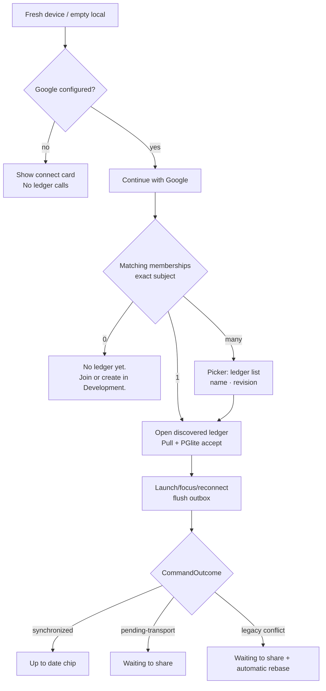
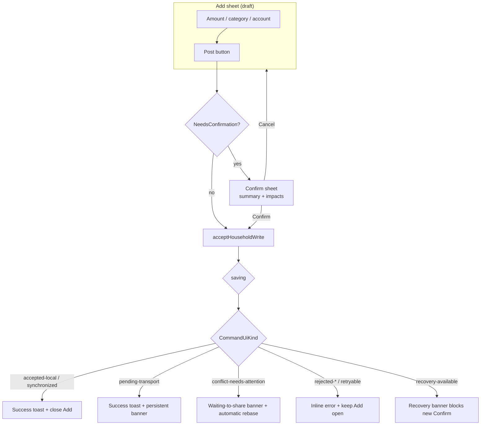
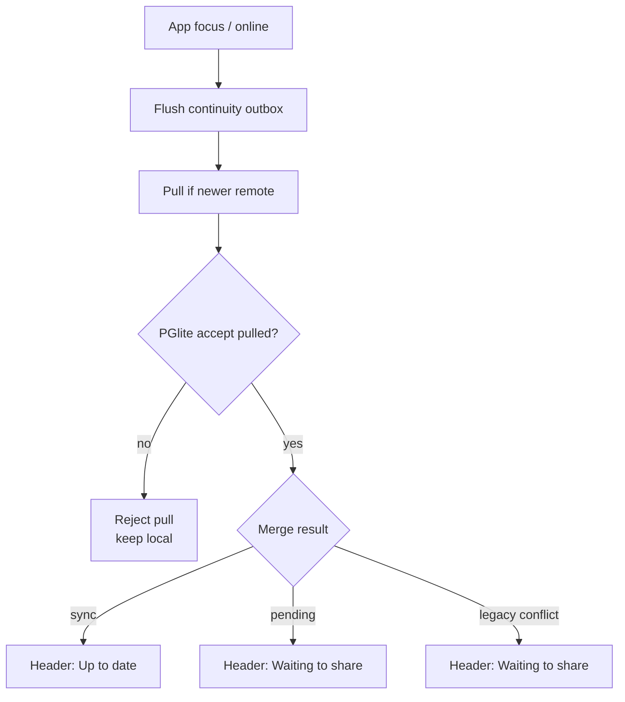
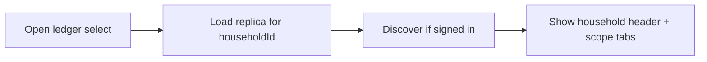

# Claude UX — Command, continuity, conflict, and recovery states

> **D-186 supersession (2026-08-31):** no conflict chooser, comparison sheet, or Review action may render. Legacy conflict state names below are transport compatibility only and present as automatic **Waiting to share / Retry now** recovery.

> **Role:** Claude design lead (UX, accessibility, responsible retention).  
> **Baseline:** `main@462063c` — **SHIPPED** as [PR #76](https://github.com/jonathanbeaulne123-blip/dual-ai-budget-app/pull/76) (2026-08-24, Toronto).  
> **Implementation:** Cursor Cloud Agent (GPT), parallel Slice A+B; worksession [`2026-08-24-command-states-slice-ab.md`](worksessions/2026-08-24-command-states-slice-ab.md).  
> **Contract:** `src/core/commandOutcome.ts`, `src/claude/commandContract.ts`, `docs/claude/COMMAND_CONTRACT.md`.  
> **Canon:** `docs/CLOUD_CONTINUITY.md`, `docs/HEARTH_ROADMAP.md` Phase 0–2, D-111, D-113, D-114, D-119.  
> **Scope:** design and copy authored here; implementation merged on `main`. No second state machine.

Jonathan approves product, Production, and money-semantic decisions. Cursor implements from this packet. Codex coordinates and audits.

---

## 1. Design law (non-negotiable)

1. **One state machine.** `CommandUiKind` from `acceptHouseholdWrite` is the write-surface truth. UI chips, toasts, headers, and modals **derive** from `CommandOutcome` / `CommandSurfaceState` via `toCommandSurface()`. Do not invent parallel `syncState` semantics that can disagree with posting flags.
2. **Posting flags are authoritative.** Never show “Saved”, “Posted”, or success chrome when `postedNothing === true`. Never imply the books changed when `postedExactlyOnce === false` unless `recovery-available` explicitly says recovery is needed (both flags false).
3. **No peer device as host.** Copy must never say “keep the other phone online”, “return to the host device”, or “publish from your phone so Bianca can see it”. The cloud is durable continuity; PGlite is this device’s validated replica (D-112, D-113).
4. **Personal vs household is a view filter**, not a second ledger host. Personal rows are member-scoped slices of the same household replica (D-114). Switching views never changes posting authority.
5. **Development vs Production are separate books.** Environment mismatch is a permanent validation failure. Development-data openness (pre-October) is disclosed honestly; never call it private or secure.
6. **Confirm is the only money gate.** Add is draft until Confirm. Reversal/repost creates new journal rows; history is not silently rewritten (D-111, sit-down reverse flow).
7. **Synthetic Development data only** in fixtures, screenshots, and demos.

---

## 2. CommandOutcome → household experience map

### 2.1 Primary write states (`CommandUiKind`)

| Kind | `ok` | `postedExactlyOnce` | `postedNothing` | `retryable` | `recoveryAvailable` | Books truth | Share truth |
|---|---|---|---|---|---|---|---|
| `saving` | false | false | false | false | false | unchanged | n/a |
| `accepted-local` | true | true | false | false | false | accepted on device | not sent (demo/unlinked/no transport) |
| `pending-transport` | true | true | false | true | false | accepted on device | queued; outbox will retry |
| `synchronized` | true | true | false | false | false | accepted on device | cloud revision matched |
| `rejected-no-write` | false | false | true | false | false | unchanged | none |
| `retryable-failure` | false | false | true | true | false | unchanged | none |
| `permanent-validation-failure` | false | false | true | false | false | unchanged | none |
| `conflict-needs-attention` | true | true | false | true | true | accepted locally | legacy stale marker; automatic rebase pending |
| `recovery-available` | false | false | false* | true | true | uncertain | uncertain |

\*When `recovery-available`, both posting flags may be false (persist failed after ingest and restore failed). UI must not pick “posted” or “not posted” alone — show recovery path.

### 2.2 Error classes (`CommandErrorClass`)

| Class | Typical kind | User-facing gist |
|---|---|---|
| `validation-rejected` | `rejected-no-write` / `permanent-validation-failure` | Policy or field refusal; fix the command |
| `unbalanced-journal` | `permanent-validation-failure` | Double-entry failed; nothing posted |
| `books-unavailable` | `retryable-failure` | PGlite/engine could not accept |
| `persist-failed` | `retryable-failure` or `recovery-available` | Engine may have accepted; snapshot save failed |
| `pending-transport` | `pending-transport` | Local accept OK; share incomplete |
| `conflict-detected` | `conflict-needs-attention` | Remote revision stale; automatic rebase and retry |
| `disconnected` | `pending-transport` | Offline; local accept OK |

### 2.3 Sharing mode (`SharingMode`) — display only

Sharing mode mirrors household.sharing.mode after the write. It **annotates** transport context; it does not override posting flags.

| Mode | When shown | Header chip (short) | Must not say |
|---|---|---|---|
| `local` | Demo, empty, unlinked, Hearth Pass overlay | **This phone** | “Synced”, “Shared” |
| `invite-draft` | Pre-join invite flow | **Draft** | “Saved to cloud” |
| `publish-confirming` | Legacy publish confirm | **Publishing…** | “Done” until outcome |
| `linked` | Linked, not yet synchronized this session | **Linked** | “Up to date” |
| `pending-transport` | Outbox / transport retry | **Waiting to share** | “Bianca can see it now” |
| `synchronized` | CAS matched | **Up to date** | “Instant on all devices” (honest: “when they open Hearth”) |
| `conflicted` | Legacy open conflict record during upgrade | **Waiting to share** | “Review”, “choose”, or “Synced” before acknowledgement |
| `disconnected` | Network down with pending | **Offline** | “Lost” |
| `transport-error` | Hosted error with pending | **Share paused** | “Not saved locally” when postedExactlyOnce |

---

## 3. Complete state / copy matrix

Copy uses Toronto plain language. `{amount}`, `{note}`, `{member}`, `{ledger}`, `{environment}` are runtime substitutions. **Primary** = headline; **Secondary** = supporting; **Action** = single primary CTA where applicable.

### 3.1 Confirm-in-flight

| Surface | Primary | Secondary | Action | a11y live |
|---|---|---|---|---|
| Add Post button | Posting… | — | disabled | `aria-busy="true"` |
| Confirm modal | Confirming… | Do not close this sheet. | Confirm disabled | focus trapped |
| Header | Saving… | — | — | `role="status"` polite |

**Reduced motion:** spinner becomes static “Saving…” text; no clink/spark until `postedExactlyOnce`.

### 3.2 Locally accepted (`accepted-local`)

| Surface | Primary | Secondary | Action |
|---|---|---|---|
| Toast (3s hold) | Posted {amount} | On this phone. | Undo (if token) |
| Add sheet | — | closes on accept | — |
| Header chip | This phone | Not shared yet. | — |
| Audit row | Posted · {actor} | Local only | View entry |

**When:** demo household, unlinked member, zero REST policy, or transport not requested.

### 3.3 Synchronization pending / offline (`pending-transport`, `disconnected`)

| Surface | Primary | Secondary | Action |
|---|---|---|---|
| Toast | Posted {amount} | Waiting to share. | — |
| Banner (persistent) | Saved here. Not shared yet. | Hearth will retry when you're back online. | Review pending |
| Header chip | Waiting to share | · offline | Retry now |
| More → Continuity | {n} update(s) waiting | Last try: {time} | Export outbox diagnostics |
| Audit row | Posted · pending share | confirmation {shortId} | — |

**Retry rule:** `retry-same-confirmation` — never mint a new confirmation id for the same command.

**Offline empty state:** “You're offline. You can still post on this phone. Sharing waits until connection returns.”

### 3.4 Synchronized (`synchronized`)

| Surface | Primary | Secondary | Action |
|---|---|---|---|
| Toast | Posted {amount} | Up to date. | Undo |
| Header chip | Up to date | · {ledger name} | — |
| Pull on focus | — | silent unless newer remote exists | — |
| Audit row | Posted · shared | rev {n} | — |

**Honest freshness:** “Up to date on this phone” — not “every device live right now”.

### 3.5 Legacy stale-write recovery (`conflict-needs-attention`)

| Surface | Primary | Secondary | Action |
|---|---|---|---|
| Banner (non-blocking) | Saved here. | Hearth is applying the latest accepted entries. | Retry now |
| Header chip | Waiting to share | · retrying | Retry now |
| Snapshot chooser | Never rendered | Reconciliation is record-level and automatic. | — |
| Confirm follow-up | Posted on this phone | Sharing will retry in the background. | — |
| Audit | Local post visible | Automatic rebase pending | — |

**Retry rule (D-186):** the legacy state maps to automatic rebase plus `retry-same-confirmation`; no person chooses a whole snapshot.

**Auto-merge success:** If runtime returns `accepted-local` after auto-merge, show neutral toast “Merged compatible changes” — only when code proof exists; do not infer from UI timing.

### 3.6 Rejected / not posted

#### `rejected-no-write`

| Surface | Primary | Secondary | Action |
|---|---|---|---|
| Inline (field) | {userMessage} | — | Fix field |
| Add sheet | stays open | Previous entry unchanged. | Edit |
| Toast | **Do not show success toast** | — | — |

#### `permanent-validation-failure`

| Surface | Primary | Secondary | Action |
|---|---|---|---|
| Inline | {userMessage} | Nothing was posted. | Fix amount/category |
| Unbalanced | The journal is not balanced. | Nothing was posted. | — |
| Closed month | That month is closed. | Reopen from Books to post there. | Go to Books |

#### `retryable-failure`

| Surface | Primary | Secondary | Action |
|---|---|---|---|
| Banner | Couldn't save. | The previous household is still here. | Try again |
| Action | Retry | Same confirmation id. | Retry |

### 3.7 Recovery available (`recovery-available`)

| Surface | Primary | Secondary | Action |
|---|---|---|---|
| Banner (urgent) | Recovery needed. | The books may have accepted this entry, but this phone couldn't save safely. **Do not Confirm again.** | Open recovery |
| Recovery sheet | Diagnostics (redacted) | revision, balance tick, conflict count | Export household / conflict bundle |
| Confirm modal | **Blocked** if prior id pending | Use recovery, not a new Confirm. | Open recovery |

**Copy when both flags false:** “We can't tell if this posted. Recovery is available. Don't tap Confirm again with a new id.”

### 3.8 Scope: Personal vs household ledger view

| Context | Header | Posting | Visibility default | Sync copy |
|---|---|---|---|---|
| Household view | Household | shared + personal rows visible per policy | `household` / `both` | same CommandOutcome |
| Personal view | Personal | member-scoped filter only | `personal` | same outcome; never “personal sync” |

**Switcher copy:** “Household” / “Personal” — subtitle: “Filter, not a separate cloud ledger.”

**Partner privacy:** In personal view, never show partner personal amounts in banners/toasts. Automatic reconciliation remains member-scoped and never renders a snapshot diff.

### 3.9 Scope: Development vs Production

| | Development | Production |
|---|---|---|
| Pill label | Development | Production |
| Switch guard | “Separate books. Development data is disposable through September 30.” | “Production household. Requires explicit approval to experiment.” |
| Google discovery | Enabled (D-113) | Disabled until Auth/RLS cutover |
| Open hosted warning | Show once per session: “Development cloud data is openly readable/writable. Not private.” | Hidden (when secured) |
| CommandOutcome | same contract | same contract |

### 3.10 Google sign-in on a new device

Flow uses existing continuity discovery — no new backend.



| Step | Primary copy | Secondary | Must not say |
|---|---|---|---|
| Welcome | Continue with Google | Find your ledgers on this device. | “Link this phone as host” |
| Discovering | Looking for your ledgers… | — | — |
| Picker | Choose a ledger | {name} · revision {n} | — |
| Zero match | No Development ledger for this Google account yet. | Join a household or create one here. | — |
| Production block | Production waits for the security cutover. | — | — |
| After open | Pulling latest… | Old device can be off. | “Keep other phone awake” |

### 3.11 Correction through reversal / repost

Uses existing `reversePostedMoney` + Confirm. Not a separate state kind — outcome follows normal CommandOutcome.

| Step | UI | Copy |
|---|---|---|
| Ledger → Reverse | Confirm sheet | Reverse {date} {type} {amount}? Original stays. A reversing entry posts today. |
| Success | Toast | Reversed {amount}. Original unchanged. |
| Undo token | Toast action | Undo reverse (session/local scope per D-111) |
| Repost | Add prefilled draft | New Confirm required; links via `reversalOfId` |
| Already reversed | Inline error | Already reversed. Reverse the reversing entry if you meant to reinstate. |
| Closed month | validation | That month is closed. Reopen from Books. |

**Audit presentation:** show original + reversing row; never hide original.

---

## 4. Mobile-first flow diagrams

### 4.1 Add → Confirm → Outcome (phone)



### 4.2 App launch / focus / reconnect



### 4.3 Ledger switcher (multi-household D-114)



---

## 5. Annotated designs (viewport specs)

Visual mockup: [`docs/claude/command-states-mockup.html`](claude/command-states-mockup.html) (synthetic Development fixtures).

Design tokens: existing `:root` in `src/styles.css` — pine `#1a3d32`, paper `#f6f1e8`, brass `#b8860b`, wax success `#2f6b4f`, danger `#6b1d1d`, muted `#5c5348`.

### 5.1 Phone narrow — 320px

```
┌──────────────────────────────┐  ← 320 min; no horizontal scroll
│ [mark] Hearth          [DEV] │  topbar 44px tap targets
│ Alex · household · Aug 24    │  13px secondary
├──────────────────────────────┤
│ [ Waiting to share · offline]│  status chip; icon+text; wraps 2 lines OK
├──────────────────────────────┤
│ Household | Personal         │  segmented; 44px height
├──────────────────────────────┤
│ ⚠ Saved here. Not shared yet.│  banner; body 14px; action right OR stacked
│   Hearth will retry…         │
│              [Review pending]│
├──────────────────────────────┤
│  (OfficePhone glance board)  │  calculator hero; max 5 objects
├──────────────────────────────┤
│ Home  Ledger  Plan  More     │  bottom nav; safe-area inset
└──────────────────────────────┘
```

**320 constraints:** banner actions stack below copy; ledger switcher label hides (“Ledger ▾” only); no snapshot comparison sheet exists.

### 5.2 Phone primary — 390×844

```
┌────────────────────────────────┐
│ [mark] Hearth            [DEV] │
│ Alex · household · Mon Aug 24  │
├────────────────────────────────┤
│ ⚠ Saved here. Not shared yet.  │  single-line chip preferred
│        [Review pending]        │
├────────────────────────────────┤
│  Open ledger [Beaulne Demo ▾]  │  if replicas > 1
├────────────────────────────────┤
│  Household  |  Personal        │
├────────────────────────────────┤
│   [ OfficePhone content ]      │
│   CAD pad · blotter · wallet   │
└────────────────────────────────┘
```

**Add sheet at 390:** full-height sheet; Confirm modal overlays with `role="dialog"`; Post button fixed above safe area.

### 5.3 Tablet / wide phone — 720px

At `720px` (`WIDE_BREAKPOINT`), shell switches to Office wide — **command state chrome stays consistent** (same header chip + banner semantics).

```
┌──────────────────────────────────────────────────────────┐
│ Hearth · Alex · household                    Development │
│ [ Up to date · Beaulne Demo ]                            │
├──────────────────────────────────────────────────────────┤
│  Household | Personal          │  canvas │  side detail  │
│  (no second sync truth)        │  desk   │  retry/truth │
└──────────────────────────────────────────────────────────┘
```

Legacy stale-write recovery at 720+: the same compact Waiting-to-share strip; never side-by-side snapshot cards.

### 5.4 Desktop office — ~1100px

```
┌────────────────────────────────────────────────────────────────────────┐
│ Hearth   Alex · household · Aug 24, 2026              [Development]    │
│ Sync: Up to date · Beaulne Demo · rev 42                               │
├────────────────────────────────────────────────────────────────────────┤
│ │ Rainy window + movable widgets (September Office)                  │ │
│ │ Status banner only spans content column, not full bleed              │ │
│ │ Hercules pointer-events none during Add/Confirm                    │ │
├────────────────────────────────────────────────────────────────────────┤
│ Home │ Ledger │ Plan │ More                                            │
└────────────────────────────────────────────────────────────────────────┘
```

**1100 rules:** banner max-width follows app column; do not obscure Post on calculator; recovery sheet uses two-column diagnostics + actions.

---

## 6. Accessibility, motion, and edge behavior

### 6.1 Keyboard and focus

| Context | Behavior |
|---|---|
| Add sheet open | focus first interactive; trap until Close |
| Confirm modal | trap; initial focus Confirm; Esc → Cancel |
| Legacy stale-write state | one status message plus optional Retry; no dialog or focus trap |
| Banner actions | keyboard activatable; visible focus ring 2px brass |
| Ledger switcher | native `<select>` or listbox with arrow keys |

### 6.2 Screen reader

| Event | Announcement |
|---|---|
| `saving` | “Saving.” polite |
| success + synchronized | “Posted {amount}. Up to date.” polite |
| pending-transport | “Posted {amount}. Waiting to share.” assertive |
| legacy conflict | “Saved here. Sharing is catching up.” polite |
| rejected | “Not posted. {userMessage}” assertive |
| recovery | “Recovery needed. Do not confirm again.” assertive |

Use `aria-live="polite"` for success and automatic sharing recovery; reserve `assertive` for validation or uncertain recovery.

**Do not** rely on toast alone for failures — inline + live region.

### 6.3 Reduced motion (`prefers-reduced-motion: reduce`)

- Disable clink, spark, visor pop, Hercules celebration on post.
- Replace banner slide with instant show/hide.
- Saving: text only, no spinner rotation.

### 6.4 Offline / empty / error / recovery

| State | Empty | Error | Recovery |
|---|---|---|---|
| No household | Create / Join / Google | inline | export if partial |
| Offline | post allowed locally | transport messages | outbox retry |
| Demo | “Sample data” chip | — | reset env guard |
| PGlite down | block Post | books-unavailable copy | rebuild from snapshot per `booksRecoveryAdvice` |
| Legacy conflict | — | non-blocking Waiting-to-share banner | automatic rebase; optional Retry |

### 6.5 Touch targets

Minimum 44×44px for Post, Confirm, banner actions, scope tabs at all breakpoints.

---

## 7. Add and Confirm modal — integration recommendations

Current: Add sheet (`App.tsx` `adding`), Confirm via `NeedsConfirmationError` + `ConfirmSheet` (`Confirm.tsx`).

### 7.1 Wire CommandSurface into Add/Confirm

1. On Confirm click, set surface `saving` immediately (disable buttons, `aria-busy`).
2. After `commitHousehold` resolves, read `toCommandSurface(outcome)` — **never** infer from `setToast` or `setSyncState` alone.
3. Map outcome → toast/banner/header via single function `renderCommandSurface(state)` (Cursor implements in App or small module).

### 7.2 Confirm modal content rules

- Summary lists: amount, account(s), category, visibility, effective date, balancing impact, environment pill.
- If prior `recovery-available` for same confirmation id, **block** Confirm with recovery CTA.
- Show share context line from `sharingMode`: “Will share after post” only when transport requested and not demo.

### 7.3 Add sheet persistence rules

| Outcome | Add sheet |
|---|---|
| success kinds | close |
| validation failures | stay open, focus first invalid field |
| pending-transport / synchronized | close (post succeeded locally) |
| legacy conflict | close post, keep books usable, reconcile automatically |
| recovery | close post, open recovery |

### 7.4 Accessibility upgrades (Confirm.tsx)

- Add `aria-describedby` pointing to body + impact list.
- Confirm button gets `aria-disabled` when `busy` or `saving`.
- Return focus to Add Post on Cancel.
- Danger confirms (reverse, reset env) use `aria-label` restating action.

### 7.5 Deprecate misleading syncState mapping

Today `App.tsx` sets `syncState` `"error"` for pending-transport — **incorrect**. Replace with derived chip from latest command surface + outbox queue depth. Keep `syncState` only as UI shorthand tied to outcome (or remove).

---

## 8. Global chrome placement

| Element | Location | Source |
|---|---|---|
| Environment pill | header right | session environment |
| Ledger switcher | below header if `replicas.length > 1` | D-114 catalog |
| Scope tabs | header stack | view personal/household |
| Sync chip | header stack | `sharingMode` + outbox |
| Persistent banner | below header | waiting-to-share / pending / recovery |
| Ephemeral toast | bottom above nav | success + undo |
| Inline error | Add sheet / field | validation |

**Hercules:** may acknowledge success (`postedExactlyOnce`) in chat only after outcome — never before. Never post money.

---

## 9. Cursor implementation review checklist

### 9.1 Contract fidelity

- [ ] UI reads `CommandOutcome` / `toCommandSurface` only — no toast-timing inference
- [ ] `guaranteesPostedNothing()` gates all success visuals
- [ ] `guaranteesPostedExactlyOnce()` required for “Posted” copy
- [ ] `recovery-available` blocks new Confirm with same flow
- [ ] `retryRuleFor()` drives Retry vs Recovery; legacy conflict never creates a chooser
- [ ] Duplicate receipt shows neutral reuse, not double post

### 9.2 Copy and trust

- [ ] No “host phone” language anywhere
- [ ] No “saved to cloud” when `pending-transport`
- [ ] Development openness disclosed where hosted transport runs
- [ ] Production discovery disabled message matches GoogleBridge
- [ ] Personal view never leaks partner personal amounts in banners

### 9.3 Accessibility

- [ ] 320px no horizontal scroll; 44px targets
- [ ] Confirm/Add focus trap + restore
- [ ] Live regions for automatic sharing recovery/failure
- [ ] Reduced motion respects `prefers-reduced-motion`
- [ ] Keyboard path for Add → Confirm → Undo

### 9.4 Visual evidence required from Cursor

- [ ] Screenshots at 320, 390, 720, ~1100 for: pending, synchronized, legacy retry, rejected, recovery
- [ ] Playwright or manual script using `COMMAND_SURFACE_FIXTURES`
- [ ] VoiceOver or NVDA spot-check on Confirm + Waiting-to-share banner

### 9.5 Non-scope (must not change)

- [ ] No edits to `acceptHouseholdWrite`, outbox, Supabase, schema, Auth/RLS
- [ ] No Production data or deployment
- [ ] No second state machine file

---

## 10. Product questions — implementation defaults

Full household-language writeup, current-code facts, and epic-rebase notes: [`docs/briefs/COMMAND_STATES_PRODUCT_QUESTIONS.md`](briefs/COMMAND_STATES_PRODUCT_QUESTIONS.md).

Jonathan still owns any **keep-this-side merge**. Cursor may ship the UI defaults below; they do not invent books semantics.

| # | Question | Implementation default | Tag |
|---|---|---|---|
| 1 | Stale snapshot recovery | Automatic record-level reconciliation; no chooser or comparison sheet. | **Resolved by D-186** |
| 2 | Pending banner always vs quiet | Chip always; banner only offline / failed retry / blocked | **UI default** |
| 3 | Undo “this phone”? | `Undo (this phone)` unless last outcome was `synchronized` | **UI default** |
| 4 | Auto-merge toast? | Silence. Optional Audit line: goal jars combined, journals matched | **UI default** |
| 5 | Personal rows in reconciliation UI? | No snapshot contents are rendered; automatic merge retains only the active member's Personal envelope. | **D-186** |
| 6 | Prefill Add after reverse? | Yes — draft at Review; Confirm still required | **UI default** (epic §5.5) |
| 7 | Multi-ledger: remember vs ask? | Remember `session.householdId`; picker when unknown | **Already true** |
| 8 | Production pill: block vs browse? | Keep pill as local switch; no Production discovery/REST | **Already true** |

---

## 11. Dual Course deltas

| Course | Delta | Rationale |
|---|---|---|
| **Budget (5)** | **+4** | Trustworthy command outcomes, honest sync/recovery/conflict copy, reversal clarity, environment/scope truth — reduces silent money loss and false “posted” belief. |
| **Engagement (3)** | **+1** | Calm status chips and Hercules-safe success lines after verified post — companion celebrates only when `postedExactlyOnce`. |

---

## 12. Acceptance criteria (design complete)

- [x] State/copy matrix covers all nine `CommandUiKind` values + scope dimensions
- [x] Mobile-first mermaid flows for Add, launch, ledger switch, new device
- [x] Viewport annotations at 320 / 390 / 720 / ~1100
- [x] Keyboard, focus, SR, reduced-motion, offline, empty, error, recovery specified
- [x] Add/Confirm integration recommendations tied to existing components
- [x] Cursor review checklist with evidence requirements
- [x] Unresolved product questions listed without silent money semantics
- [x] HTML mockup for visual evidence (see mockup file)

---

## 13. Evidence index

| Artifact | Path |
|---|---|
| Command contract | `docs/claude/COMMAND_CONTRACT.md` |
| TS adapter + fixtures | `src/claude/commandContract.ts` |
| Visual mockup | `docs/claude/command-states-mockup.html` |
| Cursor brief | `docs/briefs/CURSOR_COMMAND_STATES_UX.md` |
| Viewport screenshots | `/opt/cursor/artifacts/command_states_*.png` |

**Next owner:** Cursor — preserve `renderCommandSurface` plus salvaged Add/Confirm a11y. Codex — audit against checklist §9 and `CommandUiKind` only. No conflict-choice decision remains.
