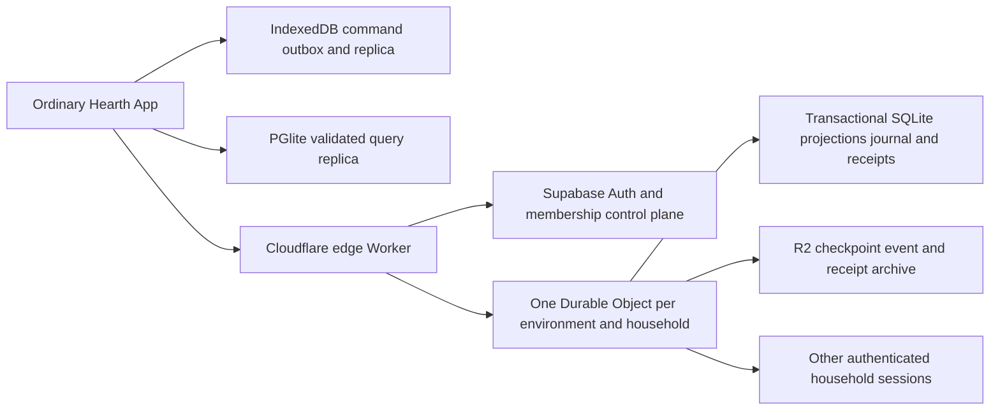

# Ledger sync v2 — D-235

Status: implemented in `codex/ledger-sync-rebuild`, based on `9c54a8f9fb019360bc6aacae4983ddce0e56b2d5`. This is an implementation and activation contract, not a claim that hosted households have migrated. Production is explicitly rejected by this service.

The household outcome is concrete: Bianca confirms groceries in the ordinary Add flow; the authority accepts that intent against the current books, persists it, and Jonathan sees the accepted balance through a WebSocket event. A second editor's unrelated posting does not cause a whole-household CAS conflict. Local drafts respond immediately; money becomes accepted only after durable cloud acknowledgement. An optimistic draft must never masquerade as posted money.

## 1. Conflict resolution and state

Neither OT nor a text CRDT is the money authority. OT transforms positional edits against an ordered document history; CRDTs merge independently produced document operations and support long offline editing. For a future shared text document, Yjs remains the preferred sequence CRDT with stable element identities, relative cursor positions, state-vector exchange, and a persisted update log. The separate document-collaboration worktree is not this ledger implementation.

For this application's financial state, the definitive choice is **typed intent, one serialized household authority, and immutable idempotent receipts**. Merging two balances or replaying a client-produced full snapshot is invalid accounting. Two independent expenses are separate accepted operations. A competing edit to the same bill, close period, or reviewed resource either executes against the exact reviewed resource or returns a business conflict requiring another review.

- The client captures the invoked domain command and its JSON arguments at preview time. Nested implementation calls collapse into that outer intent. Compound commands retain explicit steps and map preview-created IDs to server-created IDs.
- Every confirmed intent has a UUID persisted to IndexedDB before transmission. Its fingerprint includes actor, environment, household, steps, reviewed money, and resource hashes. `observedSequence` is a replay hint and is deliberately excluded from identity.
- The server owns actor binding, ID allocation, business-resource checks, reviewed financial facts, and the existing accounting/household transition rules. CAD remains integer cents. Cumulative debit/credit accumulation is checked using BigInt before Number-based journal calculations can lose cents.
- Shared and each member's Personal projection are separate. Only the authenticated member's Personal projection is assembled for command execution or returned to that client. A changed Shared projection is checked against the other stored Personal books too.
- SQLite stores keyed projection rows, chunked journal events, receipts, archive jobs, import fences and metadata. An in-memory Shared map plus member Personal maps is a reconstructible cache.
- Undo references a durable receipt, never an old household snapshot. It is the member's latest eligible financial receipt, checks affected resources, removes only created rows and restores changed transaction/related rows. A changed bill or claim blocks stale Undo. Funded facts use their dedicated reversal path.

## 2. Wire protocol

Transport is same-origin WebSocket over TLS in hosting. There are two independent connections: `socket` for the durable ledger lane and `socket?lane=presence` for ephemeral presence. WebRTC offers no advantage for a small authenticated household with an authoritative durable writer; SSE alone would still require a separate upstream path.

A fresh authenticated `POST /ledger-sync/v2/development/HH-…/ticket` resolves Supabase membership and issues a single-use ticket, valid for 15 seconds. The ticket is sent as a WebSocket auth message, not in the URL. A scope lease lasts 60 seconds; clients renew at 40 seconds using a fresh authenticated ticket. Expired/revoked sessions fail closed. Membership changes can take up to the lease bound to reach an already connected session unless its room is explicitly invalidated.

Control messages are small JSON:

```json
{"type":"auth","ticket":"single-use-uuid"}
{"type":"credit","bytes":61518}
{"type":"error","id":"command-uuid","definitive":true,"code":"BUSINESS_PRECONDITION_CHANGED"}
```

A definitive pre-commit business rejection removes that command from the outbox and requires review. Errors after a commit attempt close the connection without rejecting the intent: reconnect and retry the same UUID.

The financial JSON body is carried inside binary frames:

```json
{
  "type":"command",
  "command":{
    "version":2,
    "id":"11111111-2222-4333-8444-555555555555",
    "environment":"development",
    "householdId":"HH-example",
    "observedSequence":42,
    "steps":[{
      "kind":"postEntry",
      "args":[{"date":"2026-09-07","type":"expense","amount":"4.00","accountId":"ACC-VISA","subcategoryId":"SUB-FOOD-GROCERIES","createdBy":"MEM-001","confirmDuplicate":true}],
      "previewIds":["TXN-preview"],
      "reviewed":[{"type":"expense","date":"2026-09-07","amountCents":400,"accountId":"ACC-VISA","subcategoryId":"SUB-FOOD-GROCERIES","visibility":"household","createdBy":"MEM-001","splits":[{"party":"joint","amountCents":400}],"funding":null}],
      "resources":[]
    }]
  }
}
```

This illustrates the shape using a joint split. Never construct the reviewed facts independently of the displayed domain preview. Server actors and amounts must match its recomputed result.

| Binary offset | Representation |
|---|---|
| 0 | protocol version, uint8 = 2 |
| 1 | encoding, uint8 = 1 (UTF-8 JSON) |
| 2–37 | message UUID, 36 ASCII bytes |
| 38–41 | zero-based part index, uint32 big-endian |
| 42–45 | total unframed byte length, uint32 big-endian |
| 46–77 | SHA-256 of the complete unframed body |
| 78 onward | up to 60 KiB of payload |

Commands are bounded to 128 KiB, 20 steps and depth 24. Prototype keys and invalid numeric values are rejected. Full snapshot transfer is capped at 32 MiB, each frame is bounded, and a 256 KiB credit window limits queued transport. Readers check order, size, transfer age and checksum. An event contains a strictly increasing sequence and `{set, unset, rows}` patches; keyed row patches contain `put` and `remove`. Personal patches are omitted from every other member's event. ACK carries the canonical receipt after the event stream has reached its sequence.

Presence messages are at most 1 KiB, coalesced/rate-limited to 10 Hz per connection. The server stamps member identity, device namespace and timestamp; the client does not choose another actor. Heartbeats run every five seconds and peers expire after fifteen seconds. Presence bypasses the financial work queue and uses its own socket. The current ledger UI broadcasts presence, not document typing or text selection. Text cursors require the separate document CRDT/editor integration; claiming that feature from this ledger channel would be incorrect.

## 3. Infrastructure and durability



No Redis or Kafka is required for the household fan-out path. The Durable Object is both the connection room and the single writer. Adding a broker between commit and two household clients would add another delivery/reconciliation boundary without changing the authority.

Commit order is contractual:

1. Validate command, actor, permissions, reviewed facts and business resources against current state.
2. In one SQLite transaction, update projections, append the event, insert the immutable receipt, advance sequence, and enqueue the archive job.
3. Await SQLite durability.
4. Upload the sealed scope/authority-bound event plus receipt to R2; advance its archive tip only after the event object exists. Imports set a checkpoint-required marker in their same SQLite transaction, so a crash cannot expose an unarchived baseline.
5. Only after the archive barrier succeeds may an event, ACK, snapshot, resume response or replayed receipt expose that state.
6. Clients persist the accepted replica in IndexedDB, paint the server-validated state, and transactionally update PGlite. A failed local projection blocks writes and triggers canonical recovery. It does not roll back accepted server money.

R2 is an acknowledgement dependency in this implementation. An archive outage deliberately delays acceptance exposure; it cannot produce a successful ACK whose recovery archive is missing the posting. Snapshot checkpoints contain Shared, every imported Personal scope and all receipts. Checkpoints are produced at import and every 200 accepted commands. Owner-facing restore metadata is fetched separately; full historical snapshots do not ride every edit. Available restore points are bounded to forty in a thirty-day window.

## 4. Concurrency, reconnect and regions

A household hashes to `environment/householdId`; Cloudflare routes it to one Durable Object. `enam` is a placement hint for this Toronto household, not an active-active regional writer. Editors in other regions reach that same home authority. Local drafts are immediate; acceptance has an unavoidable network round trip. Different households shard independently and do not share a serial queue.

A replaced connection node closes sessions with retry semantics. Clients use full-jitter exponential backoff from 500 ms to 30 seconds, fetch new authorization and tickets, resume from their durable sequence, and then resend pending UUIDs in durable insertion order, with one unacknowledged command in flight per client. Room admission is capped at 20 WebSocket connections per second and 100 sockets. Financial work is bounded to 64 queued messages per room and 16 per connection. Slow senders/receivers are disconnected for resync instead of accumulating unbounded buffers. These are resource controls, not evidence that a 10,000-client outage has been load-tested.

The server streams contiguous journal events when the gap is at most 500 and after the import boundary; otherwise it sends a chunked canonical snapshot. The final ready message includes a SHA-256 of the complete scoped replica; a mismatch forces a canonical snapshot even when sequence numbers match. WebSocket order is used only within a connection; durable sequence and receipts survive reconnects. There is no cross-region last-writer-wins merge of financial snapshots and no automatic fallback to an older authority.

## 5. Offline and failures

If a device is disconnected for fifteen minutes, local drafts and previously confirmed pending intents remain in its own IndexedDB scope. Its cached books remain readable; it cannot honestly show an unacknowledged financial command as accepted. On reconnect it obtains fresh membership, downloads the missing event range or a snapshot, validates/persists/adopts that state, and submits pending command UUIDs in insertion order.

Five other users' additive postings are already in that canonical state. Each queued additive expense executes against it and survives without a whole-household revision conflict. A queued change to a bill or another guarded resource whose reviewed value changed returns a definitive conflict for review. A receipt already present because the ACK was lost returns the same canonical IDs and sequence. Auth loss preserves pending intent but blocks sending it; it never grants access through a local cache or an old Google link.

Recovery distinctions:

- Local replica failure: force a canonical snapshot while preserving pending UUIDs. No legacy snapshot is read.
- Primary authority loss: restore a checksum-verified checkpoint and contiguous, scope/authority-bound tail into an empty, exclusively owned authority. Rebuild all receipts and Undo markers before serving. A second live writer must never coexist with recovery.
- Event uploaded but tip failed: no external state escaped; retry the SQL-held receipt. An exclusive total-loss restore can omit the unexposed orphan.
- Tip uploaded but ACK lost: restore includes that receipt; stable-ID retry does not post twice.
- Membership revoked: existing leases expire or are invalidated; reconnect performs current authorization.
- New household: a dedicated idempotent bootstrap creates the control membership and frozen initial state. It cannot submit into the currently open room.
- Development deletion: fence the room, delete control-plane records and archived data, and retain a permanent tombstone so legacy clients cannot resurrect the identity. Local device cleanup stops the client and removes its v2 replica, pending commands and recovery copies after the user's existing confirmation.

## Activation and evidence boundary

Migration 019 is authored and locally exercised; it has not been applied to a hosted project by this worksession. It takes the household lock, freezes the legacy Shared and every Personal import source, and permanently fences legacy snapshot/event writers. The authority instance UUID prevents a second empty room from re-importing an old source after the first has accepted money. Supabase remains the identity/membership control plane; embedded member rows are projections, not a second authorization database.

Operational logs record accepted-command timing, archive timing, event byte size, queue rejections and receipt replay. They exclude money, notes, household/member IDs and command contents. Provider dashboards/alerts and their thresholds still require hosted activation.

A release must provision the Development R2 binding and SQLite Durable Object namespace, apply 019 under the approved migration procedure, deploy the reviewed build, and then prove Google create/discovery/invite/revoke, both members' Personal isolation, financial confirms/retries/Undo/recovery and calibrated two-device receiver paint on that exact deployment. `VITE_LEDGER_SYNC_V2=0` is only a pre-cutover build control: it must never be used to restore legacy writing to a migrated household. Production is disabled in both client mode selection and server routing.

Local tests and the local Chromium latency harness prove their stated execution paths only. They do not establish hosted two-device latency, provider disaster recovery, browser quota behavior across all platforms, 10,000-client reconnect capacity, or Production readiness. Current 32 MiB state/transfer limits and full domain-state validation bound this implementation; pagination and larger-household capacity require separate measured work before promising unbounded scale.
