# The Tool Atlas — what a person sees first, and where everything else lives (2026-09-25)

Design brief, not a build. Baseline `main@4e0234a` (#545). Context, in the order the prompt gave it: the design canvas "Journey Map Home" (nine boards), the Horizon deck (`CONTRACT.md` rules 15–21, `SCALES.md` §4, `TIME.md`), then the project docs. The repo won on every conflict, and it disagreed with the prompt in two places that matter (§0). Fictional household throughout: Jonathan and Bianca, Toronto, CAD; every figure below is made up.

How it was made: four read-only agents inventoried the app in parallel (household tools, personal tools, the navigation graph and parity, the + history / write audit / vocabulary), a fifth merged them into one 65-row canonical table, two more scored that table blind against one rubric, and the orchestrator reconciled the nine outcomes they split on against `TIME.md` and `SCALES.md`. Then an accessibility reviewer and a design critic read the draft cold. Working files: `scratchpad/atlas/` (inventory-household, inventory-personal, nav-graph, history-writes-vocab, canonical, scores-A, scores-B).

## 0. Two things the repo said that the prompt did not expect

**0.1 The "+" speed dial is not retired.** At `4e0234a` it renders on the island's one bar (`src/App.tsx:7228` → `src/harbour/HarbourWorld.tsx:1124` → `src/harbour/village/VillageHUD.tsx:42`, `BarFab`), on the Reading-edition bar (`src/harbour/HarbourEntry.tsx:57`, added by #545 itself), on the door edition while a tool is open (`src/harbour/nav/Compass.tsx:274`), and on the personal nav (`src/App.tsx:9260`). It holds Record an expense · Add income · Move money · Add a shift (`src/core/fabActions.ts:31-46`), closed label "Add money", two presses to an Add slideshow, and it never posts. No commit removes it (`git log -S"BarFab" -S"FabSpeedDial"`). What *was* retired: the navigation verbs and the "What can we do?" label (#455, D-246, feedback row 5 "too many buttons"), and the Compass district row that used to hold it (#537, D-298 "one bar replaces the Compass districts… adding money stays two presses"). If the + is missing on Jonathan's phone the causes, in order of likelihood, are a Charter takeover (`charterTakeoverVisible` hides it, `App.tsx:9209`), a deploy older than #537, or that it reads as one icon among seven on a 390 px bar (the phone shows icons only, `village.css:19`). **Check before build:** open the live site on the phone and look at the bar; if the + is there, this brief's speed-dial section is a redesign of a living control, not a resurrection.

**0.2 The first screen is the Village Square, not the Queen's Court.** `HarbourWorld` boots at `world.go("court")` (`HarbourWorld.tsx:581`), and `court` is `village/VillageCourt.ts`, the square on Hearth Mountain. `court/CourtScene.ts` (the cistern, mailbox and pieces) is imported by nothing at runtime; the Queen now stands in the Fund Bank (`village/BankScene.ts:6-19`). `src/harbour/startup/` does not exist. The flat edition's first screen is the Desk's Today page (`src/harbour/desk/DeskToday.tsx`), served since #545 by a separate `ReadingHarbour` component with its own bar (`HarbourEntry.tsx:29-63`). Tap counts below start from those two screens. The deck's home (the Journey map at LOD 0, `CONTRACT` rule 15) is not built yet, and this brief designs for it.

## 1. Phase 0 · The inventory

**Deployed build.** `.github/workflows/pages.yml:57-76` sets `VITE_HEARTH_HOUSE_WORLD=1`, `VITE_HEARTH_HARBOUR=1`, `VITE_FUND_MODEL_V2=1`, `VITE_CELLAR_V3=1`, `VITE_HERCULES_WORKSPACE=1`, `VITE_PLAN_SYSTEM_V2=1`; it does **not** set `VITE_PLAN_STUDIO_V3` or `VITE_FUND_STANDING_BOOK`, so the v3 studio (and with it the only screens that call `proposeFundDivision` / `proposeProtectRefill`) and the Standing Book binder are dark. The legacy tab bar, the Office, `DailyHearth.tsx`, the Court scene and the tower's jug/gun doors are dead at HEAD (appendix A).

**Counting rules.** Home = the Village Square (island) or Desk · Today (flat), household space, after sign-in. A tap is a press, including a slide pick; scrolling and typing are free. "(P n)" = the same tool reached in My Money from the same household home (the island's only space switch is inside All tools and switching does not close the sheet, `App.tsx:6523-6537`, so every personal tool costs +2 on the island and +1 on the Desk).

**Every write is a captured command, with these exceptions** (full audit in `scratchpad/atlas/history-writes-vocab.md` Part B; 248 `captureCommand` definitions, ledger sync v2 refuses anything else at `src/ledgerSync/client.ts:504`):
- Money-meaning, legacy-mode only (`useLedgerSync` off): Create Demo Suite (`App.tsx:3951`, no capture at all), Replace Demo Suite and Undo Confirm (captured only when sync is on, `:3926`, `:4973`), and three system merges that touch money rows without a command event — outbox auto-resolve (`:1643`), boot reconcile (`:2190`), last-entry-wins on every legacy save (`:2494`). **FLAG** for the sync/trust owner; not UI tools.
- Development-only: four Month Rehearsal steps return uncaptured results (`src/core/monthRehearsal.ts:147-161,519,706,765,820`); sync would refuse them.
- Own-channel by design (not money): pottery and Kitty **designs** (`hearthside/designClient.ts:44`), the Hearthside **vault** (letters, published memories, encounters, guest visits), Shared Hercules replies (`App.tsx:7513`), membership RPCs, appearance (Supabase user metadata).
- Per-device, money-*display*: "Include my private pay · this phone" (`queen/QueenCellarExtras.tsx:21`) and "Hide this reminder" for a due bill (`core/dueOccurrenceReview.ts:41`). Soft flags: one phone can hide a bill the other still sees.
- Two `fundModelCommands` have no UI caller at all: `setFundOverride`, `setCategoryHome`.

### 1.1 The canonical table (65 tools)

Merged from 107 household rows, 80 personal rows and 39 chrome rows; every source row is accounted for in `scratchpad/atlas/canonical.md` §"Chrome folded". Sub-features (a Books division, a Status fold, a FundStage plate) fold into their parent unless they have their own door.

| ID | Tool (as the UI shows it) | Space | Edition | Lives in | Writes | For | Freq | Taps island / flat / desktop |
|---|---|---|---|---|---|---|---|---|
| T01 | + "Add money" speed dial (household: Record an expense · Add income · Move money · Add a shift; personal: Shi… | both | both | `FabSpeedDial.tsx` | none (opens the Add flow; not shown during the Charter takeover) | J records | daily | 1; verb 2 (P 4) / 1; verb 2 (P 2) / 1 |
| T02 | Record an expense (Add slides: amount → category → account → picture/note → "Post $x"; "Split between two cat… | both | both | `AddSlideshow.tsx` | postEntry (with categorySplit / confirmDuplicate), addPreset, archive… | J records | daily | 7 (P 10) / 7 (P 8) / 7 |
| T03 | Add income ("How much came in?" … "Post income") | both | both | `as T02` | postEntry (income) | J records | weekly | 7 (P 10) / 7 (P 8) / 7 |
| T04 | Move money (transfer; the Wallet's card "Pay" opens it prefilled) | both | both | `as T02` | postTransfer | J records | weekly | 7 (P 10) / 7 (P 8) / 7 |
| T05 | Add a shift (+ → Shift: "Who is working?" Clock in / Sign out / Finish this shift → hours, sales, tips → "Pos… | both | both | `addSlideshow.ts:70-77` | clockInShift, clockOutShift, postShift; with jobs postWorkShiftWithAt… | J records | daily (shift days) | 3 to clock in (P 6) / 3 (P 4) / 3 |
| T06 | Open Shifts (the Work page: Today · Report · Jobs · Evidence; breaks; finished-shift review → Confirm; postin… | personal (also opens in the household view) | both | `WorkShiftPage.tsx:243-759` | clockInShift, clockOutShift, startShiftBreak, endShiftBreak, chooseOp… | J records | daily (shift days) | 2 (AT → Open Shifts); posting a shift adds 5 / 2 (AT, or a personal plate) / 2 (or Ctrl/Cmd+K → Shift) |
| T07 | Swipe / Till (quick purchase) | household | both (route o… | `Swipe.tsx:80` | postEntry via submitSwipePurchase | J records | daily | ✗ / ✗ / 2 (Ctrl/Cmd+K → Till; keyboard only) |
| T08 | Read the bill jars (the Cellar: 3D jars on the rail, plus the Cellar room "This month / Its months"; "Break t… | household (in personal the same target opens the Kitty nest, T11) | both | `harbour/cellar/CellarScene.ts:25,512` | postDueRecurrences; rollMissingSubscription (plus captured proposePla… | both | weekly | 2 (AT); a jar 3 (Quick travel → Home · Cellar → jar); post a bill 4–5 / 1 (Prepare pot or Sundial); a jar 2 (Leaving → jar); post 3–4 / 2 / 1 |
| T09 | Repeating reminders / due preview ("Review →", a named Confirm, "Hide this reminder") | both | both (a link … | `DuePreviewSheet.tsx:7-47` | postOneRecurrence; FLAG (soft): "Hide this reminder" is per device (h… | J records | weekly | open a tool, then 2 / open a tool, then 2 / open a tool, then 2 |
| T10 | Desk · Leaving (next out, spoken for, calendar-weight rail, bill jars; personal "Next to leave · your Calenda… | both | flat | `harbour/desk/DeskLeaving.tsx:18-235` | none | both | weekly | ✗ (flip + chip = 2) / 1 (P 2) / ✗ (2) / 1 |
| T11 | Open Kitty Banks (household: the Loft in 3D and the Loft rack with shelves, fill-mark pins, dividers, "Hang a… | both | both | `harbour/village/LoftScene.ts:78-83` | saveKittyNestDesign (held rack save); allocateHouseholdFundSurplus (j… | both | weekly | 2 (P 3); jug 4–5; gun 5–6 / 1 (Build pot) (P 2); jug 3–4 / 2 / 1 |
| T12 | Kitty Bank room (one bank: bank · studio · plan · money · history; "Add to this bank" / "Fund this bank"; spe… | both | both | `kitty/KittyBankRoom.tsx:258,858-1504` | fundGoal, purchaseGoal, releaseHouseholdFundKitty, saveGoalEnvelope, … | both | weekly | 3 (Quick travel → Home · Loft → bank); funding a bank adds ≈5 / 1 (Protect pot, Protect only); other banks 2 / 3 / 1–2 |
| T13 | Meet the Queen, household (the Fund Bank in 3D: the Queen, teller counter, vault, consultation desk, touch le… | household | island (in fl… | `harbour/village/BankScene.ts:6-19` | none in the bank (doors → Standing Book); the room writes saveKittyNe… | both | weekly | 2 (AT → Meet the Queen); a bank object 3; her room 3 / 1 (Everyday card; no Queen surface opens) / 2 / 1 |
| T14 | Meet the Queen, personal (Queen's Bay → Queen dressing overlay) | personal | island | `house/HouseWorld.tsx:105 (QueenDressing)` | FLAG (cosmetic): the Queen's style is saved with appearance to accoun… | both | rarely | 3 (AT → My Money → Meet the Queen) / not traced / 3 |
| T15 | Desk · Today, household, with DeskPlace "Nearby tools" (Household Fund ↗ · Supporting records ↗ · Explore mou… | household | flat | `harbour/desk/DeskShell.tsx:118-151` | none | both | daily | ✗ (flip = 1) / 0; each card's door 1 / ✗ (backtick = 1) / 0 |
| T16 | My Desk · Today, personal (seals Money in / Money out / Leftover; six plates: "Am I on the clock", "What a sh… | personal | flat | `harbour/desk/DeskShell.tsx:59-151 (scop…` | none ("It never posts money") | both | daily | ✗ (flip, then My Money = 2) / 1 (My Money); each plate adds 1 / ✗ (2) / 1 |
| T17 | Household Fund panel (Books › Fund: contributions; month plan and transfer; "Confirm a safe Kitty rollover"; … | household | both | `HouseholdFundPanel.tsx` | proposeHouseholdFundContribution, confirmHouseholdFundContribution, h… | both (custodi… | weekly | 3 (AT → Standing Book → Fund); rollover 5 / 1 (DeskPlace "Household Fund ↗"); rollover 3 / 3 / 1 |
| T18 | Fund ledge / apron pocket ("Household Fund · Shared" → half detent The Level or the Shift Ask board → Fund bo… | household | both (phone o… | `FundLedge.tsx:14-190` | confirmHouseholdFundContribution, holdHouseholdFundContribution, rele… | both | daily | 3 (open a tool → grip); a plate 5; an action 6 / 3 / n/a (hidden at ≥720px; OfficeWide not mounted) |
| T19 | Open the Standing Book (the Library in 3D: lectern; the Bindery — Lantern Row · Low Water · Cut Bank · Glassh… | both | both | `house/HouseBooks.tsx:12-44` | none (the division is kept in localStorage hearth:book:*) | both | weekly | 2 (P 3); a Bindery station 3 / 1 (DeskPlace "Supporting records ↗") (P 2) / 2 / 1 |
| T20 | Desk · Books (Today waterline, Spending shape, Goals, Contributions, Record; personal "Today · my books", "Mi… | both | flat | `harbour/desk/DeskBooks.tsx:24-140` | none | both | weekly | ✗ (flip + chip = 2) / 1; a division 2 (P 2; division 3) / ✗ (2) / 1 |
| T21 | Desk · Accounts (a tile per account, unfold the register, "Open the Wallet") | both | flat | `harbour/desk/DeskAccounts.tsx:21-80` | none | both | weekly | ✗ (flip + chip = 2) / 1 (P 2) / ✗ (2) / 1 |
| T22 | Accounts / Wallet (add, edit, archive, investment value, card interest and rewards, savings interest, Fund ca… | both | both | `Accounts.tsx:260-534` | addAccount, updateAccount, archiveAccount, markInvestmentValue, postC… | J records (B … | weekly | 3 (P 4) / 2 (Accounts chip → Open the Wallet) (P 3) / 3 / 2 |
| T23 | All activity (register, "Search activity", duplicate contrast (DuplicatePrise on phone, a table on wide scree… | both | both | `Ledger.tsx:56-254` | markDuplicate (via applyDuplicateReview); Remove → guard → reversePos… | both | weekly | 3 (P 4); review or remove 4–5 / 3 / 3 |
| T24 | Import (QFX/OFX, photos → inbox → duplicate review → Confirm) + "Connect with Flinks" | both | both | `BatchImport.tsx:520-540` | buildBatchImport; Flinks only stages evidence through the Worker and … | J records | weekly | 5 / 5 / 5 |
| T25 | Tools & audit / "Audit office — journal, trial, statements" (Journal, Trial balance, Statements, Reconcile, C… | both | both | `Books.tsx:72-89,486-795 (Reconcile :631` | recordReconciliation, closeBooksMonth, reopenBooksMonth, setBudget | B checks | monthly | 4; reconcile or close 6 / 4 / 4 |
| T26 | Time Machine ("See any month" → months, year grid, "Open the books for {month}") | both | both | `timeMachine/TimeMachine.tsx:69-363` | none | B checks | monthly | 3 / 2 / 3 / 2 |
| T27 | Plan Studio front door: the recipe card / Kitchen wizard ("One pull raises it": five questions → Play the pul… | both | both | `plan-wizard/KitchenWizard.tsx:20-487` | savePlanDraft → proposeHouseholdPlan (household) / lockPersonalPlan (… | J records (B … | monthly | 2 (P 3); pinning the card ≈10–12 / 2, or 1 by the Sitdown dog-ear (P 3) / 2 / 2 (1) |
| T28 | Plan Studio drawer ("Open the drawer — the seven tools" / Plan tools: Overview, lenses, Scenarios, Assumption… | both | both | `PlanStudio.tsx:75-256` | createPlanScenario, acknowledgeHouseholdPlan, savePlanBridgeDraft, sh… | both | monthly | 3 (P 4); a section 5–6 / 3 / 3 |
| T29 | Sitdown / "Our check-in" (personal: "Arrive with your own thoughts"; the Campfire in 3D: ring, stones, seats;… | both | both | `PlanStudio.tsx:251` | appendPlanSitdownTurn, closeChapter, openChapter; FLAG (non-money): t… | both | monthly | 5 (the Sitdown section); a Campfire seat 2 (→ Plan Studio) / 1 (dog-ear → Plan Studio, only while a Sitdown waits); the section 5 / 5 |
| T30 | Chapter room (open a Chapter, Rituals, Moves, adopt tasks) | household | both | `ChapterPanel.tsx:122-307` | openChapter, addRitual, editRitual, acknowledgeRitualChange, setRitua… | both | weekly | 3 / 3 / 3 |
| T31 | Close the month ("Where leftover goes"; the copy says it "is not the Sitdown itself") | household | both | `tabs/BooksTab.tsx:85-93` | saveSitDownSession, applySitDown, executeSitDownMoves, adoptSitDownSt… | both | monthly | 3–4 / 3–4 / 3–4 |
| T32 | The charter / Charter founding | household | both | `Charter.tsx` | signHouseholdCharter, revokeCharterPermission, commitCharterFounding,… | both | rarely | 4 (AT → Status → Household → the charter) / 4 / 4 |
| T33 | Unfold the Calendar (Calendar · Appointments · Bills tabs; Dates / Board display; a day's "+" potential expen… | both | both | `Calendar.tsx:158-929` | skipOccurrence, pauseRecurrence, adoptRhythm, dismissRhythm, addPoten… | both | daily | 2 (P 3); a day's "+" 4, then Save; post a bill 5 / 2 (Calendar chip → Unfold) (P 3) / 2; a day's "+" 3 |
| T34 | Desk · Calendar (week/month heat, "Unfold the Calendar") | both | flat | `harbour/desk/DeskCalendar.tsx:22-103` | none | both | weekly | ✗ (flip + chip = 2) / 1 (P 2) / ✗ (2) / 1 |
| T35 | Open the Master Planner (days, months, lists, "Who's carrying what"; the Glasshouse in 3D: pots, beds, harves… | both | both | `planner/Planner.tsx:138-355` | saveTask, completeTask, reopenTask, acknowledgeTask, saveTaskList, ad… | both | weekly | 2 (P 3); tick a task 3; a pot 3 / 2 / 2 |
| T36 | Journey / Our Path world (◇ Journey; the Atlas nook's eras; recipes, name, category signals, cross an era; Er… | household | both | `path/OurPathWorld.tsx:153-2201` | proposePathRecipe, proposePathName, agreePathProposal, declinePathPro… | both | monthly | 1 (bar ◇ Journey); an era 3; Mine 3 / 1 / 1 |
| T37 | Personal Journey ("Your own island": Open Personal Plan, month picker, wishes / memories / banks) | personal | both | `house/PersonalJourney.tsx:113-139` | none | both | rarely | 3 (AT → My Money → Step into Journey) / 3 / 3 |
| T38 | Tend a wish (Boathouse Conservatory: "Plant a possibility", future path) | household (personal: T45) | both | `hearthside/Hearthside.tsx:146-177` | commitHearthside | both | weekly | 2; a Boathouse station 3 / 2 / 2 |
| T39 | Open a memory (Theatre: "Keep an ordinary day", memory wall) | household | both | `hearthside/Hearthside.tsx:149,164-202` | commitHearthside | both | weekly | 2 / 2 / 2 |
| T40 | Open the writing desk (letters, voice, capsules) | household | both | `hearthside/Letters.tsx:19-120` | FLAG (non-captureCommand vault, by design): client.command('save-draf… | both | rarely | 2 / 2 / 2 |
| T41 | Choose three memories (Theatre projector) | household | both | `hearthside/TheatreProjector.tsx:5-9` | none (sessionStorage draft; the film is recorded on the device) | both | rarely | 2 / 2 / 2 |
| T42 | Spend a moment together (encounters) | household | both | `hearthside/EncounterEntry.tsx` | FLAG (separate encounter client: POST encounter-command + IDB) | both | rarely | 2 / 2 / 2 |
| T43 | "Sit together": the practical board (shared boards, plan next steps, Shift Ask) | household | both | `HouseholdLife.tsx:18-22` | saveBoardTask, saveBoardMilestone, removeBoardTask, removeBoardMilest… | both | weekly | 3 (estimate); by the ledge's "The Ask" 6 / 3 / 3 |
| T44 | Open the conversation folio (+ the Kitchen Table "Work centre"; personal "Make room for one intention", "A no… | both | both | `house/KitchenFolio.tsx:57-228` | commitHearthside (household) / commitPersonalLife (personal); drafts … | both | weekly | 2 (P 3) / 2 (P 3) / 2 |
| T45 | Private folio (personal Together, "Personal conservatory — A folio for what is yours": private wish · experie… | personal | both | `house/PersonalTogether.tsx:20-205` | commitPersonalLife; drafts are local | J records | weekly | 3 / 3 / 3 |
| T46 | Hercules, the panel (talk, suggestions, memories, Add drafts; guided setup "Hercules · setting up together"; … | both | both | `Hercules.tsx:239-2179` | commitCompanion, recordHerculesTalk, wipeHerculesChat, forgetHercules… | both | daily | 2 (AT → Hercules) (P 3) / 2 (P 2) / 2 |
| T47 | Talk with Hercules (the Hercules workspace room) | both | both | `App.tsx:6553-6556 (openHouseObject('her…` | FLAG (non-captureCommand): Worker WorkspaceClient.authorizeAction | both | weekly | 2 / 1 (Hercules's corner) / 2 / 1 |
| T48 | Hercules discovery (suggestion cards; the pawprint on All tools; Not now / Don't suggest) | both | both | `HerculesDiscovery.tsx` | commitCompanion (suggestion.set) | both | weekly | 2–3 (the pawprint shows at 0) / 1 (the corner's door; flat has no pawprint) / 2 / 1 |
| T49 | Open the dressing room (Hercules's Cottage: wardrobe, looks, keepsakes, play) | household (personal lands on T45) | both | `wardrobe/HerculesDressingRoom.tsx` | commitCompanionGallery, commitCompanion (look.*), commitCompanionPlay… | both | rarely | 2; a Cottage object 3 / 2 / 2 |
| T50 | Enter the Pottery Studio (the Kiln: Shape · Paint · Fire; fired pieces; the personal private studio) | both | both | `hearthside/CollaborativeStudio.tsx:33-1…` | FLAG (separate design channel): POST /ledger-sync/v2/{env}/{hh}/desig… | both | rarely | 2 (P 3); a station 3 / 2 (P 3) / 2 |
| T51 | ✿ Arrange room | household | island | `VillageHUD.tsx:42` | commitHearthside (village-arrangement.save / revert-latest) | both | rarely | 2 (a room → ✿); commit >3 / ✗ / 2 |
| T52 | Skate the island (Skate Club: book, goals, routes, spots, decks, replay) | household | island | `harbour/skate/SkateHUD.tsx:121-160` | none (progress kept per device) | both | rarely | 1 (the Village Square card); the book 2 / ✗ / 1 (or B) |
| T53 | Character chooser ("J jonathan" / "B bianca" / "? Choose character") | household | island | `VillageHUD.tsx:35-38,50-53` | none (avatar kept per device) | both | rarely | 2 (opens by itself on first run) / ✗ / 2 |
| T54 | Walk together | household | island | `harbour/presence/WalkTogether.tsx:110-1…` | none (share flag kept per device) | both | rarely | 3 (only through the skate book) / ✗ / 1 |
| T55 | ↗ Look around | household | island | `VillageHUD.tsx:42` | none | both | rarely | 1 / ✗ / 1 |
| T56 | Walking the island (moves Jump · Slide · Run · Emote; ride offers; the four wanders) | household | island | `HarbourWorld.tsx:367-372,505,1138-1154` | none | both | rarely | 1 (moves, ride); wanders are 3D-only (a tap, then a 23–33 s walk) / ✗ / keys; ride 1 |
| T57 | ▤ Simple view / ≋ Harbour flip (the edition flip; "Illustrated / Reading edition" switch in the sheet; the De… | both | both | `harbour/nav/Compass.tsx:84-156,186-215` | none (localStorage hearth:motion, one setting per device) | both | daily | 1 / 1 / 1 (or `` ` ``) |
| T58 | ☰ All tools (the quick sheet: Home — the village / Study / Kitchen / Making / Together — the Boathouse; "Ever… | both | both | `harbour/nav/QuickSheet.tsx:80-284` | none | both | daily | 1 / 1 (drawer chip, "⌖ Village map", "☰ All tools" or "Explore mountain & town") / 1 (Space works only when no body stands on the stage) |
| T59 | Space switch "Our Home ↔ My Money" (+ "Switch household" with more than one replica) | both | both | `App.tsx:6999-7032,6523-6537` | none (session / localStorage) | both | daily | 2 (AT → My Money); Switch household 3 / 1 (Desk header); Switch household 3 / 2 / 1 |
| T60 | Quick travel… ("Go straight to": Village square, Our home, Fund bank, Library, Glasshouse, Pottery studio, He… | household | both | `VillageHUD.tsx:9-18,42` | none | both | weekly | 2 / 2 (options show raw ids; a place only changes DeskPlace) / 2 |
| T61 | ⌖ Mountain & town guide (Places; "The glass dam": HOUSEHOLD FUND · ACCEPTED BALANCE, Kitty reserves, Free to … | household | island | `harbour/mountain/MountainPanel.tsx:31-68` | none | both | weekly | 1; the glass dam 2; monorail or race 3 / ✗ ("Explore mountain & town" opens All tools) / 1 |
| T62 | Command palette (Ctrl/Cmd+K) | both | both | `App.tsx:2372-2374,8990-9016` | none to the books (Export downloads JSON) | J | rarely | ✗ / ✗ / 1 |
| T63 | My private house (the personal illustrated house: rooms Home · Study · Kitchen · Together · Making, level pil… | personal | island | `house/HouseWorld.tsx:19-107` | none (house return and camera kept locally) | both | daily | 2 (AT → My Money; one more tap closes the sheet); a tool inside 3–4 / ✗ (flat personal is My Desk, T16) / 2 |
| T64 | Status Centre (Needs us · Household · Your Hearth · Appearance and comfort · Sources and continuity · Privacy… | both | both | `App.tsx:7760-8357` | undoConfirm / restoreSharedPoint (captureExplicit), reversePostedMone… | both | weekly | 2 (AT → Status); a fold 3–6 / 2 / 2 |
| T65 | Welcome / sign-in ("Continue with Google"; choose, create or join a household; "I have an invitation or recov… | both | n/a (before h… | `App.tsx:5774-6030` | createLedger (the Worker creates it); joining redeems an Auth invite … | both | rarely | before home: 2 / before home: 2 / before home: 2 |


**Chrome on the glass at rest today, phone island, 390×844** (`nav-graph.md` §4): sync strip 30 px, address card ~70, "Skate the island" card 56, character button 44, Jump·Slide·Run·Emote 44, the bar 54 = **298 px (35 %)**; on first run the character chooser opens itself for another ~157 px (**54 %**). The clear band is y 206–627. The bar has seven controls on the phone, icons only: ▤ Simple view · ⌖ Mountain & town · ⇢ Quick travel · ↗ Look around · ◇ Journey · + · ☰ All tools. The flat edition shows *two* flips (Desk header and bar) and *four* triggers for the same All-tools sheet (drawer chip, "⌖ Village map", "☰ All tools", "Explore mountain & town").

### 1.2 The "+" speed dial, its whole history

| When | Change | Why (quoted) |
|---|---|---|
| 2026-08-21 `ece84901` | a plain nav + opening one Add form | initial build |
| 2026-08-31 `77842cc5` (D-164) | **the speed dial**: Shift · Income · Expense · Transfer, closed "Add money" | "The dial never posts; Confirm still writes." |
| 2026-08-31 D-181 | each verb gets its own cashpad prompt chain | "Speed-dial mode opens a full-screen prompt chain." |
| 2026-09-12 #449 (D-243) | **adaptive action**: Our Home gets six verbs incl. two *go* verbs (Plan a cost → Calendar, Decide together → Together), label "What can we do?" | Vision v2 §4.5 "one control in a stable position whose verb set changes with the destination" |
| 2026-09-12 #453 (D-245) | a seventh verb, "Plan the week" → planner. **The richest the + ever was: 7 verbs, 3 of them navigation** | planner slice 3 |
| 2026-09-12 #455 (D-246) | **go-verbs retired the same day**; four money verbs in both spaces, "Add money" everywhere; the Household-tools secondary bar retired | feedback row 5 "Too many options and buttons at once" (Bianca, urgency 10); "the one control that should mean 'add' also means 'go somewhere'" |
| 2026-09-20 #509 | the + moves to the centre of the Little Harbour Compass (district row) | "byte-identical verbs" |
| 2026-09-24 #537 (D-298) | **the district row retires**; the + moves onto the one bar (`BarFab`); the Compass becomes the door edition | "One bar replaces the Compass districts… adding money stays two presses" |
| 2026-09-25 #545 | the Reading bar also carries the + | Horizon Pass 0 |
| planned, unbuilt | `docs/horizon/SCALES.md:150`: the Journey-map bar carries **Record**, Calendar, Books, All tools, the flip, Step in/out | CONTRACT rule "money is one tap away everywhere" |

What it holds now: personal Shift · Income · Expense · Transfer; household Record an expense · Add income · Move money · Add a shift (Plan tab reorders to Record · Move · Income · Shift). Every pick calls `openAddFor(null, mode)`; posting happens at Final Confirm through `postEntry` / `postTransfer` / `postShift`. The `go` branch is still in the type and in `FabSpeedDial.tsx:101` as dead code.

### 1.3 Where the vocabulary drifts

Full tables with file:line and counts in `history-writes-vocab.md` Part C. The ten worst, each with the deck's word:

| Concept | On screen today (examples) | Deck's word | Fix |
|---|---|---|---|
| the spendable amount | "Everyday · now" (Desk), "What now" (`queen/queenHouse.ts:28`), "Left for everyday, now", "the Queen" | **Everyday · now** | one label; the Queen is a sculpture, never a number |
| the shared money object | "The Fund" (also the *household Books tab label*, `App.tsx:9257`), "Household Fund", "HOUSEHOLD FUND · ACCEPTED BALANCE", "Your shared Fund", "Fund Bank" | **the Fund**; building **the Fund bank** | the Books tab stops wearing the Fund's name |
| goals | "Open Kitty Banks", "Our goals", "Loft & goals", "Goals Glasshouse", "Kitty reserves", "jar" (a bill!), "pot" (a lens *and* a task) | **Kitty Banks** in the Loft; lens **Build** | "jar" means bill only; "pot" means Glasshouse step only |
| bills | "Leaving", "Next out", "Scheduled to leave", "bill jars", "commitment", "obligation", "Recurring", "due" — seven names | **bill**; page **Leaving**; lens **Prepare** | |
| the month ritual | "Close the month" (Books), "Close the previous Chapter", "sealed" (Campfire), "check-in" (v3), "Sit-down" still rendered from `.ts` copy (`core/helpDesk.ts:111`, `core/naming.ts:17`, outside the `.tsx` fence) | **Chapter** closes at **the Campfire** (Seal); weekly **Sitdown** = two chairs | |
| plans | "Master Planner" (tasks) vs "Pull out the Plan Studio" (money) vs "Our plans" (opens tasks) vs "Plan together"; "kitchen table" opens *Books* (`village/architecture.ts:293`) | Plan Studio = **the kitchen table**; a **recipe card**; steps = **Glasshouse pots**, "Open the planner" | the Glasshouse door says "steps", never "plans" |
| recording | "Add money" (closed +), "Record an expense" vs personal "Expense", "Post groceries $x", "Log shift"; and "Record" is *also* the Books division "The paper trail" | **Record** | rename the Books division "Paper trail" |
| the ledger | household tab "The Fund", "Standing Book", "standing books", "Audit office"/"Audit Office", "Library", "Ledger" | **Books** (bar); **the Standing Book** in **the Library** | |
| shared life | "Together" (tab, and also the practical "What needs us"), "Hearthside", "Play", "Together — the Boathouse" | **the Boathouse** (wishes, memories, letters) | the practical agenda moves to the Campfire |
| the map and its first screen | "Our Path", "Journey", "Atlas nook", "Our island"; first screen = "the Village Square" / "Village square" / "Town square" / "The Court" / "Queen's Court" (docs) | **the Journey map** (home), **the Horizon**, **Little Harbour**, **the square** | |
| the two spaces | "My Money" / "Personal" / "my folio" / "My private house"; "Our Home" (space) vs "Our home" (the house) differ by one capital; "Shared" used as a space name | canon D-243: **My Money** / **Our Home**; the house is **Our home** | on screen the spaces become **Mine / Ours** (§9, the orchestrator's call; the house stays "Our home") |

## 2. Phase 1 · The ranking

### 2.1 The rubric

Two scorers who had not inventoried the app scored all 65 rows blind against the same rubric (`scratchpad/atlas/RUBRIC.md`), for this household: Jonathan records most money (shifts and tips, purchases, transfers); Bianca checks and agrees (what's leaving, the Fund, plans, the monthly close); phones most days, desktop sometimes.

- **Usefulness U (1–5)**: does a household need this to run its money? 5 = the app fails without it; 3 = a real recurring job; 1 = play, cosmetics, a duplicate.
- **Simplicity S (1–5)**: can Bianca use it cold, on a phone? 5 = one glance, one obvious control; 1 = needs the docs, jargon, hidden gestures, > 3 taps, stacked confirms, native `<select>`s, drift on that screen.
- **Depth D (1–5)**: how much it does once open. Descriptive only.
- **Frequency weight w**: daily 1.0 · weekly 0.7 · monthly 0.4 · rarely 0.2.
- **Score = w × (2U + S) + D/5** — usefulness counts double, simplicity once, depth is a tie-break.

Outcomes: **Surface** (on the glass at rest, ≤ 5 things) · **One tap** (in the speed dial or one bubble away) · **Two taps** (behind a bubble, inside a sheet) · **Buried** (All tools / search, by name) · **Merge into ___** · **Retire** (Jonathan's sign-off; what is lost and what replaces the need). Ranking is not deletion.

### 2.2 The scored table

Both scorers' scores, the mean, and both outcomes. They agreed on 56 of 65 outcomes and on every Surface pick. §2.3 settles the rest and records the seven places where the orchestrator overrode an agreed outcome.

| ID | Tool | U (A/B) | S (A/B) | D (A/B) | w | Score (mean) | Scorer A | Scorer B |
|---|---|---|---|---|---|---|---|---|
| T01 | + Add money speed dial | 5/5 | 4/4 | 2/2 | 1.0 | 14.4 | Surface | Surface |
| T02 | Record an expense | 5/5 | 2/2 | 4/4 | 1.0 | 12.8 | One tap | One tap |
| T03 | Add income | 4/4 | 2/3 | 3/2 | 0.7 | 7.8 | One tap | One tap |
| T04 | Move money | 4/4 | 2/3 | 3/2 | 0.7 | 7.8 | One tap | One tap |
| T05 | Add a shift | 5/5 | 3/3 | 3/3 | 1.0 | 13.6 | One tap | One tap |
| T06 | Open Shifts (Work page) | 3/3 | 2/2 | 5/5 | 1.0 | 9.0 | Two taps | Two taps |
| T07 | Swipe / Till | 2/2 | 2/1 | 2/1 | 1.0 | 5.8 | Merge into T02 | Merge into T02 |
| T08 | Bill jars (Cellar) | 4/4 | 2/2 | 4/4 | 0.7 | 7.8 | One tap | Two taps |
| T09 | Due preview / reminders | 4/4 | 3/3 | 2/2 | 0.7 | 8.1 | Merge into T08 | One tap |
| T10 | Desk · Leaving | 4/5 | 4/4 | 2/3 | 0.7 | 9.6 | Merge into T08 | One tap |
| T11 | Kitty Banks (Loft) | 4/3 | 2/1 | 4/4 | 0.7 | 6.8 | One tap | Two taps |
| T12 | Kitty Bank room | 4/4 | 2/2 | 5/5 | 0.7 | 8.0 | Two taps | Two taps |
| T13 | Meet the Queen, household (Fund Bank) | 2/2 | 2/1 | 3/3 | 0.7 | 4.4 | Buried | Buried |
| T14 | Meet the Queen, personal dressing | 1/1 | 3/2 | 2/2 | 0.2 | 1.3 | Merge into T13 | Merge into T13 |
| T15 | Desk · Today, household | 5/5 | 3/3 | 4/4 | 1.0 | 13.8 | Surface | Surface |
| T16 | My Desk · Today, personal | 3/3 | 3/4 | 4/3 | 1.0 | 10.2 | One tap | One tap |
| T17 | Household Fund panel | 5/5 | 2/2 | 5/5 | 0.7 | 9.4 | One tap | One tap |
| T18 | Fund ledge / apron pocket | 4/4 | 1/1 | 5/5 | 1.0 | 10.0 | Merge into T17 | Merge into T17 |
| T19 | Standing Book (Library) | 4/4 | 2/2 | 5/5 | 0.7 | 8.0 | One tap | One tap |
| T20 | Desk · Books | 3/3 | 4/4 | 3/3 | 0.7 | 7.6 | Merge into T19 | Merge into T19 |
| T21 | Desk · Accounts | 3/3 | 4/4 | 2/2 | 0.7 | 7.4 | Merge into T22 | Merge into T22 |
| T22 | Accounts / Wallet | 4/4 | 2/2 | 5/5 | 0.7 | 8.0 | Two taps | Two taps |
| T23 | All activity | 4/4 | 3/3 | 3/3 | 0.7 | 8.3 | Two taps | One tap |
| T24 | Import + Flinks | 3/3 | 2/1 | 4/4 | 0.7 | 6.1 | Two taps | Two taps |
| T25 | Tools & audit | 2/2 | 1/1 | 5/5 | 0.4 | 3.0 | Buried | Buried |
| T26 | Time Machine | 3/3 | 3/4 | 3/2 | 0.4 | 4.3 | Two taps | Merge into T19 |
| T27 | Plan Studio front door (Kitchen wizard) | 4/3 | 2/2 | 4/4 | 0.4 | 4.4 | One tap | Two taps |
| T28 | Plan Studio drawer | 3/3 | 1/1 | 5/5 | 0.4 | 3.8 | Two taps | Two taps |
| T29 | Sitdown / Our check-in | 4/3 | 2/1 | 4/4 | 0.4 | 4.2 | Two taps | Merge into T31 |
| T30 | Chapter room | 2/2 | 2/2 | 4/4 | 0.7 | 5.0 | Merge into T29 | Buried |
| T31 | Close the month | 4/4 | 2/2 | 4/4 | 0.4 | 4.8 | Merge into T29 | Two taps |
| T32 | The charter | 2/2 | 2/2 | 3/3 | 0.2 | 1.8 | Buried | Buried |
| T33 | Unfold the Calendar | 4/4 | 2/2 | 5/5 | 1.0 | 11.0 | Surface | Surface |
| T34 | Desk · Calendar | 3/3 | 4/4 | 2/2 | 0.7 | 7.4 | Merge into T33 | Merge into T33 |
| T35 | Master Planner | 2/2 | 3/3 | 4/4 | 0.7 | 5.7 | Buried | Buried |
| T36 | Journey / Our Path | 2/2 | 2/1 | 4/4 | 0.4 | 3.0 | Buried | Buried |
| T37 | Personal Journey | 1/1 | 3/3 | 2/2 | 0.2 | 1.4 | Merge into T36 | Retire |
| T38 | Tend a wish | 3/2 | 3/3 | 3/2 | 0.7 | 6.1 | Two taps | Buried |
| T39 | Open a memory | 1/1 | 3/3 | 2/2 | 0.7 | 3.9 | Buried | Buried |
| T40 | Writing desk (letters) | 1/1 | 3/2 | 3/3 | 0.2 | 1.5 | Buried | Buried |
| T41 | Choose three memories | 1/1 | 3/3 | 2/1 | 0.2 | 1.3 | Merge into T39 | Merge into T39 |
| T42 | Spend a moment together | 1/1 | 2/2 | 2/2 | 0.2 | 1.2 | Retire | Retire |
| T43 | Sit together (practical board) | 3/2 | 2/2 | 4/3 | 0.7 | 5.6 | Merge into T35 | Merge into T35 |
| T44 | Conversation folio | 2/2 | 3/3 | 3/3 | 0.7 | 5.5 | Merge into T29 | Buried |
| T45 | Private folio | 2/2 | 3/3 | 3/3 | 0.7 | 5.5 | Buried | Buried |
| T46 | Hercules panel | 3/2 | 3/3 | 5/4 | 1.0 | 8.9 | One tap | Two taps |
| T47 | Talk with Hercules (workspace) | 2/2 | 3/3 | 3/2 | 0.7 | 5.4 | Merge into T46 | Merge into T46 |
| T48 | Hercules discovery | 2/2 | 4/3 | 1/1 | 0.7 | 5.4 | Merge into T46 | Merge into T46 |
| T49 | Dressing room (Cottage) | 1/1 | 3/3 | 4/3 | 0.2 | 1.7 | Buried | Buried |
| T50 | Pottery Studio (Kiln) | 1/1 | 2/2 | 4/3 | 0.2 | 1.5 | Merge into T12 | Merge into T12 |
| T51 | ✿ Arrange room | 1/1 | 2/2 | 3/2 | 0.2 | 1.3 | Buried | Buried |
| T52 | Skate the island | 1/1 | 3/3 | 4/4 | 0.2 | 1.8 | Buried | Buried |
| T53 | Character chooser | 1/1 | 4/4 | 1/1 | 0.2 | 1.4 | Buried | Buried |
| T54 | Walk together | 1/1 | 2/2 | 2/1 | 0.2 | 1.1 | Retire | Buried |
| T55 | ↗ Look around | 1/1 | 4/3 | 1/1 | 0.2 | 1.3 | Merge into T56 | Merge into T56 |
| T56 | Walking the island | 1/1 | 2/2 | 3/2 | 0.2 | 1.3 | Buried | Buried |
| T57 | Simple view / Harbour flip | 2/2 | 2/2 | 1/1 | 1.0 | 6.2 | Two taps | Buried |
| T58 | ☰ All tools | 4/4 | 3/2 | 3/3 | 1.0 | 11.1 | Surface | Surface |
| T59 | Space switch (Our Home ↔ My Money) | 3/3 | 3/3 | 1/1 | 1.0 | 9.2 | One tap | One tap |
| T60 | Quick travel… | 1/1 | 2/2 | 2/2 | 0.7 | 3.2 | Merge into T58 | Merge into T58 |
| T61 | Mountain & town guide | 2/2 | 2/2 | 4/3 | 0.7 | 4.9 | Buried | Merge into T58 |
| T62 | Command palette | 2/2 | 2/2 | 3/2 | 0.2 | 1.7 | Buried | Buried |
| T63 | My private house | 2/2 | 2/1 | 4/3 | 1.0 | 6.2 | Merge into T16 | Merge into T16 |
| T64 | Status Centre | 3/3 | 2/2 | 5/5 | 0.7 | 6.6 | Two taps | Two taps |
| T65 | Welcome / sign-in | 5/4 | 3/4 | 2/2 | 0.2 | 2.9 | Buried | Buried |


### 2.3 The splits, settled — and the overrides, owned

| Row | A said | B said | Settled | Why |
|---|---|---|---|---|
| T09 Due preview / T10 Desk · Leaving | merge both into T08 | T10 One tap, T09 One tap | **T10 stays as the Desk's Leaving page (the flat twin of the strip + the card's Leaving line); T09 becomes the dial's "Bill paid" verb and the Cellar panel's "Mark paid"** | one day ledger feeds the strip, the Desk's Leaving page and the camp card (`CONTRACT` rule 19); a due bill is recorded as paid through the dial, not through a reminder sheet |
| T11 Kitty Banks (Loft) | One tap | Two taps | **Two taps** to the room; the Build figure on the open card opens the Loft's compact panel | `SCALES` §4.3: "Loft (Kitty Banks with steps, 'Open the banks')" |
| T23 All activity | Two taps | One tap | **Two taps** (Books → register) | the register is a division of Books; Books is one tap |
| T26 Time Machine | Two taps | merge into T19 | **Retire** → a visible "‹ August" tab at the strip's left edge walks back one month per tap; the bed's month card keeps "Open the books for {month}" | `TIME.md` Part 1: "Walking back is replay (the slider retires)". Not a hidden gesture: a tab you can see |
| T27 Kitchen wizard | One tap | Two taps | **Two taps** (Kitchen panel → "Open the table"); a card that needs you lifts it to one through the card's "Needs you" line | monthly; `SCALES` §4.3 |
| T29 Sitdown / T30 Chapter room / T31 Close the month | T30, T31 → T29 | T29 → T31, T30 Buried | **all three → one Campfire ritual** (T29′), Two taps; rituals stay with the Chapter; the weekly Sitdown = two chairs at the flagstone, one tap from the Calendar's week | `TIME.md` D29: five beats (Arrive · Look back · Settle · Look ahead · Seal); books close inside Settle |
| T37 Personal Journey | merge into T36 | Retire | **Retire → the "Mine" layer on the one island + the personal camp card** (decision D2) | `SCALES` §1 "one place"; owner-only private footpaths already exist (`path/OurPathWorld.tsx:153-165`) |
| T38 Tend a wish | Two taps | Buried | **Two taps** via the Boathouse panel | weekly for this couple |
| T46 Hercules | One tap | Two taps | **One tap**: he stands on the map (he wanders only when motion is allowed; calm view parks him); tap him → his bubble | `SCALES` §4.2 "his corner opens as a bubble, never a transition" |
| T54 Walk together | Retire | Buried | **Merge into T53** (presence, in Settings). Whether a partner's walker is visible *by default* is decision D4 | it is a preference, and today it is opt-in per device |
| T57 Edition flip | Two taps | Buried | **Surface, as a one-tap toggle "Simple view" (island) / "Island" (flat)** | Jonathan 2026-09-24: the flip must be visible on mobile, one tap; it is one tap today (T57: 1 / 1 / 1) and this keeps it so |
| T61 Mountain & town guide | Buried | merge into T58 | **Retire** → the map at Region, the Fund bank panel, and All tools' Places; the tour, monorail, race and small moments are world experiences behind Step in | the Horizon replaces the mountain; "The glass dam" reading duplicates the card |
| T63 My private house | merge into T16 | merge into T16 | **Retire** (decision D2) → the personal camp card in Mine on the same map; the personal Desk stays as its flat twin | the house is the same house (`SCALES` §3, homestead) |

**Overrides of agreed outcomes, and why.** The scorers agreed on Buried for T35 (steps), T36's Atlas tools, T39 (memories), T40 (letters), T45 (private folio) and T49 (the Cottage). This brief keeps five of them Buried. It promotes only **T35 Glasshouse steps to Two taps** (weekly for this couple; the Glasshouse host's panel opens it). The other five stay Buried: their hosts' compact panels show *counts* ("2 wishes · 14 memories") with one "Open the Boathouse" door, which lands on the Boathouse's front page; a memory or a letter is then a third tap — inside the outcome's ≤ 3 rule for Buried. The map sets the *depth* a host can reach; the ranking sets the *order* inside every list. T57 goes to Surface against both scorers on Jonathan's explicit instruction.

### 2.4 One outcome per tool

**Surface (5 things on the glass at rest)** — the strip (T33's glance, a band: this month with the next seven days' markers) · the camp card (T15/T16: three lines, personal or household by the Ours | Mine pill) · **Record** (T01, the speed dial) · **All tools** (T58, with search) · **Simple view** (T57, the one-tap flip). The Journey map (T36) is the ground, not a thing on the glass; Hercules (T46) stands *in* it. "Step in" lives on every host panel and on the open camp card; pinch past Up close is a shortcut to it, never the only way.

**One tap** — Purchase, Shift, Income, Bill paid, Move money (T02, T05, T03, T09, T04 — the dial) · the Calendar sheet (tap the strip) · the Fund bank panel (tap Everyday · now) · the Cellar panel (tap "Leaving next", T08) · Hercules's bubble (tap him, T46) · the Ours | Mine pill (T59) · in the flat twin, the Desk chips Today · Leaving · Accounts · Calendar · Books (T10, T20, T21, T34) and its bar.

**Two taps** — Books (T19: card open → "Books", or the Library host → "Open the books") · Open Shifts (T06: personal card → "On the clock") · the Loft panel and a Kitty Bank's room (T11, T12) · Accounts / Wallet (T22: bank panel → Accounts) · All activity, Import (T23, T24: Books → division) · the kitchen table: recipe card and drawer (T27, T28; T44 joins them) · the Campfire ritual (T29′) · Glasshouse steps (T35; T43's to-dos join them) · Tend a wish (T38) · Status (T64: All tools → Settings).

**Buried (All tools / search, ≤ 3 taps)** — the Atlas's tools: eras, recipes, the island's name (T36) · memories, letters, the projector (T39, T40; T41 merged) · the private folio (T45, listed only in Mine) · the Cottage (T49) · Tools & audit (T25) · the charter (T32) · Arrange room (T51) · Skate (T52) · character and presence (T53, T54) · ⌘K (T62 → focuses All tools' search).

**Merge** — T07 Swipe/Till → T02 (the remembered-account quick post becomes Purchase's first slide) · T13 "Meet the Queen" → the Fund bank host (the Queen is its face; the tool name goes) · T14 personal Queen dressing → T64 Appearance · T18 Fund ledge + FundStage plates → T17 and the camp card (Needs you / To settle survive in the bank panel; The Level survives as the bank panel's open drawing; The Ask joins Glasshouse steps) · the money gun → the jug (one command, `allocateHouseholdFundSurplus`, one surface: "Move $X to Kitty Banks") · T41 → T39 · T43 "Sit together" → T35 steps + the Campfire's Look ahead beat · **T44 conversation folio → the kitchen table (T27)** — it is the couple's talk, not the cat's · T47 workspace + T48 discovery → T46 · T50 Pottery → T12 (the studio is a tab inside a Kitty Bank; the Kiln stays a world place) · T55 Look around → drag; T56 walking → the world · T60 Quick travel → T58 Places · T61 → the map.

**Retire (Jonathan signs, §7)** — T18 Fund ledge · T26 Time Machine as a screen · T29/T30/T31 as three screens · T37 Personal Journey and T63 My private house (D2) · T42 encounters · T61 Mountain guide.

## 3. Phase 2 · The grouping system

### 3.1 Targets, restated honestly, and whether the design meets them

| Target (prompt) | What this design does | Met |
|---|---|---|
| ≤ 5 things on the glass at rest | strip · camp card · Record · All tools · Simple view; each is **one focus stop** (the strip and the card use roving focus inside), so a keyboard user Tabs through five | yes (A5 counts focus stops, not pixels) |
| record a purchase ≤ 2 taps from home | Record (1) → Purchase (2) opens the flow with the last account remembered. **To a posted purchase: amount → category → Post = 5 taps; 4 with a preset chip.** The flow's internal steps are unchanged by this brief; a later slice may shorten them | yes to the flow; the full path is a stated number, A1b |
| what is leaving this week visible at 0 taps | the card's second line is always "Leaving next · Hydro $142 · Sat 27 · +2 this week"; the strip's next seven days carry the markers | yes (A6 checks *visible, unclipped* text with four bills) |
| nothing more than 3 taps from home | every **tool** ≤ 3 (Buried = All tools → search → result). **Named actions inside tools have their own counts** (A1c): confirm a contribution 4 (Everyday → Open the bank → the item → Confirm), close the books 5 (the Campfire's third beat), a bank's studio tab 4, Reconcile 4 | yes for tools; actions are listed, not hidden |
| the same grouping on phone, desktop, island and flat | **one tool list and one vocabulary everywhere** (`toolAtlas.ts`): the All-tools sheet and the Desk drawer render the *same headings in the same order*; the Desk's five chips are the flat twin of the glass (Today = the card, Leaving = the strip + Cellar, Accounts = the bank's accounts, Calendar, Books), not of the groups; the map's hosts are the `host` column of the same list | yes as reworded (A4 reach parity, A4b heading parity) |

Hosts are tappable at LOD 0: each of the seven hosts and the camp has a ≥ 44 px hit area on the phone at Sky, with its one-word state label at Region (`SCALES` §4.1). A pinch is a shortcut to a tier, never the only way (A27).

### 3.2 The groups, in one vocabulary

Six **job** headings, then Places and Settings. Each heading is a plain job; the deck's place name is in the subtitle, so the sheet teaches the map without hiding a job under a place. `toolAtlas.ts` carries a `group` (job) and a `host` (place) column: the sheet and the Desk drawer use `group`; the map's compact panels use `host`. Rows inside a group are ordered by score.

| # | Heading · subtitle | Tools (by score) | Host(s) on the map → compact panel |
|---|---|---|---|
| — | **Record** (a chip row, not a heading) · a purchase, a shift, income, a bill paid, or money moved | T02 T05 T03 T09 T04 | — |
| 1 | **Bills and dates** · what's leaving and when, in the Cellar and on the Calendar | Calendar T33 (11.0) · Desk Leaving T10 · bills T08 · the weekly Sitdown | Cellar → the next three bills, **Mark paid**, **Open the Cellar** |
| 2 | **The Fund** · Everyday · now, what we each put in, and every account | the bank panel T17 (9.4; T18 merged) · Accounts / Wallet T22 (8.0; T21 its Desk chip) | Fund bank → accepted balance and as-of, the last three moves, **Record**, **Open the bank** |
| 3 | **Kitty Banks** · in the Loft, what we're saving toward | the Loft T11 (6.8) · a bank's room and studio T12 (8.0; T50 merged) · the jug | Loft → banks with steps, **Open the banks** |
| 4 | **Books** · the Standing Book in the Library: every entry, imports, the paper trail | Books T19 (8.0; T20 its Desk chip) · All activity T23 (8.3) · Import T24 (6.1) · Tools & audit T25 (3.0) | Library → this month in / out / leftover, **Open the books** |
| 5 | **Plans** · the recipe card at the kitchen table, the Campfire, and steps in the Glasshouse | steps T35 (5.7; T43 merged) · the Campfire ritual T29′ (4.8) · the recipe card T27 (4.4; T44 merged) · the drawer T28 (3.8) | Kitchen → this month's card, **Open the table** · Campfire → "Chapter closes in 5 days · 1 card needs you", **Open the Campfire** · Glasshouse → steps by state, **Open the steps** |
| 6 | **The Boathouse** · wishes, memories and letters, and the Atlas of our island | wishes T38 (6.1) · memories T39 (3.9; T41 merged) · letters T40 (1.5) · the Atlas: eras, recipes, the name T36 (3.0) · *in Mine only:* the private folio T45 | Boathouse → "2 wishes · 14 memories · 1 letter", **Open the Boathouse** · Atlas → this era, **Open the Atlas** |
| 7 | **Places** · go anywhere on the island | every host and neighbourhood by name (T60 merged) · Step in · Skate T52 · Arrange room T51 · the wanders T56 | — (each Places row opens the host's compact panel *and* flies the camera; keyboard users get the same panel) |
| 8 | **Settings** · household, privacy, appearance, help | Status T64 (without "Needs us", which moves to the card) · the charter T32 · character and presence T53 T54 · Hercules Pro · sign-out T65 | — |
| footer | **Hercules** · talk with him, or visit his Cottage | T46 (T47 T48 merged) · the Cottage T49 | he stands on the map: tap → his bubble (**Talk**, **Visit**) |

Words that retire from screens with this table: "Master Planner", "Our plans", "Plan together", "Meet the Queen" (as a tool), "Add money", "What now", "Household Fund" (as a label), "Next out", "Scheduled to leave", "Close the month", "check-in", "Sit-down", "Together" (as a tab), "Hearthside", "Play" (as a tab), "Our Path", "Atlas nook", "Village map", "Quick travel", "Mountain & town", "Town square" / "The Court" (the square is **the square**), "Pay it" (→ **Mark paid**: Hearth records, it does not pay), "cov." (→ **Covered to Oct 3**). Two collisions inside the deck itself, fixed here: **pots** are Prepare · Protect · Build (`TIME.md`'s wizard); the Glasshouse holds **steps** (its plants are the art, never "pots" on screen); **jars** are bills only (`TIME.md:73` "the chosen pot's jar" should read "the chosen pot's bank"). "Post" stays on the final button: Record is the door, Post is the act (`core/terms.ts` keeps "posted" and "Final Confirm" load-bearing). The synonym index (§3.4) keeps every retired word findable.

### 3.3 The Record speed dial

Replaces the plain Record button of `SCALES.md:150` and today's "Add money" +. It keeps every law the + earned: one control in a stable position (Vision v2 §4.5), **+ means add and nothing navigates** (D-246), every verb opens the existing Add slideshow and **never posts** — Final Confirm posts (D-164). It is the only chrome that may carry a money verb, and its verbs are never icon-only (§4.2).

| # (nearest the thumb first) | Verb (label) | Icon · accessible name | Opens | Command at Final Confirm |
|---|---|---|---|---|
| 1 | **Purchase** | receipt · "Purchase: record one" | the expense slideshow; the first slide names the ledger (**Into: Ours** / **Mine**, changeable there), the last account remembered, presets as chips | `postEntry` (expense; `categorySplit` optional; `confirmDuplicate` on the duplicate prompt) |
| 2 | **Shift** | clock-with-tray · "Shift: clock in, clock out, or record one" | clock in / sign out / finish this shift. **Shown only for a member with a job set up** (`WorkJobs`); the other partner's dial is a stable four | `clockInShift` / `clockOutShift` / `postShift` (with jobs: `postWorkShiftWithAttendanceReview`) |
| 3 | **Income** | hand-receiving-coin · "Income: record it" | the income slideshow, ledger named on the first slide | `postEntry` (income) |
| 4 | **Bill paid** | slip-with-stamp · "Bill paid: record a bill as paid" | the next due bills as slips; pick **one** → its named Confirm ("Record Hydro, $142, paid from Prepare"). "Post all due" stays where it is today (the Cellar, its own named Confirm) and is not on the dial | `postOneRecurrence` |
| 5 | **Move money** | two-arrows · "Move money between accounts" | the transfer slideshow (the Wallet's "Pay" opens it prefilled) | `postTransfer` |

Five verbs, no sixth: "Into a Kitty Bank" is 17 characters, monthly, and the Loft panel's "Add to this bank" already carries `fundGoal` one tap from the card. (This is the orchestrator's call, not a decision for Jonathan; object if a Build write belongs on the daily control.) Order: money out, then money in, then the one row that is neither; the same order for both people and in both spaces (the `plan`-tab reorder retires). **"First" means nearest the Record bubble**: the column opens upward, so Purchase is closest to the thumb; DOM and focus order start at Purchase. Rows are ≥ 48 px tall, full-width labels, right-aligned toward the thumb; a Comfort setting **"Record on the left"** mirrors the column for left-handed use, still a stable position per person.

States and semantics: closed = a button labelled **Record** (`aria-haspopup="true"`, `aria-expanded`, description "Purchase, shift, income, bill paid, or move money"); open = the same visible word with a ×, `aria-expanded="true"`, focus on Purchase, ↑/↓ between verbs, Tab or Escape closes and returns focus to the bubble (kept from `FabSpeedDial.tsx:97-99`); the open column plus a 16 px margin is a camera dead zone; a tap outside closes it; the map is `inert` behind it. While an Add sheet is open the dial is shut and `inert`. During the Charter takeover the dial is absent (kept).

The Add flow, as it must behave for the dial to be honest: the **first slide names the ledger** ("Into: Ours", switchable) so the Ours | Mine pill on the card can never silently decide where money goes (decision D1 sets the default per verb); the **confirm slide shows amount, account, category and date as text** above a button whose accessible name carries the amount and destination ("Post $12.40 purchase to Everyday"); the **duplicate prompt** is an `alertdialog` named "This looks like a purchase you already recorded", listing the matched fields in words, initial focus on "Don't record it", Escape = don't record; an invalid amount sets `aria-invalid` with a linked message and moves focus; a failed post raises `role="alert"`, keeps the draft and offers Retry; after posting, a `role="status"` line says what was posted and where.

What this changes in `src/core/fabActions.ts`: `FabAddMode` gains `"bill"`; `fabActionsFor(view, member)` returns one list, minus Shift for a member with no job; `fabClosedLabel` returns "Record"; the dead `go` kind is deleted from the type and from `FabSpeedDial.tsx:101`. The Books division named "Record" becomes **Paper trail** (`desk/booksModel.ts:47`, `interiors/InteriorDesk.tsx:15`, `house/HouseBooks.tsx:12`) so "Record" means one thing.

### 3.4 The escape hatch: All tools, with search

All tools (☰) is a sheet over the map (`role="dialog"`, labelled, focus contained; the map dims and stays put; Escape or "Put it back" returns to the exact map state, `SCALES` §4.4). At its top: a **search field** (autofocused on desktop; ⌘K / Ctrl+K and `/` focus it; on the phone it is one tap away), then a **Recent** row (the last three tools opened, per person), then the Record chip row, then the six groups of §3.2 in that order, then Places, then the footer: Hercules, Settings, the edition switch. The Hercules pawprint moves off All tools onto Hercules himself on the map (and, when it matters, into the card's "Needs you" count): the escape hatch never doubles as a notification.

Search matches **three things**: a tool's name, its synonyms, and **the household's own words** — bill names, account names, Kitty Bank names, people ("Hydro" opens the Cellar at the Hydro jar; "Visa" opens the bank's accounts at the Visa; "Bianca" opens her contributions). The synonym index is the drift table turned into a dictionary, kept in one file (`src/core/toolAtlas.ts`) that also feeds the group headings, the Desk drawer and the host panels, so there is one list, not four. Results are ranked and show their group; a word that means two things lists both (A3 asserts the top three, not a single first result):

| Typing… | Finds (group shown) |
|---|---|
| bills, leaving, next out, scheduled, due, jars, cellar, prepare, obligation, commitment, recurring, subscription, paid | Bills and dates — the Cellar |
| calendar, week, dates, appointments, potential, planned, strip, time machine, replay, sitdown (weekly) | Bills and dates — the Calendar |
| fund, everyday, now, queen, bank, balance, shared money, household fund, contribution, custodian, surplus, protect, accounts, wallet, visa, statements | The Fund — the Fund bank |
| goals, kitty, banks, build, envelope, save, reserve, loft, rollover, jug, pottery, studio, kiln | Kitty Banks — the Loft |
| books, ledger, register, journal, standing book, library, audit, activity, import, paper trail, record (the noun), reconcile, close pack | Books — the Library |
| plan, planner, plan studio, recipe, card, kitchen, table, wizard, scenario, bridge, draft, folio, conversation | Plans — the kitchen table |
| steps, tasks, to-do, glasshouse, rituals, moves, who's carrying, board, ask | Plans — the Glasshouse |
| chapter, month, close, campfire, seal, check-in, rehearsal, sitdown (monthly) | Plans — the Campfire |
| together, hearthside, boathouse, wishes, memories, letters, projector, play, private | The Boathouse |
| journey, our path, atlas, island, era, map, horizon, recipes (island), name | The Boathouse — the Atlas |
| hercules, talk, suggestion, cottage, dressing room, wardrobe, looks, companion | Hercules |
| simple view, reading, flat, desk, illustrated, step in, look around, walk, skate, arrange, character, avatar, quick travel, village, town, square, mountain, harbour | Simple view / Places |
| status, settings, health, sync, appearance, theme, comfort, quiet, export, backup, undo, restore, invite, pair, charter, sign out, labels | Settings |

Burying is safe because A3 asserts every tool is in the top three for its name and every synonym, and every household name resolves, on phone and desktop, in both editions.

### 3.5 First landing, for each person

Both sign in to **the same screen**: the Journey map at LOD 0 from the south-east, today's camp lit at the current month's stretch, the strip band and the three-line camp card docked, three bubbles anchored to the viewport (Record bottom-right, All tools bottom-left, Simple view top-right under the date chip), the **Ours | Mine** pill on the card's first line set to Ours. Identical: the map, the strip, the card's anatomy, the bubbles, the groups, the words, the theme. Different, and only where the data differs:

**Jonathan, Tuesday 22:40, after a shift.** The card reads *Everyday · now $1,284.50* · *Leaving next · Hydro $142 · Sat 27 · +2 this week* · *Since you were here · Bianca agreed to the October plan*. His walker stands at the camp. On the open card Hercules's line is a button: "Shift tonight? Record it here." He taps **Record → Shift → Sign out → tips → Post shift**. Tomorrow the strip's band shows a coin on stone 25, and the Calendar's day row says the amount.

**Bianca, Tuesday 19:10, before payday.** Same card, but the third line reads *Needs you · the October plan* (it opens the kitchen table at one tap) and, once that is done, *Since you were here · Jonathan recorded 3 purchases · $131.40*. The band shows the pennant on Fri 26 and the slip on Sat 27; the card's second line already says Hydro $142. If she wants the whole month she taps the strip (Calendar, one tap); if she wants the Fund she taps the figure (bank panel, one tap). Her walker stands at the camp; whether his is visible is D4.

**Flat edition (either person):** the Desk with the same five chips (Today · Leaving · Accounts · Calendar · Books) and the same drawer; Today *is* the camp card in full; the bar is the island's three things and nothing else: **[Island] [Record] [All tools]**, Record in the centre. The Reading bar's "⌖ Village map", its raw-id Quick travel `<select>` and its second flip go. One Desk implementation survives (`ReadingHarbour` rendering `DeskShell`; `HarbourWorld`'s own fallback Desk goes) — the orchestrator's call, since no parity test can pass while two exist.

**First visit (either edition):** the card's third line reads, once, **"Your month runs along the bottom. Drag to look around the island, and tap a place to open it."** (keyboard: "…and press + to look closer"); the camp is outlined, not pulsed, under reduced motion.

**Mine:** the pill flips the card to the personal camp card (seals, "On the clock", "When money lands next", "What I am saving toward", the shift streak), draws the "Mine" layer on the same map (private footpaths, private steps, private banks, visible only to the signed-in member) and shows a small **Mine** ribbon on the map's corner so the scope is never a surprise. Hosts keep their meaning: the Fund bank is always the shared Fund; the Loft shows private banks in Mine; the Boathouse lists the private folio in Mine only. The pill is a two-option radio group named "Whose money", state announced ("Showing Mine"), and it closes nothing. The dial's verbs are the same; the first slide of every flow names the ledger (§3.3), so the pill never decides where money goes on its own.

## 4. Phase 3 · Surface UI rules (the glass)

### 4.1 Bubble anatomy

The bubbles are the only chrome besides the strip and the card. They are Hearth's own glass (the app already has `--glass` tokens and `backdrop-filter` in 39 rules; this makes one recipe of them).

| Property | Value |
|---|---|
| Size | phone: a 56 × 56 px circle (hit area 56; icon 24 px, stroke 2) with its **label on a glass pill below the circle, outside it** (Atkinson Hyperlegible 600, ≥ 12 px, never clipped; the pill grows with text size); desktop: 48 × 48, icon 22 |
| Anchor | **fixed viewport coordinates, never the card**: Record at right 16 px / bottom (dock height + 12 px); All tools at left 16 px, same height; Simple view at right 16 px / top 100 px. The card can grow or gain a line and the bubbles do not move (the stable-position rule) |
| Blur | `backdrop-filter: blur(14px) saturate(120%)`; the camp card and strip use `blur(10px)`; nothing else on the map blurs |
| Tint (Classic) | bubbles `rgba(246,240,228,0.72)` day, `.80` night; the card and strip `.80` day, `.82` night; ink `#2E241B` |
| Edge | inner highlight 1 px `rgba(255,255,255,0.55)` on the top-left arc (the chalk edge of `STYLE` §1.1); outer line 1 px `rgba(46,36,27,0.18)`. **Both are decorative**: the icon and label identify the control (WCAG 1.4.11 does not require a boundary then). Under `prefers-contrast: more` the outer line is the dressing's ink at 0.66 |
| Shadow | `0 8px 24px -12px rgba(26,23,20,0.45)` + a contact ellipse on the map beneath it (`STYLE` §1.2, alpha 0.34 → 0) so it sits *on* the island |
| Focus | a two-tone ring, 2 px `#1A1714` inside 2 px `#FFFFFF`, 2 px offset, drawn with `outline` (survives forced colours); ≥ 4.58:1 against every map patch measured |
| Rest | as above, 100 % |
| Pressed | scale 0.96, fill alpha 0.86, 90 ms (0 ms under reduced motion, the state change stays); haptic tick where Comfort allows, never the only feedback |
| Open | the bubble becomes a **solid** card (`#F6F0E4`, no blur) that expands from its own centre (the dial: a paper column upward; All tools: a sheet from the bottom; Simple view: no open state, it toggles), 180 ms, 0 ms under reduced motion |
| Disabled | `aria-disabled="true"` (still focusable), ink at 45 %, no shadow; the reason ("Simple view is already on" / "Step in needs WebGL") in `aria-describedby`, shown on focus, hover and on activation as a toast — never only on a long press |

**Focus order on home:** date chip → Simple view → the map (one stop, named "The Horizon, September"; Places is its keyboard equivalent) → the strip (one stop, roving inside) → the camp card (the Ours | Mine pill, then its rows) → All tools → Record. Every sheet and panel is a `dialog` that takes focus, contains it, and returns it to its invoker on Escape or "Put it back"; the map is `inert` behind a modal sheet. A focused element is never left under the dock, the open dial or a sheet.

**Where they sit, and the camera's dead zones.** The phone's bottom **dock** (strip band + three-line card + a 12 px gutter above it) is fixed-height and is a pointer dead zone for the orbit controller: a drag, pinch or wheel that *starts* inside it never moves the map. The dead zone is a check on `pointerdown` origin, never a capture: no handler in the dock calls `preventDefault`, the dock's `touch-action` is `manipulation` (browser zoom works over it), and `touch-action: none` is set on the map canvas only. The viewport meta never disables zoom. Bubbles have a 44 px dead margin. Between the dock and the top chip the map is free: tap = select, drag = orbit, pinch = a shortcut through Sky → Region → Stop → Up close, long-press = nothing. Every camera function has a single-pointer and a keyboard path (tap a host; + / − keys; Step in on the panel). **Landscape phone (844 × 390):** the dock becomes a right-hand column (strip on top, card below, 300 px wide), bubbles at the column's edges; orientation is never locked. Desktop: the three bubbles in a right-hand column (Record, All tools, Simple view top to bottom) beside the docked card; wheel over the card scrolls the card, over the map zooms; the card is a focusable scroll region.

**The strip is one control.** On the phone it is a band: the month as a progress line, today's marker, and the next seven days' markers as small silhouettes (pennant, slip, chairs, coin — shapes that differ in grayscale, never colour alone; past / today / future differ by shape and by the word "Today"). At rest it has **one tap target** (→ the Calendar sheet at this week) plus the visible **"‹ August"** tab at its left edge (one month back per tap; "September ›" returns). Per-day taps live in the Calendar sheet, where day rows are ≥ 44 px. Keyboard: one Tab stop, roving focus across the stones, ← / → a day, ⇧ ← / → a week, PgUp / PgDn a month, Home today, End the month's last stone, Enter opens that day in the Calendar, Enter on the flagstone opens the Sitdown; each stone's accessible name says its date and every marker in words ("Saturday 27 September: Hydro bill, $142, leaving"). Desktop may keep per-stone hits with a ≥ 24 px hit box.

**The card is three lines, ≥ 44 px each, each one target.** Line 1: the Ours | Mine pill and *Everyday · now $1,284.50* (→ the bank panel). Line 2: *Leaving next · Hydro $142 · Sat 27 · +2 this week* (→ the Cellar panel). Line 3, by priority: *Needs you · …* → *Since you were here · …* → the first-visit line; then a grab handle opens the full card (Prepare · Protect · Build, the three seals, The Level, Hercules's line, **Books**, **Step in**, "What changed here"). Nothing on the card is under a bubble's 56 px circle. Home has one `h1` ("Our month · September"); the strip and the card are named regions.

### 4.2 Icon-first buttons

- Every bubble and chip has an icon from one stroke set (24-grid, 2 px stroke, round caps, inline `<svg>` with `<title>`, `currentColor` so forced colours work), and an **accessible name that starts with its visible label** (WCAG 2.5.3): "Record", "All tools and search", "Simple view", "Purchase: record one", "Bill paid: record a bill as paid". Decorative glyphs (·, ›, ☰, ⌖) are `aria-hidden`; badges are part of the name ("Needs you, 1 item"; "Hercules has a suggestion").
- **The label pill shows until that bubble has been used 5 times *by this person*** (`hearth:atlas:used:<memberId>:<id>`, a per-viewer convenience, never truth), then the bubble is icon-only and the word returns **on long-press (350 ms), on keyboard focus and on hover** as a dismissible tooltip, and always in the accessible name. Labels never hide under `prefers-contrast: more`, at text size ≥ 125 %, in calm view, or when the Comfort setting **"Always show labels"** is on. A long press never activates; activation is on pointer-up.
- **Never icon-only for money-moving actions**: the dial's five verbs, "Mark paid", "Move $X to Kitty Banks", "Post…", "Confirm" always show their words, in both spaces, at every count and width, and their confirm-step names carry the amount and destination.
- Badges: one pawprint on Hercules when he has a tier ≤ 1 suggestion; one small count in the card's "Needs you" line. No other badges.

### 4.3 Contrast and fallbacks

- **Text 4.5:1 and icons 3:1 against the busiest patch of map behind each bubble, the card and the strip** — measured by compositing the tint over the sampled region at the twelve Sketchbook poses × three dressings × day and night (A2). The accessibility pass computed the worst cases (`scratchpad/atlas/a11y/contrast-out.md`):

| Dressing · time | Worst patch | Composite | Ink | Ratio |
|---|---|---|---|---|
| Classic · day (α .72) | road ink `#4B5158` | `#C6C3BD` | `#2E241B` | 8.63 |
| Classic · night (α .80, ink `#1a1a24` at .8) | night water `#1F3441` | `#CBCAC3` | `#3D3D44` | 6.55 |
| Taylor · day (α .76) | road ink | `#D4CFD0` | `#49323D` | 7.55 |
| Taylor · night (`#f3e3c8` α .76) | night water | `#C0B9A8` | `#49323D` | **5.95** (the lowest) |
| Newfoundland · day (α .74) | road ink | `#CACCC6` | `#273E41` | 7.00 |
| Newfoundland · night (α .82) | NF night water `#17303a` | `#CFD3CD` | `#273E41` | 7.48 |

- **Secondary text on the glass** uses `#5A4A3C` only (4.82–5.59:1; on Taylor's night card the tint is ≥ .82, which lifts it above 4.5). `#8A7A69` is retired as a text colour everywhere (3.65 on paper, ≤ 2.73 on glass); it stays for strokes and dividers.
- **The Record bubble's accent fill is opaque** and its label must pass against it: Classic sumac darkens to **`#B04C34`** (4.71 with `#F6F0E4`), Taylor lilac to **`#826789`** (4.70 with `#fff8f4`), Newfoundland `#2f5b63` passes (6.75). Because an accent disc is 1.03–1.35:1 against water and forest, the Record bubble keeps a **2 px paper ring** (`#F6F0E4` / `#fff8f4` / `#f5f3ea`, ≥ 4.7 against the accents) so the disc reads at every patch. At night the accents do not change; the ring stays.
- **Solid version**: under `prefers-reduced-transparency`, `prefers-reduced-motion`, `prefers-contrast: more`, `forced-colors: active`, the Quiet/calm Comfort setting, Save-Data, the lite quality tier, or a measured frame over budget, every bubble and the dock render **solid** (`#F6F0E4`, no blur, a 1 px line **`#8A7A69`** — 3.65:1 against the fill, so calm view does not lose the bubbles on sand). Under forced colours every bubble carries a `1px solid transparent` border that the system paints, and focus uses `outline`. The dressing's *edge treatment* survives (chalk edge, washi corner, white frame), so calm view is still dressed.
- **Motion**: under reduced motion nothing on home transitions or animates, the camp is outlined not pulsed, Hercules stands still, the Newfoundland ripple is off; with motion on, any ambient animation longer than 5 s (Hercules wandering, water) has a pause — calm view is that control.
- **Blur budget**: at most four blurred regions at once (three bubbles + the dock) totalling ≤ 9 % of the viewport; blur is skipped while the camera moves and restored 120 ms after it stops; if the three.js frame budget (`CONTRACT` §performance: ≥ 60 / ≥ 30 fps by tier) is missed for 1 s, drop to solid until the next place change.
- **Status messages**: after every Final Confirm a `role="status"` line says what was posted and where ("Posted $12.40 purchase to Everyday"). A partner's change that syncs in while you look at home produces at most one polite announcement per 30 s. Nothing on home is `aria-live` with content at load; "Since you were here" is ordinary text in the card's reading order.

### 4.4 The three dressings' glass

Each dressing changes the *material* of the glass, never only its hue (`STYLE` §1.3.4):

| | Classic Hearth | Taylor's Scrapbook | Newfoundland |
|---|---|---|---|
| Glass | warm porcelain glass: fill `rgba(246,240,228,.72)`, chalk top edge `#fbf5e6` | **vellum** (frosted tracing paper): fill `rgba(255,247,246,.76)`, `blur(10px)` (paper diffuses more, so less blur is needed), a washi-tape corner `#e8a6bd` at 20 % on the top-left, deckled 1 px white edge | **wavy glass**: fill `rgba(247,247,237,.74)`, a 1.5 px white frame `#f5f3ea`, the blur carries a 2 px horizontal ripple (`backdrop-filter` + an SVG `feDisplacementMap` at scale 2, static; off under reduced motion and in calm view) |
| Ink · secondary | `#2E241B` · `#5A4A3C` | `#49323D` · `#5A4A3C` (night: `#49323D`) | `#273E41` · `#5A4A3C` |
| Record accent | `#B04C34`, label `#F6F0E4`, ring `#F6F0E4` | `#826789`, label `#fff8f4`, ring `#fff8f4` | `#2f5b63`, label `#f5f3ea`, ring `#f5f3ea` |
| Night | bubbles α .80, card α .82; ink `#1a1a24` at 0.8 opacity (`LIGHT` §4); the chalk edge → moon chalk | lamplit cream `#f3e3c8` fill, card α .82 | fog-lit: the frame stays white, bubbles α .82, card α .84 |
| Type | Fraunces for the figure, Atkinson Hyperlegible for labels (already loaded) | Caveat for the card's kicker only, never the sole carrier of a fact; labels stay Atkinson | Figtree 800 caps, letter-spaced 0.06 em, for the bubble words (≈ 15 % wider; the pill grows) |

## 5. The grouping map

```mermaid
flowchart TB
  subgraph GLASS["On the glass at rest (5 focus stops)"]
    STRIP["The strip (a band)<br/>this month · next 7 days' markers · ‹ August"]
    CARD["The camp card (3 lines)<br/>Ours | Mine · Everyday · now<br/>Leaving next · +2 this week<br/>Needs you / Since you were here"]
    REC(("Record"))
    ALL(("All tools<br/>+ search"))
    FLIP(("Simple view"))
  end
  MAP[["The Journey map (the ground) · seven hosts tappable at LOD 0 · Hercules stands on it"]]

  REC -->|1 tap| V1["Purchase · Shift · Income · Bill paid · Move money<br/>first slide names the ledger: Into Ours / Mine"]
  STRIP -->|1 tap| CAL["Calendar (sheet) · day rows ≥ 44 px · the weekly Sitdown at the flagstone"]
  CARD -->|line 1| BANK["The Fund bank · panel"]
  CARD -->|line 2| CELLAR["Cellar · panel · Mark paid"]
  CARD -->|line 3| NEEDS["Needs you → the thing that needs you"]
  CARD -->|open| FULL["Prepare · Protect · Build · seals · The Level · Hercules's line · Books · Step in"]
  MAP -->|tap a host| PANELS["Compact panels (tier 2) · each has Step in"]
  MAP -->|tap Hercules| HERC["Hercules's bubble · Talk · Visit"]
  FLIP -->|1 tap| DESK["The Desk (flat twin) · Today · Leaving · Accounts · Calendar · Books · [Island] [Record] [All tools]"]

  BANK -->|Open the bank| BANKFULL["Contributions · Needs you · To settle · custodian · Accounts / Wallet"]
  CELLAR -->|Open the Cellar| CELLARFULL["All bills · its months · Post all due"]
  PANELS --> LOFT["Loft · Kitty Banks · a bank's room · studio · the jug"]
  PANELS --> KITCHEN["Kitchen · the kitchen table · recipe card · drawer · the couple's folio"]
  PANELS --> LIB["Library · Books"]
  PANELS --> GLASS2["Glasshouse · steps"]
  PANELS --> FIRE["Campfire · the Chapter ritual (5 beats)"]
  PANELS --> BOAT["Boathouse · wishes · memories · letters · the Atlas"]
  PANELS --> COT["Cottage · Hercules's looks"]

  ALL -->|search: name · synonym · your own words| EVERY["Six job groups · Places · Settings · Hercules"]
  FULL --> BOOKS["Books (sheet)"]
  BOOKS --> DIV["register · spending · goals · contributions · paper trail · import · audit"]

  classDef glass fill:#F6F0E4,stroke:#2E241B,color:#2E241B
  classDef one fill:#EDE3D1,stroke:#5A4A3C,color:#2E241B
  classDef two fill:#FFFFFF,stroke:#8A7A69,color:#2E241B
  class STRIP,CARD,REC,ALL,FLIP glass
  class V1,CAL,BANK,CELLAR,NEEDS,FULL,HERC,PANELS,DESK one
  class BANKFULL,CELLARFULL,LOFT,KITCHEN,LIB,GLASS2,FIRE,BOAT,COT,EVERY,BOOKS,DIV two
```



Tiers, in the deck's words (`SCALES` §4): glance = the glass; on-map = a tap on the strip, a host or Hercules; compact panel = one screen-third, two or three likely actions and one "Open"; working surface = a sheet over the map; deep tool / the world = Step in.

## 6. The first-landing screens

**Phone, 390 × 844, island, at rest.** The canvas "Journey Map Home" board 1 is the reference; this is what changes on it: the bar goes, the strip becomes a band, the card becomes three lines, the bubbles are anchored to the screen.

```
┌──────────────────────────────────────┐ y0     (47 px status inset above)
│ [Thu, Sep 25]          (Simple view)▤│ 100    date chip left; the flip bubble right, label pill under it
│                                      │
│          the Horizon, LOD 0          │        free map: tap a host · drag · pinch
│     camp lit at September's bed      │        seven hosts ≥ 44 px each at this scale
│        Hercules on the quay          │
│                                      │
│ (All tools) ☰              Record (+)│ 560    bubbles anchored to the viewport, 12 px above the dock
├──────────────────────────────────────┤ 628 ── the dock (fixed height) · pointer dead zone from here down ──
│ ‹ August  September ▁▁▁▂▁▁▂▁▁●□▯▮□   │ 40     the strip band: one tap → Calendar; ‹ August one tap back
├──────────────────────────────────────┤
│ Ours | Mine    Everyday · now $1,284 │ 44     → the Fund bank panel
│ Leaving next · Hydro $142 · Sat 27 +2│ 44     → the Cellar panel
│ Since you were here · Bianca agreed… │ 44     → the thing (or Needs you · …, or the first-visit line)
│ ────                                 │        grab handle → the full card
└──────────────────────────────────────┘ 810    (34 px home indicator below)
```

Chrome inside the safe areas (763 px usable): date chip 44 + dock 172 = **≈ 216 px (28 %)**, with the bubbles inside that band; the clear map is y 100–560 = **460 px (60 %)**, against 421 px and seven bar controls today. The card never grows at rest (a fourth line becomes the third by priority); the bubbles never move.

**Landscape, 844 × 390:** the dock is a 300 px right-hand column (strip on top, card below); Record and All tools sit at the column's outer edge; the map keeps the left 540 px.

**Desktop, 1440 × 900:** the map fills the window; the card is a 360 px column docked bottom-left with the strip above it; the three bubbles stack at the right edge, vertically centred (Record · All tools · Simple view); host labels appear at Region; the same words.

**Flat twin (the Desk):** header "The Desk" with the Ours | Mine pill; chips Today · Leaving · Accounts · Calendar · Books (`tablist`, arrow keys); Today is the camp card in full; the bar is **[Island] [Record] [All tools]**, Record in the centre. One flip, one bar, one implementation.

## 7. Kill / merge list for Jonathan to approve

In plain words: what you lose, and what takes its place. Every row stays reachable by name and synonym in All tools until it is physically removed.

| # | Action | What you lose | What takes its place |
|---|---|---|---|
| K1 | Retire the Fund ledge / apron pocket and the FundStage plate rail (T18) | **The pull-up Fund pocket at the bottom of a tool on the phone, with its plates (The Level, The Ask, the Fund board) and your choice of which plates show.** Know before signing: it scores 10.0, fourth among household surfaces, above the panel it merges into (T17, 9.4) — because it is daily and deep, not because it is simple (S = 1). It is phone-only and has no desktop path at all today | the camp card (Everyday, next leaving) and the Fund bank panel (balance, last moves, Needs you, To settle). **The Level** is drawn in the bank panel's open state and on the card's full view. **The Ask** becomes a Glasshouse step |
| K2 | Retire the Time Machine as a screen (T26) | **The year grid for jumping straight to any month** | the strip's visible "‹ August" tab, one month per tap, and each month's bed card, which still opens that month's books. On the Desk: the Calendar chip's month picker |
| K3 | Fold the classic Sitdown, the Chapter room and Books' "Close the month" into one Campfire ritual (T29 T30 T31) | **Closing the books on your own.** With both acknowledgements required (D3), the books cannot close while one of you is away. Three separate screens become one evening of five beats | Arrive · Look back · Settle (the books close here) · Look ahead · Seal (`TIME.md` D27, D29); rituals stay with the Chapter |
| K4 | Retire Personal Journey and My private house (T37, T63) | **Your own island and your own house in Mine.** Your private pottery studio as a separate place | the personal camp card in Mine on the shared map, the "Mine" layer (private footpaths, steps, Kitty Banks, visible only to you), the personal Desk as its flat twin; a private Kitty Bank's studio tab for private pottery — **decision D2** |
| K5 | Retire "Spend a moment together" (T42) | **The small prompts for something to do as a couple.** Nothing in this brief replaces them; the Cottage is time with the cat and the Boathouse keeps what you already made together | nothing — say so plainly, or keep it Buried in the Boathouse until something truer exists |
| K6 | Retire the Mountain & town guide (T61) | **The guide panel**: Places, the glass-dam Fund reading, Visit plateau, the tour, the monorail, the race, small moments | Places in All tools; the Fund reading is already on the card; the tour, monorail, race and small moments stay in the world behind Step in |
| K7 | Retire Quick travel as a `<select>` (T60) and the command palette as a separate surface (T62) | **Running a command by typing** (⌘K → Shift, → Till, → Export) | ⌘K searches and opens tools; Export moves to Settings; Places in All tools |
| K8 | Merge Swipe / Till into Purchase (T07 → T02) | **The one-screen quick purchase on desktop** (unreachable on the phone today) | Purchase remembers your last account and lands on the amount; it is still a few slides |
| K9 | Merge "Meet the Queen" into the Fund bank; the personal Queen dressing into Appearance (T13, T14) | **"Meet the Queen" as a menu item, and the Queen's dressing screen in Mine** | the Queen stands in the bank; "Everyday · now" is the number; her look is in Settings › Appearance |
| K10 | Merge the practical "Sit together" board into Glasshouse steps + the Campfire's Look ahead (T43) | **The shared board as its own room** | its to-dos become steps; its agenda is the Campfire's fourth beat |
| K11 | Merge the workspace room and discovery into Hercules's bubble (T47, T48 → T46); move the couple's conversation folio to the kitchen table (T44 → T27) | **Three doors to one cat.** The conversation folio keeps being the two of you talking, at the table, not a chat with Hercules | one Hercules; the folio at the kitchen table |
| K12 | Merge the Pottery Studio into the Kitty Bank room (T50 → T12); the Kiln stays a world place | **Pottery as its own place in the menu** | each bank's studio tab; the Kiln on the island for firing |
| K13 | Rename: "Add money" → **Record**; the Books division "Record" → **Paper trail**; "Master Planner" / "Our plans" → **Glasshouse · steps**; "Together" / "Hearthside" / "Play" → **the Boathouse**; "Our Path" / "Atlas nook" → **the Atlas** (in the Boathouse group) and **the Journey map** (home); "Meet the Queen" → gone; "Sit-down" → **Sitdown** (extend the `terms.ts` fence to `.ts` copy); "Pay it" → **Mark paid**; "cov." → **Covered to** | **Familiar names.** Search still finds the old words. If the live bar shows "Add money" today (§0.1), this is a rename of a control Jonathan uses daily and ships with a one-line note on the card the first time | one vocabulary (§1.3, §3.2) |
| K14 | The Reading bar loses "⌖ Village map", Quick travel and its second flip; the Desk keeps one flip and shows Calendar and Books once (chips, not bar) | duplicates | the flat bar [Island] [Record] [All tools], the island's three things |
| K15 | Merge the money gun into the jug (both call `allocateHouseholdFundSurplus`) | **The gun's shots-and-send play** | one control, "Move $X to Kitty Banks", custodian only, safe surplus cap, one Confirm (the rules Jonathan set on 2026-09-15) |

## 8. Acceptance list (the harness can test these)

| ID | Test | Pass |
|---|---|---|
| A1 | **Tool tap counts.** From home (island: the map at LOD 0; flat: Desk · Today), on 390 px and ≥ 1100 px, walk the click graph for every tool in `toolAtlas.ts`: Surface = 0, One tap ≤ 1, Two taps ≤ 2, Buried ≤ 3 (All tools → search → result); nothing > 3; a pinch or drag never appears on a counted path | all rows within their outcome |
| A1b | **Purchase path.** Record → Purchase = 2 taps to the flow; with a remembered account, amount → category → Post ≤ 5 taps to a posted purchase; with a preset chip ≤ 4 | ≤ 5 / ≤ 4 |
| A1c | **Named actions.** Confirm a contribution ≤ 4; Mark a bill paid from the card ≤ 3 (Leaving next → Mark paid → Confirm); close the books (the Campfire's Settle) ≤ 5; open a bank's studio ≤ 4; Reconcile ≤ 4 | each within its number |
| A2 | **Contrast.** Sample the region behind every bubble, the card and the strip at the twelve Sketchbook poses × three dressings × {best hour, its opposite}, composite the real tint alpha, and assert: (a) label text ≥ 4.5 against the composite; (b) icons ≥ 3.0; (c) the Record label ≥ 4.5 against the opaque accent (Classic ≤ `#B04C34`, Taylor ≤ `#826789`); (d) every card text colour ≥ 4.5 against its composite. Edges are decorative and not asserted. Report the minimum per cell of §4.3's table | every sample passes |
| A3 | **Reachability by search.** Every tool is in the top three results for its name and for every synonym in `toolAtlas.ts`, with its group shown; every household name (each bill, account, Kitty Bank, member) resolves to its place; on phone and desktop, island and flat | 100 % |
| A4 | **Flat parity of reach.** The set of tools reachable from the Desk (chips + drawer + card doors + bar) equals the set reachable from the map (bubbles + hosts + panels + All tools); the diff is empty both ways | empty diff |
| A4b | **Heading parity.** The All-tools sheet and the Desk drawer render the identical heading sequence at 390 px and 1440 px | identical |
| A5 | **Five focus stops at rest.** On home, Tab visits exactly five chrome stops outside the map (Simple view, strip, card, All tools, Record) in the declared order (§4.1); the strip and card rove internally | 5, in order |
| A6 | **Zero-tap leaving, visible.** With a fixture whose next seven days hold four bills, the nearest bill's name and amount are rendered, inside the viewport, unclipped and untruncated, in the card's second line and as markers on the strip, at 390 px, without interaction | present and visible |
| A7 | **Money verbs named.** Every button whose action dispatches a money command (the five dial verbs, Mark paid, Move $X to Kitty Banks, Post…, Confirm) has visible text at every usage count and width, and its accessible name at the confirm step includes the amount and the destination | true |
| A8 | **Camera dead zones, without trapping.** A synthetic drag / pinch / wheel starting inside the dock, the open dial column, or within 44 px of a bubble does not change the camera's target, tier or heading; no `touchstart` / `touchmove` / `pointerdown` handler in the dock calls `preventDefault`; the dock's computed `touch-action` is not `none`; the viewport meta allows zoom | all true |
| A9 | **Fallbacks.** Under `prefers-reduced-transparency`, `prefers-reduced-motion`, `prefers-contrast: more`, `forced-colors: active`, the Quiet setting, Save-Data, the lite tier and a forced frame-budget miss: no element on home has `backdrop-filter`, every bubble's computed background alpha is 1, its border is ≥ 3:1 against its fill (`#8A7A69` on `#F6F0E4` = 3.65) and visible under forced colours, and focus uses `outline` | true |
| A10 | **Blur budget.** With blur on, blurred regions on home number ≤ 4 and cover ≤ 9 % of the viewport; blur is off while the camera moves | true |
| A11 | **Label rule.** A bubble shows its label pill until `hearth:atlas:used:<memberId>:<id>` reaches 5 for the signed-in member, then icon-only with the label on long-press, keyboard focus and hover (dismissible with Escape); the accessible name is unchanged throughout; "Always show labels", `prefers-contrast: more`, text ≥ 125 % and calm view override the counter | true |
| A12 | **Static: no command import.** `toolAtlas.ts`, the strip, the card and the panels import nothing from `src/core/commands.ts`; only the dial's Add flows and the panels' named buttons reach `captureCommand` | passes |
| A13 | **Vocabulary fence.** The retired strings of §3.2 do not appear in rendered copy (`.tsx` *and* `.ts` copy tables); "Record" appears as a verb only; "jar" appears only for bills; "pot" only for Prepare · Protect · Build; "steps" for the Glasshouse | passes |
| A14 | **The + discrepancy.** On the live site at 390 px, record whether the first screen's bar renders a control named "Add money" (or "Record"); the answer gates K13's rename note | recorded |
| A15 | **Accent label contrast.** For each dressing × day/night, the Record label and "+" on the opaque accent ≥ 4.5 | ≥ 4.5 |
| A16 | **No muted text on glass.** No text node whose background resolves to a glass composite has colour `#8A7A69` or `#716456`; `#5A4A3C` passes A2(d) in every dressing (Taylor night card tint ≥ .82) | true |
| A17 | **Solid fallback visible.** Under each A9 condition, the bubble's border has ≥ 3:1 against its fill | ≥ 3.0 |
| A18 | **Visible focus.** Tab through home, the open dial, and each sheet: every focused element shows the two-tone ring (≥ 2 px, ≥ 3:1 against the element and the sampled map behind it; worst 4.58) and is not covered by the dock, the dial or a sheet | every stop |
| A19 | **Focus order and return.** The Tab sequence on home equals §4.1's order; opening then closing the dial, All tools, Calendar, Books, each panel and each Add sheet (Escape, and "Put it back") returns focus to the invoker; modal sheets contain focus and the map is `inert` behind them | exact match |
| A20 | **Keyboard parity.** Every tool in `toolAtlas.ts` is reached and activated with keyboard only; the strip's keys (←/→ day, ⇧←/→ week, PgUp/PgDn month, Home today, End, Enter opens the day, Enter on the flagstone opens the Sitdown) work; every host panel opens from Places | 100 % |
| A21 | **Target size.** On 390 px every interactive element's hit box is ≥ 44 × 44 px (dial rows, card lines, the date chip, the "‹ August" tab) and no two hit boxes overlap (bubble vs strip header); strip stones are not individually interactive on the phone; on ≥ 1100 px ≥ 24 × 24 | 0 violations |
| A22 | **Label in name.** For every control with visible text, the accessible name contains the visible text as a contiguous, case-insensitive substring, at its start | 0 violations |
| A23 | **Long-press equivalents.** Everything a long-press reveals (label, disabled reason) is also in `aria-describedby` and shown on focus and hover; disabled bubbles use `aria-disabled`, stay focusable, and announce the reason on activation; a 350 ms press never activates | true |
| A24 | **Status messages.** After each Final Confirm a `role="status"` node contains the amount and destination within 1 s; a synced partner change while on home produces at most one polite announcement per 30 s; nothing on home is `aria-live` with content at load; badge counts have text names | true |
| A25 | **Strip semantics, no colour-only.** Each stone's accessible name contains its date and every marker in words; rendered in grayscale, pennant, slip, chairs and coin are distinguishable by shape; today differs from other days by shape or text | true |
| A26 | **Motion.** Under `prefers-reduced-motion`: no transition or animation > 0 ms on home, no camp pulse, Hercules stationary, the ripple off; with motion on, any ambient animation > 5 s has a pause (calm view) | true |
| A27 | **Single-pointer and keyboard paths for the camera.** Every tier (Sky, Region, Stop, Up close) and every host is reachable by taps alone and by keys alone, with no pinch or drag; first-visit copy contains no gesture-only instruction | true |
| A28 | **Reflow and orientation.** At 320 × 568, 390 × 844, 844 × 390 and 200 % text, plus WCAG text-spacing overrides: no clipped label, no bubble over a card target, no horizontal scroll, orientation not locked | 0 violations |
| A29 | **Dial reach.** On 390 × 844 with five verbs: Purchase is the row nearest the Record bubble and first in focus order; every row's centre is at y ≥ 40 % of the viewport; "Record on the left" mirrors the column; an outside tap closes the dial; the open column is a camera dead zone | true |
| A30 | **Confirm, duplicate, errors, ledger.** The first slide of every Add flow shows the destination ledger and lets it be changed; the confirm slide shows amount, account, category and date as text; the duplicate prompt is an `alertdialog`, lists the matched fields, puts initial focus on "Don't record it", and Escape does not post; an invalid amount sets `aria-invalid` with a linked message and receives focus; a forced post failure raises `role="alert"`, keeps the draft and offers Retry | true |
| A31 | **Haptics never sole feedback.** With `navigator.vibrate` stubbed out, every action still has a visible and announced confirmation; no vibrate call under Quiet or reduced motion | true |

## 9. The five decisions only Jonathan can make

Two of them (D2, D3, and D4) are also Bianca's: they change what she can see and what she must do each month. Ask her.

**D1 · Where each Record verb writes by default.** The Ours | Mine pill re-skins the card and the map; it must not silently decide where money goes. Every Add flow's first slide names the ledger and lets it be changed (§3.3). What is the *default*, per verb? Recommendation: Purchase, Income, Bill paid and Move money default to the space the card is showing; **Shift always defaults to Mine** (pay is personal; contributions to the Fund are a separate, explicit move, 2026-09-16). Money-meaning, so yours.

**D2 · One island for both spaces.** Retire the separate Personal Journey and My private house; Mine becomes the personal camp card plus a "Mine" layer (private footpaths, steps, banks) drawn on the household map, visible only to the signed-in member, with the Mine ribbon on the map's corner. Privacy-meaning: the household map is the canvas for private things (today's private footpaths already are, `path/OurPathWorld.tsx:153-165`, owner-only). Recommendation: yes, with the same owner-only guard and a Codex trust review. Bianca's call too.

**D3 · One ritual, and the hard lock.** Fold the classic Sitdown, the Chapter room and Books' "Close the month" into the Campfire's five beats, so `closeBooksMonth` fires inside Settle and `closeChapter` at Seal, both acknowledgements required. `TIME.md` D27/D29 recommended it; this is the go. What a "hard month lock" means when only one partner has sealed — and whether one person may ever close the books alone (K3) — is a money-meaning call. Bianca's call too.

**D4 · A partner's walker, visible by default.** Today "Walk together" is opt-in per device. This brief shows a partner's walker on the map when they are in the world. Turning presence on by default is a privacy change. Recommendation: on by default, with the existing per-device "hide me" switch in Settings. Bianca's call too.

**D5 · Which Fund figure the glass shows.** The card shows **Everyday · now** (spendable) at rest and the Fund's **accepted balance** in the bank panel one tap away. Two open money-meaning rulings sit underneath: whether the Fund's balance counts Fund events dated in the future (`fundLensToday`), and the Visa divergence between `accountsWidget.ts` ($4,716.80) and `booksPresentationFloor` ($4,646.30, two personal-visibility rows dropped) — part of that is policy (which floor the Fund surface owns) and part may be a defect (two readers of one account disagreeing); say which. The surface will show one number; which one it owns is yours.

**Calls the orchestrator made, which you may overrule:** five dial verbs, no sixth (§3.3) · the spaces are named **Mine / Ours** on screen (short enough for the pill; "Ours" is what you already say; the house stays "Our home") · one Desk implementation survives (`ReadingHarbour` + `DeskShell`) · "Post all due" stays in the Cellar, not on the dial · the Hercules pawprint moves from All tools to Hercules.

Also owed, from the deck: D11 the cats, D13 the scale, D28 the wizard pick (this brief assumes "One Pull Raises It" as the kitchen table's front door).

Do not build until D1–D5 are answered. The check in §0.1 (is the + on the live bar?) is not a decision; it is a fact to record before the first patch, and it gates K13's rename note.

## Appendix A · Dead or unreachable at HEAD

`DailyHearth.tsx` (no importer) · the Office (`OfficePhone`/`OfficeWide`, calculator CAD pad, SharedBoards → `Ask.tsx`; gated `!HOUSE_WORLD_ENABLED`, `App.tsx:7344`) · the legacy tab bars (Home · Fund · + · Our Path · Together · More; Home · Calendar · Work · + · Books · Plan · More; `App.tsx:9215-9296`) · the VillageHUD "Village map / Beyond the village" list (`onGuide` always passed) · `court/CourtScene.ts` and the Court's cistern, mailbox and pieces · `TowerScene.ts` jug/gun doors · the Standing Book binder (`VITE_FUND_STANDING_BOOK` unset) · Plan Studio v3 and its fund-division / Protect-refill proposals (`VITE_PLAN_STUDIO_V3` unset) · the legacy Queen's-world Home (`App.tsx:6967`) · the standalone onboarding takeover (`App.tsx:3581-3587`, since #411) · `setFundOverride`, `setCategoryHome` (no UI caller) · Till on any phone (palette-only) · `HarbourWorld`'s own fallback Desk (a second flat implementation, `HarbourWorld.tsx:1103-1126`).

## Appendix B · Development-only

Demo Suite (create/replace) · Quick sample data · the Month Rehearsal · Guided setup preview / Start from scratch · the Hercules action panel (`VITE_HERCULES_ACTIONS`) · Skate Lab (`/__skate-lab`) · the specimen studio · the Hercules rig.

## Appendix C · Sources

Repo `main@4e0234a` (#545). Deck: `~/Downloads/deck/CONTRACT.md` (rules 15–21), `SCALES.md` §4, `TIME.md`. Canvas: "Journey Map Home" (boards 1–9). Canon: `AGENTS.md`, `CLAUDE.md`, `docs/DECISIONS.md` (D-164, D-181, D-243, D-245, D-246, D-247, D-298), `docs/briefs/HEARTH_FUTURE_VISION_V2.md` §4.5, `docs/briefs/SIMPLE_VIEW_DESK.md`, `docs/claude/FEEDBACK_ROWS_5_7_PLAN.md`. Working files: `scratchpad/atlas/` — `inventory-household.md`, `inventory-personal.md`, `nav-graph.md`, `history-writes-vocab.md`, `canonical.md`, `scores-A.md`, `scores-B.md`, `review-a11y.md` (with `a11y/contrast.py` and its output), `review-design.md`.
