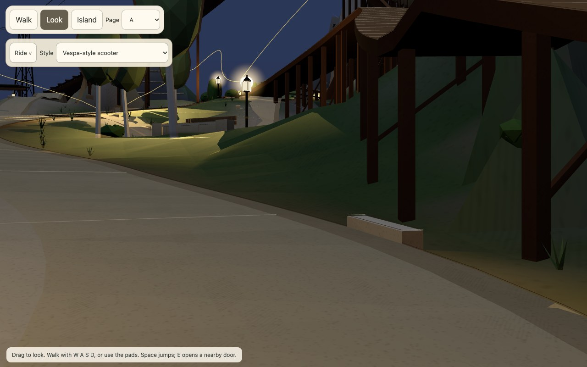

# Claude handoff: Mountain Road and Stillwater

**Prepared:** 2026-10-04  
**Purpose:** Give Claude a complete, evidence-linked continuation packet for the Mountain Road task.  
**Decision owner:** Jonathan.  
**Original request:** “build everything, make it beautiful,” followed by “finish the original task,” “finish cleanly,” a request to create a PR, and then “now finish what you were doing before.” The latest operational direction is to hand the work over cleanly; it does not convert incomplete acceptance into a pass.

## Read this first

This project has three different delivery states. Keep them separate:

| State | What is there | What it means |
|---|---|---|
| Merged repository baseline | PR #578, “Build Mountain Road and Stillwater connection,” merged at 123319dff4cfa870648e5d26272ddd6a80185554 | The main implementation and the earlier approved repairs are in GitHub main. A merge alone does not prove that a hosted deployment contains them. |
| Current follow-up | Draft PR #581: https://github.com/jonathanbeaulne123-blip/dual-ai-budget-app/pull/581. Branch codex/mountain-road-finish, HEAD 769558913bf3b1dfeb5ed3a7731338b9f1d144eb; based on origin/main 2bb45ea4ac215431c7461c46d28f35f98ecd018b. | Contains the local acceptance follow-up, evidence and fixes described below. It is not merged. |
| Hosted/live app | No deployment or hosted live verification was performed in this work. | None of PR #581’s changes are verified in the hosted app. The ordinary app will not show branch-only changes. PR #578 is merged, but its hosted deployment status was not established here. |

The active checkout is /Users/jonathanbeaulne/Documents/ChatGPT/budget app 2/.codex-work/mountain-road-book. The original user-supplied prompt is included beside this handoff as ORIGINAL_PROMPT.md. The standalone review page used for local inspection was:

http://localhost:5173/horizon-review.html?world=horizon&tier=full&shot=F&date=2026-10-01&sun=22:00&theme=classic

That URL is a local review page, not a production URL.

One correction matters to the user’s “I don’t see the lights or the changes” report: an earlier explanation said the bake added the lights. That was inaccurate. The baked baseline already had 35 Mountain Road lamp anchors and 35 associated light IDs before that bake. The local Horizon renderer capture visibly shows the lanterns and warm pools, but the capture does not prove that the latest branch is deployed. The local preview and ordinary hosted app are different environments.

## Original product objective

The original brief asks for one dependable road chain from Horizon Drive on the Prow, through the Foot, to Summit Commons and back, plus thoughtful links to nearby heights. It should work with the existing controllers for driving, riding, skating and walking; keep its surface, collision, guards, Journey map, lighting and scenery coherent; and join neighbours by a contour road where practical or a landmark bridge where necessary. The brief requires honest end-to-end evidence in both directions, across relevant modes, themes, tiers and times of day.

The explicit product constraints are:

- Budget delta: 0. Engagement delta: +2 is a target until traversal and visual acceptance are actually complete.
- No money path, command, schema, sync, Auth/RLS or Hercules payload changes.
- Mountain v2 is the native world and the same region is placed in Horizon. Native changes therefore need Jonathan’s written choice and verification in both worlds.
- No global physics change, steering assist, snapping, invisible barriers, weakened limits, or silent test exceptions.
- Keep the existing shared bridge contract; do not start a second bridge system.
- Nothing is “shipped” until merged and live deployment is verified.

The full supplied prompt is preserved in ORIGINAL_PROMPT.md. The current design record is docs/horizon/MOUNTAIN_ROAD.md, with the staged user decisions in docs/DECISIONS.md.

## Jonathan’s explicit decisions in this chat

These permissions are already recorded in the project decision log. Do not ask Jonathan to approve them again. They authorize only these measured changes; they are not proof that all final tests passed.

1. **Shared Library and Dam landings in both worlds:** approved after the shared branch ramps were measured 1.68 m and 0.69 m above the road where they merge.
2. **Awning return in both worlds:** approved to lengthen the return and move its rejoin about 16 m up the existing hairpin, keeping the main road and first rail.
3. **Original steep road grades:** retain the four inherited grade groups as named exceptions. The four audit groups have ten-metre peaks of about 14.03–15.26%; a fixed bridge has a 13.147708% audit-grid interval. No broad profile/bridge redesign was approved. These exceptions cover only those inherited grades, not new lips, gaps, collisions, route restarts or safety failures.
4. **Two folded native road frames and Awning entrance:** approved in both worlds. Fair the two frames by moving edges at most 0.665415 m while keeping centreline XYZ, heights and bridges fixed. Lower the Awning entrance’s first five rows by at most 0.251676 m while keeping its first rail.
5. **Additional folded bend:** approved in both worlds after the full-width check found another affected bend beside the Awning return. Maximum measured edge movement is 0.652967 m over a 38 m transverse fairing; preserve centreline, heights, bridges and scenery.
6. **Orchard approach:** approved in both worlds: blend the first 25.908 m of Orchard Lane, lower the first 17.936 m of its existing bridge by at most 0.361820 m, and make the bounded supporting ground cut. The junction surface movement is −0.451 m to +0.306 m. Keep the main road, its bridges, route plan positions and scenery fixed. The user’s approval noted that all 12 local rides passed; the later bridge-support clearance question remains open.
7. **Portrait framing:** redesign inherited views C/skate shelf, D/surf, F/L01 and L/Boathouse while preserving routes and scenery. This authorization is for camera framing only, not scenery relocation.
8. **Work continuation:** after asking to create a PR, Jonathan explicitly resumed the original acceptance work (“now finish what you were doing before”) and later asked to “finish cleanly.” Do not treat the earlier wrap-up checkpoint as cancellation of the resumed work.

## What was accomplished

### Main implementation in merged PR #578

PR #578 merged the first implementation checkpoint. Its scope, measured design and known limits are in docs/horizon/MOUNTAIN_ROAD.md and docs/CODEX_HORIZON_MOUNTAIN_ROAD_2.md. At a product level it:

- Publishes a continuous Prow → Foot → Summit road chain and its route/region metadata, preserving native ownership of the Mountain v2 road surface and bridges.
- Builds the fitted Foot → Stillwater → Green Road connection by grade, with a 341.094 m fitted alignment, maximum source grade 8.222%, and a 104 m lined tunnel. This is a grade/tunnel connection, not a new landmark bridge.
- Adds the approved shared landings and the longer Awning return; later user-approved native fairings and the Orchard approach are recorded as applied in the project decisions.
- Integrates road furniture, native-source stations, themed lantern fixtures, night lighting through the existing shared light system, full/lite selection, and the Journey representation.
- Adapts Horizon skating to composed-world support and destination readiness while preserving standalone Mountain v2 controller defaults and physics.
- Keeps money, ledger, Auth, sync and schema behavior out of scope.

The high-level implementation is in main, but the end-to-end acceptance criteria below remain open.

### Follow-up fixes in draft PR #581

The present branch adds/fixes the following:

- The adaptive walking-ground patch now allocates only the required local cut and expands its boundary proof only along failing edges. The served proof is 2,928 triangles, down from 4,515, with identical full/lite positions and indices.
- The collar topology repair prevents a represented face corner from being inserted twice, preserves narrow faces, and splits only at represented collinear knots. It does not snap coordinates or relax manifold, winding or error limits.
- The funicular foot-path support query now uses world-space collision vertices; renderOrigin remains a draw transform only. Candidate faces are found through a 2 m spatial index.
- Four approved portrait compositions were updated in the Horizon manifest. The baked-world checks pass all 12 landscape and all 12 portrait subjects, including visibility and horizon checks for C, D, F and L.
- The public Horizon JSON, gzip, index and Journey assets were regenerated. The focused tests, review notes, visual captures and provenance are preserved in this branch.
- Two later PR-head commits were preserved while preparing this packet: 4d4d791 adds the focused-test map used by CI and regenerates Mountain v2 data; 38d4459 makes the Mountain v2 dump portable across CPU architectures and regenerates its data. The final export check below was rerun after those changes.

These are code/asset changes in PR #581, not live application changes.

## What worked and what was verified

- On the current handoff head, the focused ground-patch and view tests passed: 8/8 in test/horizon-walking-ground-patch.test.ts and 11/11 in test/horizonViews.test.ts, 19/19 total, in 33.46 s.
- The full TypeScript no-emit check passed after fixing boundary-label type inference and adding an explicit null guard in the portrait proof. It was not rerun after the later portable-export/data commits or this documentation-only commit.
- A direct terrain bake check passed before the final rebase: terrain SHA-256 0dc23c32ca9af9d39f1719fecc5bd7b2f1017562af0f7b2c1bfa046cb44b0c76; 1,077 solids; 740 diagnostic entries; 138 planner conflicts. Treat those counts as recorded bake diagnostics, not proof of geometry-budget acceptance or a final post-rebase bake.
- The generated shared landings check passed: Library 350 vertices / 552 triangles; Awning 175 vertices / 272 triangles.
- On the current handoff head, node scripts/horizon/dump-mountain-v2.mjs --check passed: 688,628 bytes, 941 road samples and 391 course points. This verifies the regenerated exporter/data parity, not full world acceptance.
- The blind code review of the ground patch, funicular lookup and approved portrait changes found no actionable code defect in that bounded scope. It did not review or accept the full route, budget, clearance or device experience.
- A local actual-renderer Full / Classic / Night capture set on parent revision 123319d shows the Mountain Road lanterns and warm pools. It has 18 matching loaded assets, 26 matching source checks, stable source and zero reported runtime errors. One view is the closer lamp image. This is a scoped headless Chromium / SwiftShader capture, not physical-device evidence.

Capture links:

- [Mountain Road lantern close-up](../../horizon/evidence/mountain-road/after/attempts/night-review-2026-10-04/mountain-road-lamp-close.jpg)
- [Mountain-air view](../../horizon/evidence/mountain-road/after/attempts/night-review-2026-10-04/classic-full-night-review-mountain-air.jpg)
- [Library drive view](../../horizon/evidence/mountain-road/after/attempts/night-review-2026-10-04/classic-full-night-review-library-drive.jpg)
- [Stillwater drive view](../../horizon/evidence/mountain-road/after/attempts/night-review-2026-10-04/classic-full-night-review-stillwater-drive.jpg)

## What was attempted but did not work, or cannot be counted as a pass

- The pnpm bake wrapper attempted to reconcile the shared node_modules directory and failed because it had no TTY to remove it. No dependency directory was removed. Running the direct Node bake-check script succeeded.
- A full actual-served v9 walk/collision proof ran 14 ordinary walking attempts and six town ±1.3 m sweeps. It reported zero route-gating failures for those attempts, but 26 continuous-sweep contacts remain outside the original body-safe centre envelope. It also found 11 introduced canonical ground-boundary failures, 145 introduced exposed-boundary failures and 1,279 raw continuity failures (inherited plus introduced). The run detected source drift while the portrait manifest was being edited, so it is not valid final-source acceptance.
- The v9 art-clearance check found four buried funicular ribbon samples. A first attempted fix added renderOrigin to collision-space vertices, but source bounds and the renderer contract showed that collision vertices were already in world coordinates. That incorrect offset was reverted. The indexed world-space lookup is the current fix; its six tier/theme physical-clearance cases still need to run.
- A planar funicular-apron reduction passed an isolated face comparison but changed downstream canonical ground by as much as 0.2589212656 m. It was rejected and is not applied. Keep the authoritative full apron; do not reintroduce the reduction as a budget fix.
- A proposal to lower the main road further could not meet 12% while preserving fixed bridges and route positions. Jonathan chose to retain the four original grade groups as explicit exceptions.
- The successful three-view Horizon render set is from the pre-rebase parent revision. The fresh capture against revision 9e4e398 rendered Stillwater only; the Library view did not settle and mountain-air timed out. Its inventory was 1/3, so it is explicitly incomplete. The final doc-only amendment is 9bf8ce5.
- The native capture run was interrupted at Jonathan’s wrap-up request after 87 of 132 intended views. Newfoundland full overview exceeded the 45-second settling limit. Its captured inputs were checked for drift; neither that partial run nor its timeout is a pass.
- The local review initially opened at onboarding and needed a temporary, uncommitted Vite filesystem allow-list for a linked PGlite runtime. No Vite configuration change was committed.

## What remains incomplete from the original prompt

Do not report the original brief as complete. Open items include:

- A fresh, source-stable actual-served route and terrain proof on the final head, with all affected boundaries and full-width collision checks resolved.
- Full uninterrupted route evidence in both directions with real controllers and all applicable movement modes. The initial chain inventory had 5 distinct blockers, 22 major and 22 minor findings with 7 restarts; the old corridor-only audit’s 0 / 23 / 85 and zero restarts did not include the whole Mountain v2 road. The later partial walks do not replace the requested whole-chain acceptance.
- The 26 continuous-sweep contacts, 11 introduced canonical-boundary failures and 145 introduced exposed-boundary failures need disposition against unchanged criteria; do not classify them as clean just because a limited walk had no route-gating failure.
- Six-tier/theme funicular physical clearance after the coordinate fix, and the Orchard bridge-support / primitive clearance near the riding line.
- All joins and bridge ends captured and audited at rider height; final route/terrain proof and remaining guard/headroom/envelope checks for G1, the funicular, Ore Line, gates 10–12, the Crown launch, and authored view pages.
- Completed capture matrix for Classic Hearth, Taylor’s Scrapbook and Newfoundland; day/night; full/lite; rider, air and Journey. The current night set is one theme/tier/time and predates the rebase. Native authored lighting is fixed daylight; do not call it native night lighting.
- Fresh per-district geometry/draw-call budgets with the unchanged ROAD §8 limits. The recorded Lakeside solid estimate is already 33,298 full / 29,360 lite triangles before corridor art and added ground, above the 25,000 / 10,000 triangle limits; draw-call limits remain 12 per district. No budget limit was changed.
- Streaming and recovery checks, final visual comparison, the 132-view native matrix, and physical Mac/iPhone or GPU/device acceptance.
- A complete native Mountain v2 standalone walk/capture check after its approved geometry edits. The export check and local world checks do not replace that.
- Fresh CI status and a final review of the exact pushed PR head. The checks saved in the worksession are not proof that later PR status has completed.

Neighbour choices already made: Stillwater is built as the fitted grade/tunnel link. The Hollow/Green Road west route and North Face/Throat crossing remain deferred view/study options; no new viaduct, landmark bridge or flight gate was built. Shoulder remains a view/overlook study. Do not extend these without a measured fit and Jonathan’s approval.

## What Codex deliberately did not do

- Did not merge PR #581, deploy anything, write to a hosted environment, or claim live verification. The user asked for a PR checkpoint and later a Claude handoff; no deployment approval was given, and repository instructions reserve deployment for separate authorization.
- Did not redesign the whole native road or its bridges to meet 12%; the original grade findings remain named exceptions by Jonathan’s choice.
- Did not add a landmark bridge or a second bridge system, alter gates/cables/routes, or build the deferred west/north links.
- Did not change financial behavior, schema, sync, Auth/RLS, Hercules, global physics, steering, controller thresholds, collision limits, road budget caps or test acceptance limits.
- Did not ship the failed planar apron reduction, the incorrect render-origin collision offset, or any test weakening.
- Did not call a partial screenshot, headless browser pass, or bounded review “device acceptance” or “whole-route acceptance.”

## Handoff map and recommended continuation

Read these in order:

1. This packet and ORIGINAL_PROMPT.md.
2. docs/worksessions/2026-10-01-mountain-road-finish.md for the current branch’s dated status and verification details.
3. docs/horizon/MOUNTAIN_ROAD.md for the design and recorded scope.
4. docs/DECISIONS.md entries D-MR13 through D-MR27 for the exact approvals and later implementation boundaries.
5. docs/CODEX_HORIZON_MOUNTAIN_ROAD_2.md for the original draft checkpoint and retained experiments.
6. docs/horizon/evidence/mountain-road/after/LOOK.md for visual evidence and exact capture limits.
7. docs/horizon/evidence/mountain-road/after/attempts/night-review-2026-10-04/ and docs/horizon/evidence/mountain-road/after/attempts/night-review-rebased-incomplete-2026-10-04/ for successful scoped and failed/incomplete captures.
8. docs/horizon/evidence/mountain-road/after/attempts/native-capture-wrap-up-interrupted/ for the 87-view partial native matrix.
9. docs/horizon/evidence/mountain-road/proposals/ and docs/horizon/evidence/mountain-road/after/review/ for measured choices, rejected proposals and retained failure evidence.

Before editing, verify the current PR head and base, source/asset stability, and whether anything changed since this handoff. Continue the already authorized work without re-asking about the listed approvals. Keep PR #581 draft while required checks and evidence remain open. Ask Jonathan only if a genuinely new reserved native geometry, authored-view, route, bridge or deployment choice becomes necessary.
