> Current PR integration: airport #576 is merged and included in this branch. Historical references below to an absent plane controller describe the pre-airport baseline only. All three powered aircraft now exist; under-bridge aircraft acceptance remains unverified. See [integration record](../worksessions/2026-09-30-horizon-bridge-pr.md).

# The Bridge Book — ten places to meet

30 September 2026 · Local implementation in progress · Jonathan is the decision owner.

**Status: Jonathan subsequently said “build them”; the recommended cast is being implemented locally. No PR, merge, deployment or device acceptance.** The original fit sheets below retain their design intent; the current implementation and measured gaps are tracked in [the build worksession](../worksessions/2026-09-30-horizon-bridges-build.md). Geometry, rendering and Journey labels now change. Money paths do not. The drawings remain explanatory schematics; actual captures are separate evidence.

Current implementation: ten distinct structural families, shared mesh-based theme art, lantern signatures, flat meeting bays, ten baked map names/glyphs, and a fixed Bight tower stair. Quay remains seated: safe moving-span operation is not complete. Apron currently has an underslung ribbon load path with a flat carried deck; the pumpable dip is not complete. Rain shelter behavior, absent mover types and physical-device rides are not claimed. The full-depth flight test rejected the initial 24 × 8 Bight aperture; 11 × 8 fits the member mesh at the unchanged gate position. Four bounded real glider runs now pass Bight/High Span in both directions; complete authored courses and swept-wing proof remain required.

The household outcome is an island where “meet me at the Suspension Bridge” names an unmistakable place, and each crossing makes sense from the road, the water and the map. This book defines that destination while exposing where the current island cannot yet deliver the requested passage tests.

**Risk: High. Budget delta (5): 0. Engagement delta (3): +2 target; local landmark implementation; engagement acceptance remains a target.**

## 1. Verified starting point

Repository `jonathanbeaulne123-blip/dual-ai-budget-app`, branch `codex/horizon-bridge-book`, base/head `e77309efbc48a76e8328f2b427613ecc6082bb61` (#575). The app worktree tool failed because the chat directory is not a Git repository; this separate manual worktree was created from the fetched exact main in the existing local Git repository. No other checkout was edited.

Main CI is red: [test job](https://github.com/jonathanbeaulne123-blip/dual-ai-budget-app/actions/runs/36668086911/job/109736975882), 82 passed / 1 failed in `app-startup-p1.test.ts`, “Missing Bianca Month income Start”. The fixture pin has not landed. It is outside this task and unchanged. Five other check runs succeeded. This proposal does not turn that red baseline into approval.

The [measured inventory](evidence/bridges/INVENTORY.md) covers16 current structure records and retains query witnesses. The fresh [road audit](evidence/bridges/before/road-audit/AUDIT.md) reproduces **0 BLOCKER / 23 MAJOR / 85 MINOR, 0 restarts**, in 166.8 seconds on this machine. The bridge audit is a separate bounded ground-controller baseline; incomplete probes are not automatically geometry defects. Full multi-mode acceptance remains open. Ground results:34 end-reached-unverified,40 incomplete-probe,22 not-applicable. Sixty actual Journey baseline images cover ten sites at Region/Stop in all three themes; these are current generic bridge renderings, not proposed glyphs. The local High quick gate exceeded its time budget during typecheck and is not green.

Read together: [ROAD](ROAD.md), [CONTRACT](CONTRACT.md), [STYLE](STYLE.md), [road handoff](../CLAUDE_HORIZON_MAIN_ROAD.md), [before LOOK](evidence/bridges/before/LOOK.md). Source dimensions below come from `land/structures/build.ts` and the current manifest. `clear` input metadata must never be relabelled measured clearance.

## 2. Proposed decisions BRIDGES/D-B1 onward

| ID | Proposal / rule | Status and owner |
|---|---|---|
| BRIDGES/D-B1 | One deterministic BridgeDefinition generates all bridge consumers; no parallel hand-drawn collision or map geometry. | Required by brief; implementation after approval |
| BRIDGES/D-B2 | Every landmark has one structural family and everyday picture name. Preserve internal structure IDs. | Proposed cast; Jonathan |
| BRIDGES/D-B3 | Bight Suspension is the sole Phase 2 exemplar; keep existing deck/route positions while fitting towers and anchorages around envelopes. | Brief requires stop before exemplar |
| BRIDGES/D-B4 | Recommend twin bascule at Quay over swing; call it Drawbridge if chosen. No moving collision is authorized. | Jonathan's written choice required |
| BRIDGES/D-B5 | Preserve gate3 and its 40×12 aperture; compare outboard/above-deck arch ribs before considering gate relocation. A below-deck arch is not yet shown to fit. | Jonathan: architecture/flight experience tradeoff |
| BRIDGES/D-B6 | Gate5 needs an explicit fitted aperture. Retain its centre initially; never accept the default aperture crossing water/deck. | Jonathan approves any gate change |
| BRIDGES/D-B7 | Replace candidate Rope Bridge with Cantilever Walk: rope handrails, cantilever load path. | Jonathan; resolves suspension duplication |
| BRIDGES/D-B8 | Garden Bridge needs a narrow STYLE planting exception and a width study from3.2 to5.6eu. | Jonathan; do not widen yet |
| BRIDGES/D-B9 | Use emissive cards within the existing6/2 road point-light pool; add no lights. Existing D-R3 remains owed. | Jonathan confirms D-R3; not silently resolved |
| BRIDGES/D-B10 | No rain promise, real-time reflection, moving rail, or decorative invisible barrier. | Baseline capability/STYLE constraint |
| BRIDGES/D-B11 | Preserve routes, cameras, financial stops, saved-position and partner payloads. List every proposed exception separately. | Required by brief |
| BRIDGES/D-B12 | Journey gains ten individual glyphs, names and Region-tier findability derived from definitions; minor connectors remain unnamed quiet kit. | Future implementation, no map change yet |
| BRIDGES/D-B13 | Real-controller gaps are separate dependencies. Geometric sampling cannot pass absent ferry/row/plane/zip simulations. | Acceptance rule |
| BRIDGES/D-B14 | Keep all existing road handover tolerances:0.02eu surface,0.25eu axis,0.05eu road lip. The0.48eu walking step limit cannot weaken them. | Acceptance rule |
| BRIDGES/D-B15 | Keep minor connectors as plain beam/slab bridges, neutral timber/stone and no landmark night motif. Retired S1 flyover is excluded. | Proposed kit |

These IDs are local to BRIDGES.md (fully qualified as BRIDGES/D-B1 etc.). They do not replace the existing D-B1–D-B13 in horizon/DECISIONS.md.

## 3. Cast and fit sheets

All heights use world y and all dimensions use eu (full scale). Each meeting spot is a **proposed** flat3×3eu standing bay outside traffic, with a lit approach, visible guard at drops, and two0.3-radius standing bodies plus circulation. No exact meeting anchor is approved until surface, grade, clearance and view probes pass. A name alone is not a safe anchor.

Budgets below are **proposed incremental ceilings, full/lite**, including the named landmark across all its resident chunks; they are not measured runtime calls or permission to exceed district limits. Drawings are not to scale; the generic plan/section communicate corridor and bay separation, not a fitted final section.


### Suspension Bridge · Bight lagoon mouth

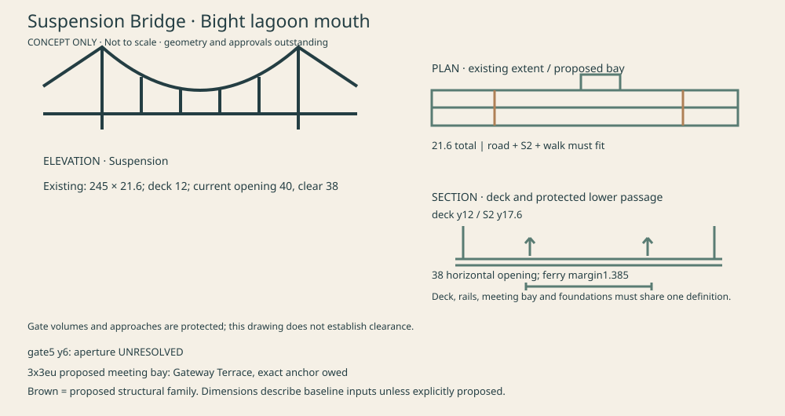

**Purpose:** The island gateway: coastal Drive, walking and boards share a crossing that announces the lagoon. **Existing fit inputs:** 245 × 21.6; deck 12; current opening 40, clear horizontal width 38. **Proposed architecture:** Two towers, a main cable necklace and hangers; tower foundations and cable anchor blocks stay outside the current navigation opening. **Signature feature:** Tower stair and lookout; retain an accessible meeting terrace at deck level.

| Passage | Declared design intent | Proof state |
|---|---|---|
| Over | V01 road/board/bicycle/walk; S2 flyover | Ground audit report; not all modes accepted |
| Under / through / nearby | FERRY alignment and gate 5 beneath the deck; both controllers absent | Keep deck y12 and S2 y17.6: existing S2 diagnostic is exactly 5.0/5.0. Baked ferry hull lateral margin 1.385 eu is a geometry result, not a sailed test. Gate5 at y6 has no explicit aperture; nominal default y−2…14 crosses water and deck. |
| Meeting | Gateway Terrace, off-line3×3eu bay | Exact anchor, grade, approach and two-body proof owed |

**Night:** Cable necklace, warm pinpoints on the towers. **Map glyph:** Two towers with a sagging cable, with the everyday name at Region tier. **Budget:** 18000 / 7000 triangles; ≤8 / 5 added calls. **Views to compare:** B; island skyline.

| Classic Hearth | Taylor’s Scrapbook | Newfoundland |
|---|---|---|
| Honey timber deck, brass shoes, warm stone anchor blocks | Layered card towers, stitched cable line and translucent paper lantern tabs | Weathered plank, granite anchor blocks, dark iron cable clamps and storm lanterns |


### The Arch · High Span gorge

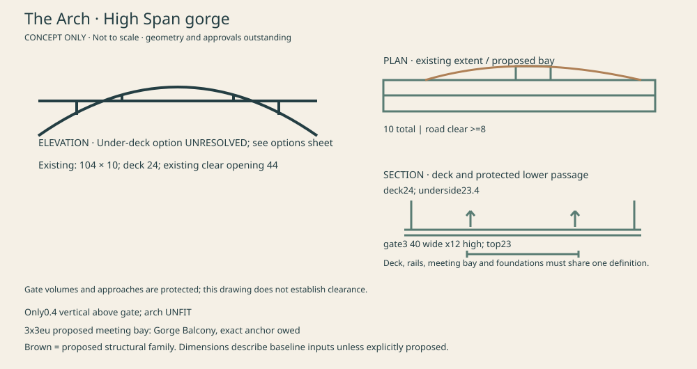

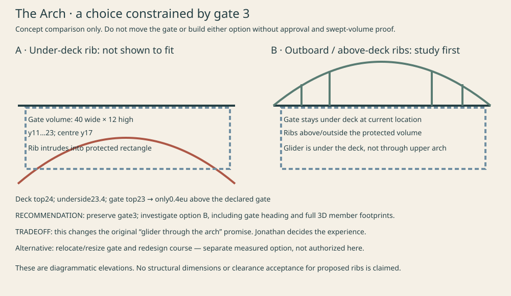

**Purpose:** The gorge crossing, with a place to watch the glider descend from the dam. **Existing fit inputs:** 104 × 10; deck 24; existing horizontal opening input 44. **Proposed architecture:** Study a through arch with above-deck/outboard ribs while retaining gate3. Keep foundations on gorge walls. The first sheet shows the unresolved under-deck alternative; the comparison sheet shows the recommended study. Neither is a cleared3D fit. **Signature feature:** Crown balcony outside the travel lanes.

| Passage | Declared design intent | Proof state |
|---|---|---|
| Over | VG road/board/bicycle/walk | Ground audit report; not all modes accepted |
| Under / through / nearby | Gate3 plane/glider below; river beneath | Gate3 40 × 12 at [1240,17,1095] ends at y23; deck underside23.4 leaves only0.4. Do not approve a conventional under-deck arch here. Compare outboard/above-deck ribs retaining gate against a moved gate; recommend retain gate and accept that glider is under the arch-supported deck, not through its upper opening. |
| Meeting | Gorge Balcony, off-line3×3eu bay | Exact anchor, grade, approach and two-body proof owed |

**Night:** Two lit arch ribs. **Map glyph:** Single large arch, with the everyday name at Region tier. **Budget:** 12000 / 5000 triangles; ≤6 / 4 added calls. **Views to compare:** A and C; gate3 option.

| Classic Hearth | Taylor’s Scrapbook | Newfoundland |
|---|---|---|
| Warm dressed-stone springings, bronze rib edges | Layered cut-card rib, visible paper gussets | Split granite springings with riveted iron rib |


### Drawbridge · Quay river mouth

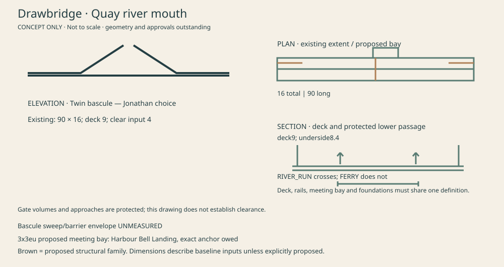

**Purpose:** The harbour front door and a visible signal that boats and people share the waterfront. **Existing fit inputs:** 90 × 16; deck 9; clear input 4. **Proposed architecture:** Two hinged leaves with machinery houses at banks. Swing option consumes a central pivot footprint in the channel. **Signature feature:** A bell and scheduled opening only after movement authority and safe occupancy logic are approved.

| Passage | Declared design intent | Proof state |
|---|---|---|
| Over | V01 road/board/bicycle/walk | Ground audit report; not all modes accepted |
| Under / through / nearby | RIVER_RUN rowing/canoe alignment; current FERRY does not pass here | Static underside8.4 from deck9 and0.6 slab. Declared clear4 is not measured air draft. Recommend twin bascule over swing, but keep deck fixed until written choice; ferry relocation is a separate decision. Queue/barrier lengths and open angle await swept-envelope design. |
| Meeting | Harbour Bell Landing, off-line3×3eu bay | Exact anchor, grade, approach and two-body proof owed |

**Night:** Bank lanterns and quiet red/green signal cards. **Map glyph:** Two raised leaves, with the everyday name at Region tier. **Budget:** 14000 / 6000 triangles; ≤8 / 5 added calls. **Views to compare:** L: existing abutment already hides3 px of Boathouse.

| Classic Hearth | Taylor’s Scrapbook | Newfoundland |
|---|---|---|
| Stone machinery houses and brass balance details | Folded paper leaves, stamped machinery panels | Clapboard machinery houses and galvanized fittings |


### Ribbon · Dam apron

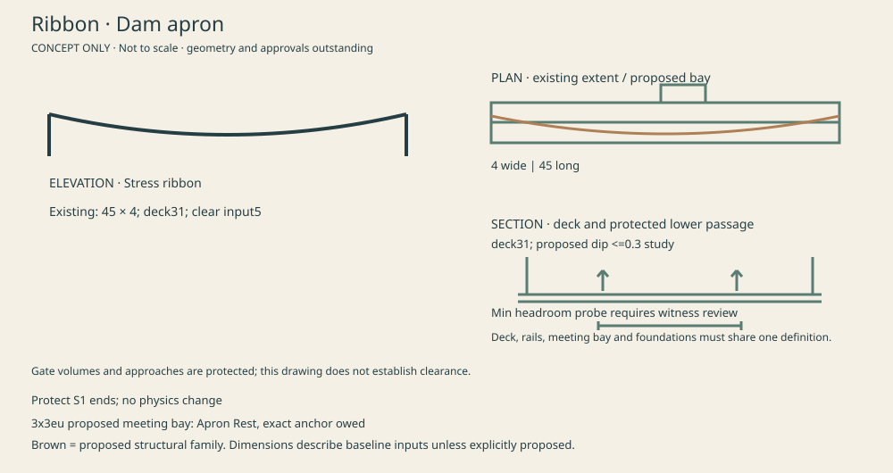

**Purpose:** A crossing whose shallow dip makes the board ride memorable. **Existing fit inputs:** 45 × 4; deck31; clear input5. **Proposed architecture:** A continuous stressed ribbon between rock anchorages; no suspension towers or second main cable. **Signature feature:** A pumpable dip and one deliberately authored grind edge.

| Passage | Declared design intent | Proof state |
|---|---|---|
| Over | S1 board and walk | Ground audit report; not all modes accepted |
| Under / through / nearby | River below; damRun approach nearby, not an assumed crossing | Keep end levels fixed. A dip reduces clearance by its full amplitude: propose ≤0.3eu study only, and reject it if any envelope fails or existing controller cannot climb both directions. Fixed collision; no global physics changes. |
| Meeting | Apron Rest, off-line3×3eu bay | Exact anchor, grade, approach and two-body proof owed |

**Night:** Thin lit deck edge. **Map glyph:** One shallow dipping stroke, with the everyday name at Region tier. **Budget:** 6000 / 2500 triangles; ≤4 / 3 added calls. **Views to compare:** Dam approach and gate4 vicinity.

| Classic Hearth | Taylor’s Scrapbook | Newfoundland |
|---|---|---|
| Pale concrete ribbon, bronze fascia rail | Bent laminated card and scored end shoes | Slate-grey ribbon with weathered hardwood coping |


### Covered Bridge · Hollow garden

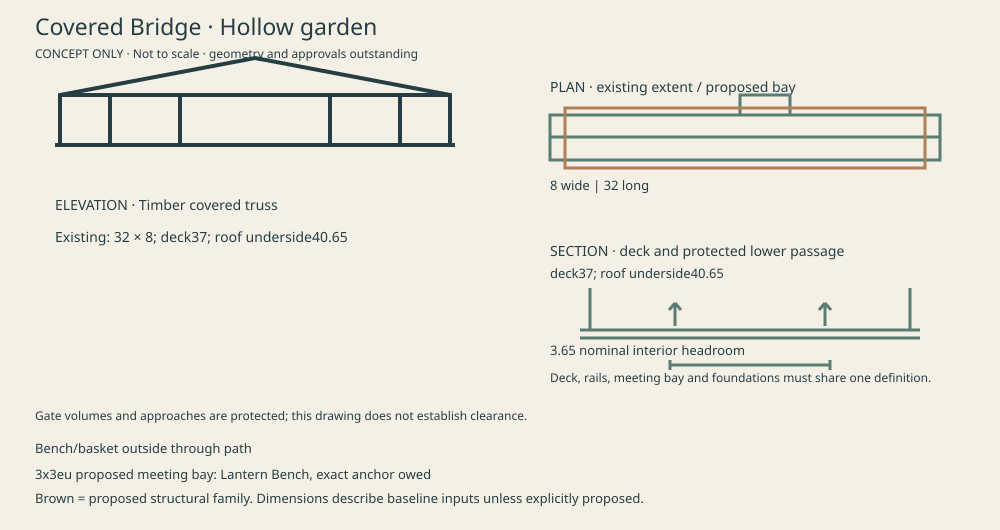

**Purpose:** A sheltered meeting place along the Garden Walk. **Existing fit inputs:** 32 × 8; deck37; roof underside40.65. **Proposed architecture:** Roofed timber truss with windows; posts and truss diagonals outside passage. **Signature feature:** Bench and ninth disc basket in separate safe bays; no basket in the through lane.

| Passage | Declared design intent | Proof state |
|---|---|---|
| Over | Walk; bicycle suitability audited separately | Ground audit report; not all modes accepted |
| Under / through / nearby | Ground beneath; S4 rail challenge must be measured independently | Roof headroom3.65 above deck. There is no Horizon rain system on this revision: physical roof exists, dry-in-rain behavior remains owed. Basket occupancy must not obstruct two standing bodies. |
| Meeting | Lantern Bench, off-line3×3eu bay | Exact anchor, grade, approach and two-body proof owed |

**Night:** Lantern-lit window rhythm. **Map glyph:** Gabled covered tunnel, with the everyday name at Region tier. **Budget:** 10000 / 4000 triangles; ≤6 / 4 added calls. **Views to compare:** Hollow garden views.

| Classic Hearth | Taylor’s Scrapbook | Newfoundland |
|---|---|---|
| Pegged honey timber and shingled roof | Deckled roof tiles, taped frame joints, vellum windows | Weathered clapboard, plank floor, storm lanterns |


### Stone Bridge · Mountain town canal

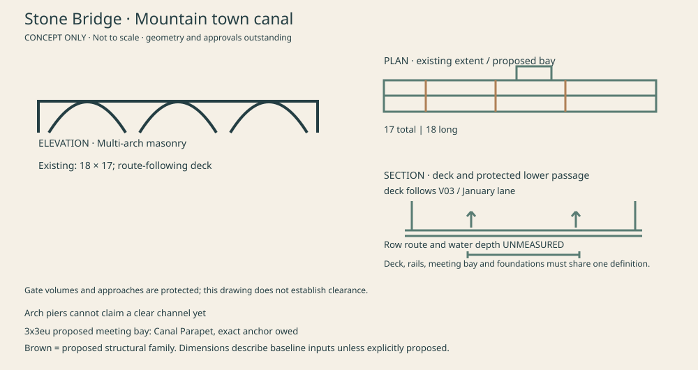

**Purpose:** The old town crossing, joining road and January walking lane. **Existing fit inputs:** 18 × 17; route-following deck. **Proposed architecture:** Several short masonry arches over the channel; piers cannot be placed before water-depth/width measurement. **Signature feature:** Arch circles suggested in the water by existing reflection-card language.

| Passage | Declared design intent | Proof state |
|---|---|---|
| Over | V03 road/board/bicycle and Year Walk | Ground audit report; not all modes accepted |
| Under / through / nearby | Canal below; G1 nearby, overhead crossing not established | No authored row centreline through this canal. Current17eu width includes the January lane. Water connectivity, depth, arch width and G1 swept separation are unverified. No real-time reflection proposal. |
| Meeting | Canal Parapet, off-line3×3eu bay | Exact anchor, grade, approach and two-body proof owed |

**Night:** Lit intrados edges. **Map glyph:** Three small arches, with the everyday name at Region tier. **Budget:** 9000 / 4000 triangles; ≤6 / 4 added calls. **Views to compare:** Mountain placed-region authority.

| Classic Hearth | Taylor’s Scrapbook | Newfoundland |
|---|---|---|
| Warm voussoirs and dressed coping | Stacked stone-shaped card, pencilled joints | Split granite voussoirs and rough coping |


### Cantilever Walk · Prow cliff loop

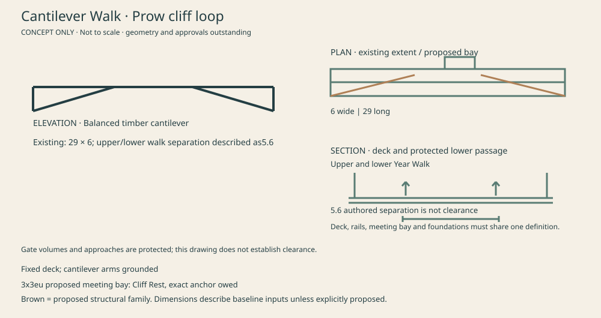

**Purpose:** A cliff-edge pedestrian crossing that reveals the lower Year Walk. **Existing fit inputs:** 29 × 6; upper/lower walk separation described as5.6. **Proposed architecture:** Two opposing timber cantilevers hold a short centre span; rope is a handrail, not a second suspension bridge. **Signature feature:** A narrow centre lookout with optional cosmetic rope sway; walking collision remains fixed.

| Passage | Declared design intent | Proof state |
|---|---|---|
| Over | Year Walk upper pass | Ground audit report; not all modes accepted |
| Under / through / nearby | Lower Year Walk; Prow zip launch nearby only | Proposed replacement for Rope Bridge to preserve unique structural typologies. No deck/camera sway by default; optional sway needs reduced-motion treatment and must not misrepresent collision. Actual lower-lane clearance must be sampled, not copied from5.6 separation. |
| Meeting | Cliff Rest, off-line3×3eu bay | Exact anchor, grade, approach and two-body proof owed |

**Night:** Warm end lanterns and sparse centre markers. **Map glyph:** Two reaching arms, with the everyday name at Region tier. **Budget:** 6000 / 2500 triangles; ≤4 / 3 added calls. **Views to compare:** Prow cliff views and zip vicinity.

| Classic Hearth | Taylor’s Scrapbook | Newfoundland |
|---|---|---|
| Pegged timber arms, braided handrails | Layered paper brackets, stitched handrails | Weathered cantilevers with fishing-rope fittings |


### Trestle · Working Bight spur

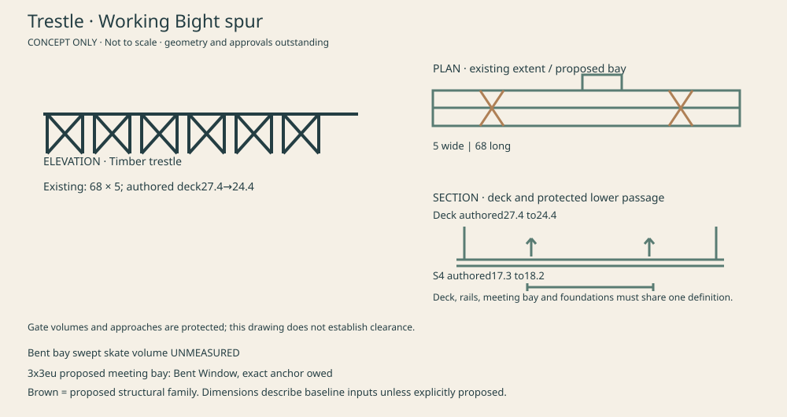

**Purpose:** Carries the spur while leaving deliberate routes between working timber bents. **Existing fit inputs:** 68 × 5; authored deck27.4→24.4. **Proposed architecture:** Repeated cross-braced bents; every footing reaches ground. **Signature feature:** S4 threads a specifically measured bent bay.

| Passage | Declared design intent | Proof state |
|---|---|---|
| Over | VBS road/board/bicycle/walk | Ground audit report; not all modes accepted |
| Under / through / nearby | S4 beside/below at authored17.3–18.2 | Retain fascia board rail0.25–0.95 above deck and road end handovers. The road audit names the S4 south-end verge issue; do not disguise it as an accepted skate-through passage. |
| Meeting | Bent Window, off-line3×3eu bay | Exact anchor, grade, approach and two-body proof owed |

**Night:** Alternating frame-lit bents. **Map glyph:** Repeated X-braced supports, with the everyday name at Region tier. **Budget:** 10000 / 4500 triangles; ≤5 / 3 added calls. **Views to compare:** Bight neighbourhood.

| Classic Hearth | Taylor’s Scrapbook | Newfoundland |
|---|---|---|
| Honey timber, pegged cross braces | Layered card bents with visible paper pins | Salt-grey timbers and iron straps |


### Garden Bridge · Garden Walk over Green Road

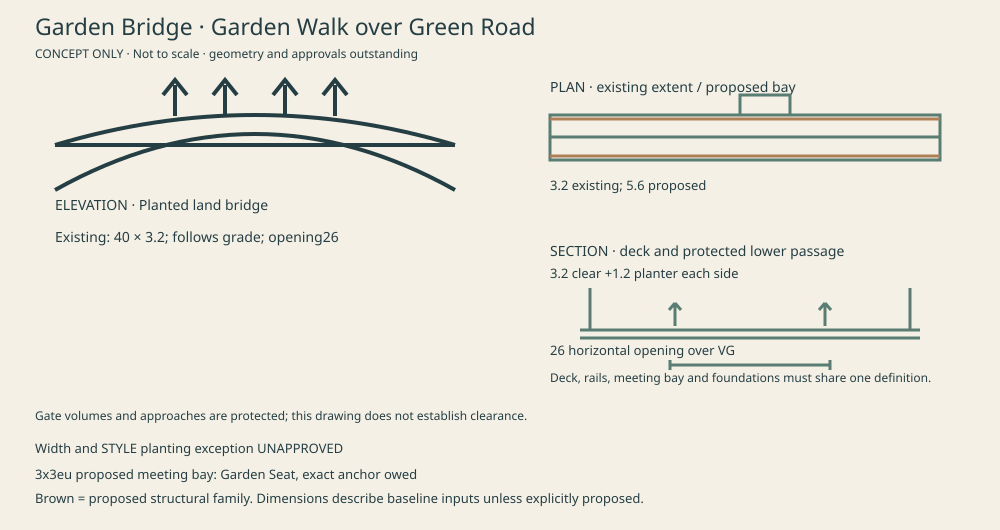

**Purpose:** Carries a continuous garden walk across the road. **Existing fit inputs:** 40 × 3.2; follows grade; opening26. **Proposed architecture:** A shallow rigid-frame planted overpass, with bank-integrated legs and a continuous deck beam; contained beds outside the unobstructed walking section. **Signature feature:** Road users pass beneath a garden canopy.

| Passage | Declared design intent | Proof state |
|---|---|---|
| Over | Garden Walk | Ground audit report; not all modes accepted |
| Under / through / nearby | VG traffic and May/September walking lanes below | Current3.2eu deck cannot hold a3.2eu clear walk plus meaningful beds. Proposed5.6eu width =3.2 clear +1.2 beds each side; widening requires new abutment/fill/view measurements. STYLE forbids planting on bridges: explicit narrow exception required. |
| Meeting | Garden Seat, off-line3×3eu bay | Exact anchor, grade, approach and two-body proof owed |

**Night:** Low garden-edge lanterns. **Map glyph:** Green crown over a road void, with the everyday name at Region tier. **Budget:** 10000 / 4000 triangles; ≤6 / 4 added calls. **Views to compare:** Green Road sightlines.

| Classic Hearth | Taylor’s Scrapbook | Newfoundland |
|---|---|---|
| Stone planter walls and planted pockets | Raised paper beds with cut foliage | Granite beds with coastal shrubs |


### Boardwalk · Reach meadow water edge

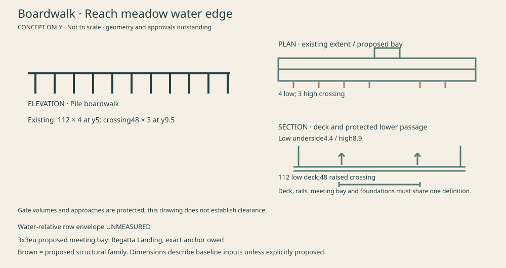

**Purpose:** A calm edge to the regatta meadow, with a raised crossing. **Existing fit inputs:** 112 × 4 at y5; crossing48 × 3 at y9.5. **Proposed architecture:** Low repeated piles follow the bank; higher crossing remains visibly part of the same landmark. **Signature feature:** Regatta watching landing outside the through route.

| Passage | Declared design intent | Proof state |
|---|---|---|
| Over | S1 boardwalk and walk reach crossing | Ground audit report; not all modes accepted |
| Under / through / nearby | Rowing alongside; proposed underpass only at raised crossing | Low boardwalk underside4.4; high crossing underside8.9. These absolute heights are not water-relative clearances. Row controller absent and continuous water corridor/required air draft unverified. |
| Meeting | Regatta Landing, off-line3×3eu bay | Exact anchor, grade, approach and two-body proof owed |

**Night:** Low landing lanterns, sparse pile glows. **Map glyph:** Low pile line with one raised crossing, with the everyday name at Region tier. **Budget:** 8000 / 3500 triangles; ≤5 / 3 added calls. **Views to compare:** Reach meadow.

| Classic Hearth | Taylor’s Scrapbook | Newfoundland |
|---|---|---|
| Honey plank with brass edge studs | Overlapping paper planks and washi landing marks | Silvered planks and rope-edged lookout |


## 4. Minor family and current inventory corrections

The plain family includes sea-stair lane bridges14×5.4 and16×5.4, S1 inflow12×5, inflow footbridge10×3.2 and Timber Crossing20×3. Their supports and rail collision are still real. Do not borrow suspension towers, arch necklaces, covered roofs or drawbridge signals. Keep gallery, road tunnel and dune culvert unchanged. Current S1 flyover and Inlet Footbridge are retired, not current baseline bridges.

Bight’s current opening is40 at s103–143, clear horizontal width38. The36 at s98–134 still appears in historical nested manifest data/comments and must not drive new design. Bight deck is245×21.6 at y12; S2 flyover is y17.6. Hollow is32m long. Quay’s ferry passage is hypothetical: RIVER_RUN crosses it, FERRY does not. Mountain canal rowing is also a proposed route, not an existing authored centreline.

## 5. Passage contracts and mover reality

| Mode | Baseline implementation | Bridge acceptance needed |
|---|---|---|
| Feet | Inline runtime move/step; browser simulateWalk/simulateMotion | Both deck directions and all approach/meeting paths through that runtime |
| Board | createBoardController / stepGround | Deck runs plus S2/S4 actual grind/line cases; no substituted physics |
| Bicycle | createBicycleController using its own profile | Both directions, legal surface and braking/headroom |
| Vespa / Harley | Same stepCruiser physics, different skins | Both directions and keep-right; existing road audit covers full roads |
| Glider | createGliderController + gliderEnvFor | Gate swept volume and feasible energy/launch for each direction; reverse course is not automatically feasible |
| Gondola / funicular | createCableRide | Swept cabin envelope; kinematic motion does not demonstrate obstacle response |
| Monorail | HorizonMonorail / advanceMonorail / transportPoint | Rail route proximity and swept train envelope; do not invent bridge track |
| Ferry / rowboat / plane / zip | No registered Horizon controller found at this SHA | NOT IMPLEMENTED; cannot satisfy requested real-simulation tests in this bridge-only stage |
| Kayak / dinghy / motorboat / yacht | Real fleet createFleet/step | Separate optional passage tests; never renamed ferry/rowboat |

Fleet current physical inputs: kayak1.2×4.6, draft0.18, air draft1.45; dinghy1.9×3.8, draft0.28, air draft1.7; motorboat2.4×5.8, draft0.42, air draft1.9; yacht14×44, draft1.3, air draft10.1. Proposed passage margin0.5eu above air draft and each hull side must be approved/fitted; existing ferry diagnostic uses its own manifest hull. Water depth must exceed draft plus a declared margin through the whole route, not merely at one bridge sample.

**Board access conflict:** the current BOARD_PROFILE permits skate/park/pad beds, not road/walk beds. Road-deck probes commonly fade back for that reason. Providing board access requires authored skate beds and connected approaches within each bridge definition; do not change the global profile. High Span’s10eu deck cannot simply promise an8eu road plus a separate4eu skate lane. Treat that as an unresolved section/width choice, with road/board coexistence not yet accepted. Bicycle likewise has profile restrictions; a geometric deck alone does not grant mode access.

Existing glider journey tests use a documented flat-ground convention for several paths and separately expose terrain/wind failures. Passing those tests cannot substitute for this brief’s whole baked-world bridge replay; the new audit must use gliderEnvFor against the runtime geography.

Each passage record must include route/controller identity, intended direction, world-space swept hull/body, width/height/depth required, safety margins, measured minima and witness coordinates/solid IDs. Emit explicit failed/unsupported/unmeasured results; never green by omission. A nearby gate, line, boat or rail is not a passage through the bridge.

Walking body contact bands0.2/0.65, height1.25, radius0.3; cruiser uses its own mounted envelope. Measure visible rails at their actual height, fascia mounting, ramped/flare ends and view-ray exclusion. Minimum structural deck thickness0.6, walk platforms0.35, footing sink0.2, grounded-object gap≤0.02. Check retained ground under every footing and honour Mountain v2 ground authority.

## 6. Proposed BridgeDefinition and shared environment

Extend CONTRACT §4 and the runtime type **in Phase 2**, beside `corridors`, only after this book is accepted. This document does not alter today's contract to pretend the field exists.

```ts
interface BridgeDefinition {
  id: string; everydayName: string; siteName: string; typology: string;
  districtIds: string[]; // one allocation per resident district; no duplicated budget
  deckStations: BridgeStation[]; // xyz, tangent, section, grade, cross-fall
  members: BridgeMember[];      // stable id, visible mesh recipe, footprint, support chain
  passages: ClearanceEnvelope[]; // mode/route, swept shape, directions, requirements
  approaches: BridgeHandover[]; // owning bed, station limits, lap and edge ownership
  lights: BridgeLightAnchor[];  // no extra dynamic light pool
  meeting: BridgeMeetingSpot;   // xyz polygon, clear route, level/guard diagnostics
  map: BridgeMapGlyph;          // silhouette recipe + Region label anchor
  budgets: BridgeBudget;        // district allocations, full/lite
}
```

The named helper `bridgeEnvironment(cuts, terrain, placedRegions, routes)` supplies the exact same final terrain, water, route, bed, corridor, gate, view and destination inputs to bake and tests. Deterministic IDs, ordering and rounding; no wall clock or randomness. Definitions generate deck solids, barriers, collision, art, light anchors, Journey glyphs and probes. A structure owns its deck and rail; corridor only fills truly bare edges at the handover. Foundations are solved against the actual terrain and pad exclusions, never hidden by a covering mesh.

Tests must assert each declared envelope and preserve reasons beside changed measures. Baked diagnostic IDs should be `bridges.<id>.<passage>.<dimension>` with measured/required and witness. Byte equality must cover full bake plus Journey slim output. Meeting spots are world anchors only: no saved-body, partner or Hercules contract change.

## 7. Views, budgets and name acceptance

A/B/C must be compared before accepting Bight/High Span architecture. L has an existing3px Boathouse loss from the Quay abutment: repair support geometry before proposing a camera move. No changed camera, ferry route, gate, course or STYLE rule is approved by this book.

Full/lite district limits remain150k/60k triangles, screen400/180 calls, target60/30fps. Journey L0 stays40k/25k triangles and60/40 calls. Road’s own allowance remains25k/10k triangles and12 calls per district; bridge allocations must fit total headroom. Baked solid triangle counts exclude runtime art, region and resident overlap. Whole-scene draw counts are not per-district counts. Actual bridge-district draws and device frame pacing remain an acceptance gate.

A fresh blind reader received only ten names and one sentence each ([transcript](evidence/bridges/design/NAME-TEST.md)). With the descriptive sentences supplied, it restated the cast correctly but found “Lift Bridge” suggests a vertical lift; hence proposed “Drawbridge” for bascule. Arch/Stone need single monumental rib versus several little masonry arches. This is one name-test pass, not silhouette or implementation acceptance.

64px silhouette pairing,200eu day/night approaches in all three themes, actual Region-tier find-by-name and two-body meeting tests remain owed after exemplar geometry exists. The SVG sketches cannot pass those render-based tests.

## 8. Phase sequence and stops

1. Finish/corroborate Phase0: capture every crossing from rider, water, air and actual Journey map; finish implemented-controller passages and actual per-district counters. Keep missing controllers and probe failures visible.
2. Jonathan reviews this book and decides D-B4–D-B9 and view/STYLE options. **Stop: no exemplar implementation in this stage.**
3. Build only Bight Suspension end to end after authorization. It establishes one definition, three dressings, envelopes, night, map, handovers and evidence. Stop for Jonathan’s look and optional phone ride.
4. Rest in dependency order: High Span; Quay after movement choice; Hollow/Garden; Apron/Prow; Canal; Trestle/Reach. One PR per bridge or close pair, independent blind review before opening.

Every implementation PR runs the High focused quick gate; every horizon*, journey-*, harbour-world-toggle, harbour-source-fences and harbour-walk* file individually; typecheck; horizon:bake then byte-exact horizon:check; before/after road and bridge audits; authored-view proofs; responsive320/390/720/~1100 UI checks. A timeout is not a pass. No full/exhaustive lane without the repo-required explicit instruction. No PR, merge, deploy or live verification is claimed here.

## 9. Owed list and next owner

**Jonathan:** twin bascule versus swing (recommended twin bascule); High Span arch/gate tradeoff; explicit gate5 aperture changes; Cantilever Walk replacing Rope; Garden planting/width exception; view changes, if any; D-R3 pool and D-R4 palms. No moving collision before written choice.

**Codex:** finish remaining Phase0 captures, walking/flight/cable/boat measurements and probe corroboration; resolve all baseline unknowns before exemplar acceptance; authored-view comparisons and actual district budgets; then implement only the approved exemplar. Missing ferry/rowboat/plane/zip controllers require a separately scoped implementation decision, not invented evidence.

**Carried road debt:** pageL Boathouse, Tideline frontage, Crown Lookout landing, lamp-post colliders, real district budget and device ride. Rain shelter behavior remains owed until weather exists. Physical Mac/iPhone, accessibility, lite performance and visual acceptance remain Jonathan/device-owner gates.

Local branch only. No source-world behavior, financial, command, schema, sync, Auth/RLS, payload, deployment, hosted or Production change. Next owner for design choices: Jonathan; next owner for outstanding measurement: Codex.

Verification note: High quick gate finished `quick-gate-failed; time-budget-breached`,609.826s total. Typecheck was terminated at593.639s after the300s budget breach; no typecheck or focused-test pass is claimed. Diff check and AI-surface check passed. Exact evidence: `docs/horizon/evidence/bridges/before/verification/quick-gate.json`.

Walking baseline completed:32 real-runtime direction checks across16 structures;26 destinations reached pending path/envelope review,4 no-route (Apron/Reach Footbridge),2 incomplete (Timber Crossing). Detailed per-structure matrix: `docs/horizon/evidence/bridges/before/CONTROLLERS.md`. No full passage acceptance is inferred.

Final capture evidence:10 corrected carried-deck views;60 Journey Region/Stop images across three themes;8 road approaches. The19-frame site-view run failed before completing water/air coverage, with an original Hollow angle rejected. Corrected Quay/Garden whole-scene calls692/774 exceed the400 cap. See LOOK and the stage handoff; all evidence is local headless and Phase0 remains partial.
