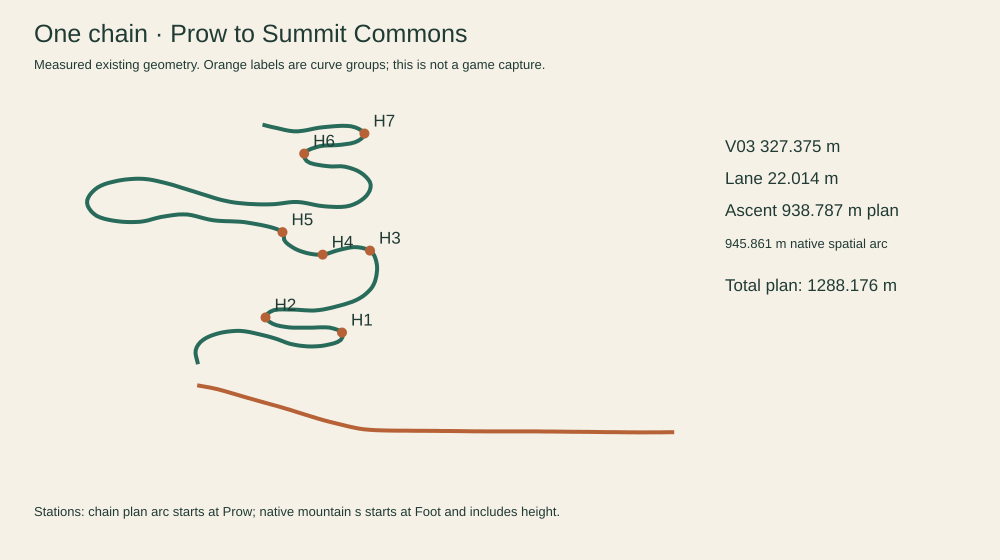
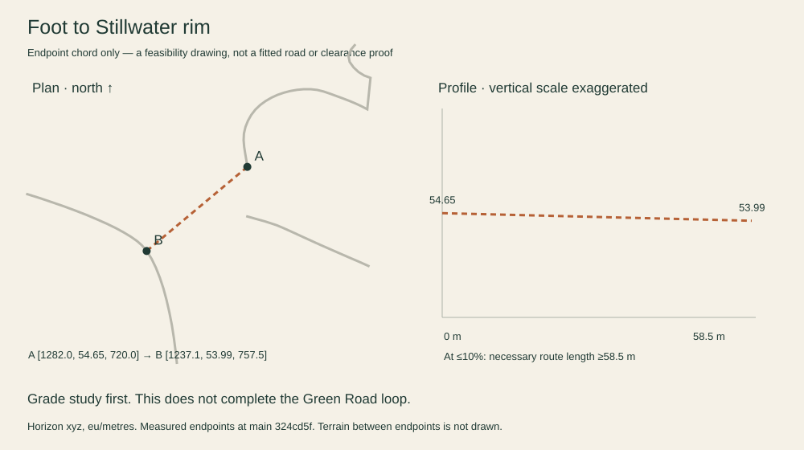
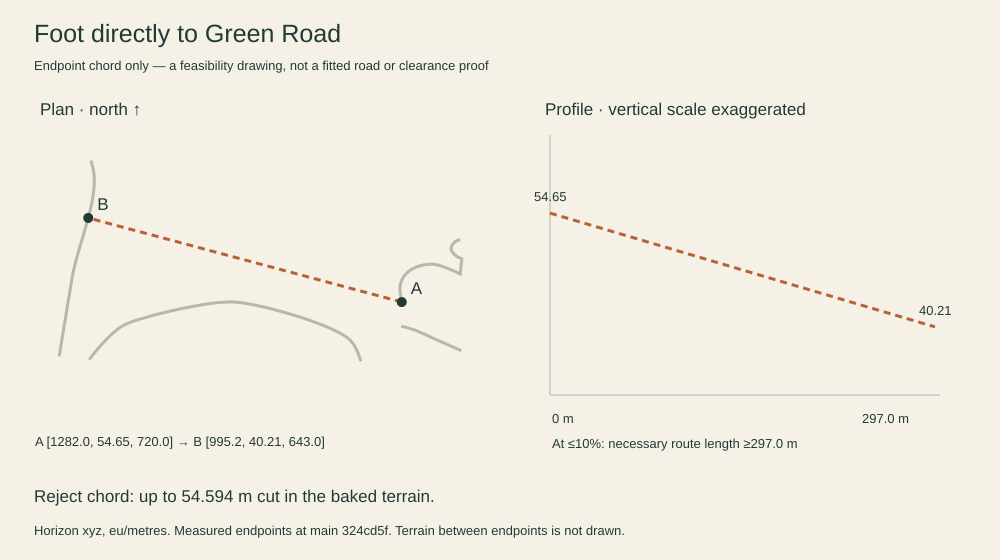
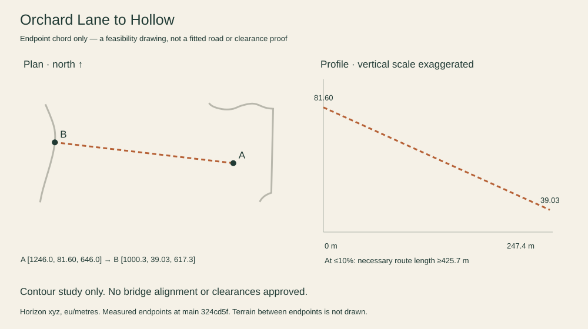
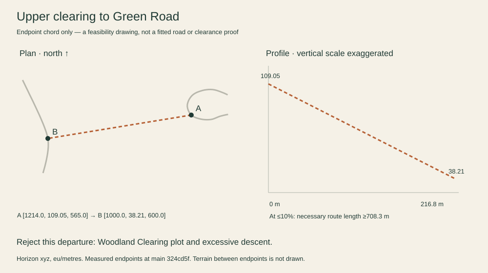
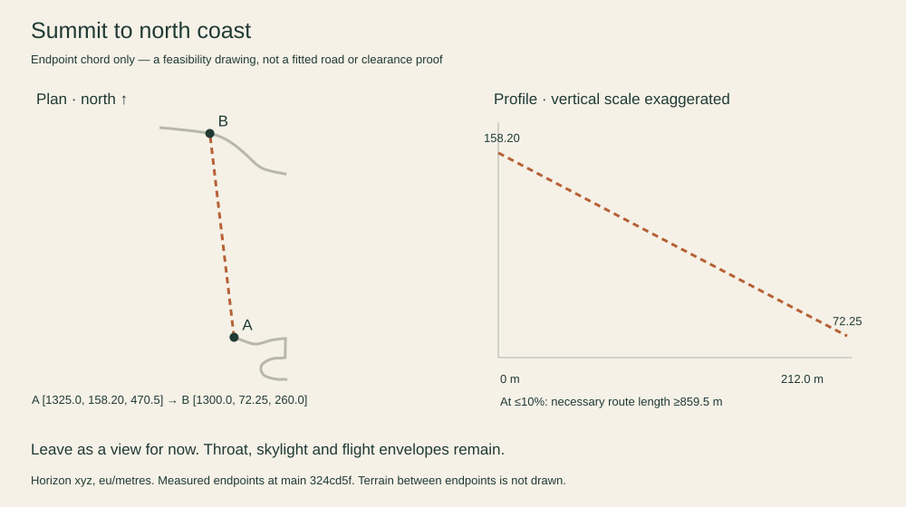
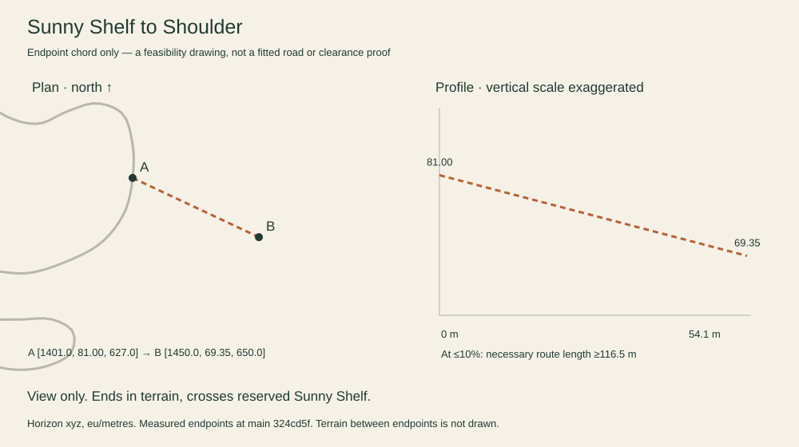
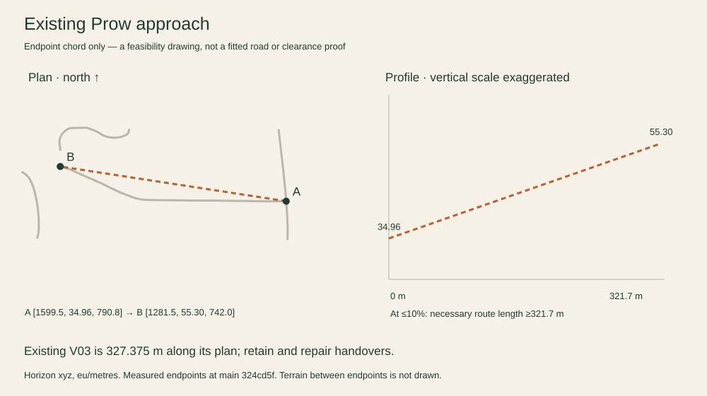
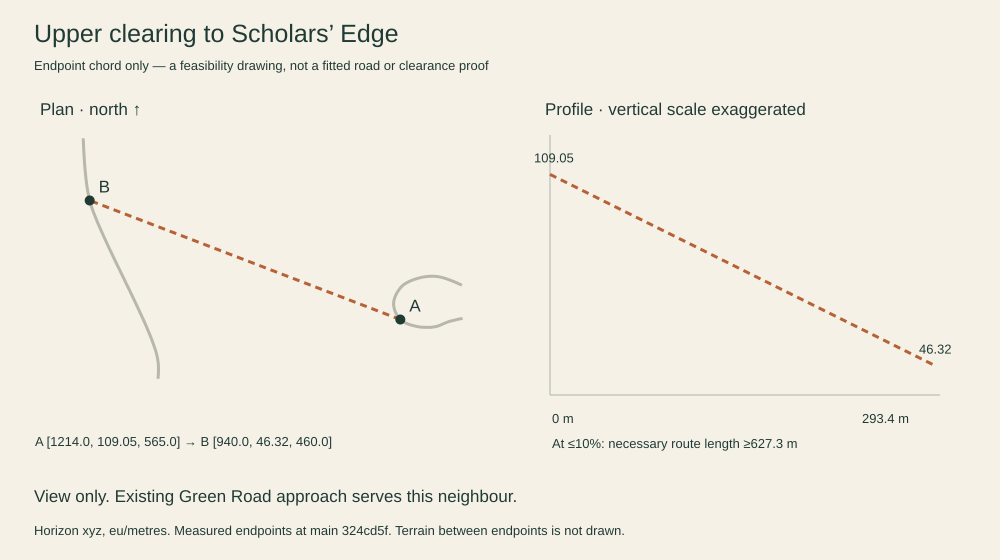

# The Mountain Road book

1 October 2026 · Draft PR checkpoint · Jonathan is the decision owner

The Prow → Foot → Summit chain and the fitted Stillwater → Green Road link are being built following Jonathan's “build everything, make it beautiful.” The road keeps its native mountain surface and bridges; Horizon supplies the connections, route metadata, furniture and lighting. The library and dam landing repairs and the longer awning return are explicitly approved in both worlds. Jonathan also explicitly retains the original steep native grades as named exceptions (D-MR17). Three native frame repairs and the first-five-row awning entry fairing were separately approved on October 1 (D-MR19–20). D-MR22 subsequently approves the Orchard approach, initial bridge fairing and bounded ground cut. These changes are applied. The latest instruction asks for the current work to be wrapped into a draft PR with remaining acceptance explicitly open.

**Budget delta (5): 0. Engagement delta (3): +2 target, awaiting completed traversal and visual acceptance. Risk: High.** No money, command, schema, sync, Auth/RLS or Hercules payload changes.

**Delivery:** local branch `codex/mountain-road-book`, with `origin/main@1cf76c551e6f49124b6257162bc4d36ca18d7bd1` (#577) integrated locally at `df77030298d5ff960d2eeaa5eb62c8558008694b`. The current work is being submitted as a draft PR at Jonathan’s request; merge, deployment and live verification have not occurred. The original Phase 1 inventory is preserved in commit `750150f`; its measurements below are explicitly the before state, not current results. Follow [the build worksession](../worksessions/2026-09-30-mountain-road-build.md) and the implementation section below for current scope.

Read with [worksession](../worksessions/2026-09-30-mountain-road-book.md), [ROAD](ROAD.md), [road handoff](../CLAUDE_HORIZON_MAIN_ROAD.md), [inventory](evidence/mountain-road/before/inventory.json), [chain audit](evidence/mountain-road/before/chain/AUDIT.md), [baseline corridor audit](evidence/mountain-road/before/corridor/AUDIT.md), and [LOOK](evidence/mountain-road/before/LOOK.md).

## 1. Before-state measurements

- V03 is **327.375 m in plan**, from `[1599.5,34.957,790.8]` to `[1281.5,55.3,742]`. The Prow junction's road height is about 35, not the landform's 40–70 height range.
- The town lane is a real part of the chain: **22.014 m along the course-derived line**, 0.65 m between endpoint elevations. It is not a 0.65 m vertical step; the profile must be tested between them. The straight endpoint distance is 22.006 m.
- The mountain ascent is **945.861 m native spatial arc / 938.787 m exported plan arc**, with 315 exported samples (every third native sample plus end). The assembled chain is **1288.176 m plan**. The audit ends within its normal 1.5 m endpoint tolerance.
- Native grade measures **1.854–15.438%**; the export's rounded samples give slightly different extrema. Width tapers from half-width 3.5 to 4.8. Horizon's bed publishes 9.6 m throughout and the native physical road surface uses constant half-width 4.8. This does not match the drawn Foot taper.
- The original road audit excludes `mountainV2.road`. It reproduces **0 / 23 / 85, zero restarts** here. The new whole-chain drive probe finds **5 distinct BLOCKER / 22 MAJOR / 22 MINOR**, with **7 restarts** across four passes. These are additional measurements, not changes to the road.
- Journey has the native road line but omits its three bridge records. Native road lamps are not supplied by the corridor. Both gaps need a common published definition.

**Inventory-time CI:** main was red for the named Bianca Month month-end regression: [CI run](https://github.com/jonathanbeaulne123-blip/dual-ai-budget-app/actions/runs/36685087825), 82 passed / 1 failed in `app-startup-p1.test.ts`, “Missing Bianca Month income Start”. This task did not author a fixture/test change. The later main integration includes the separately authorized fix; CI, Cloudflare and Horizon asset workflows on `1cf76c5` were green when integrated. Neither the old failure nor those green workflows establish this road’s acceptance.

## 2. Decisions D-MR1 onward

D-MR1–7 and D-MR11–12 guide the authorized build. D-MR8 advances to the fitted Stillwater link described below. D-MR9–10 preserve the view-only verdicts and shared bridge-contract boundary. New native source changes remain individually approved.

| ID | Proposed choice | Reason / owner |
|---|---|---|
| D-MR1 | One chain definition publishes named reaches and 2 m stations over V03, the explicit town lane and native road, with per-station width, source surface, guard, lamp and map references. | Current audit and corridor coverage stop at the Foot. Jonathan approves Phase 2. |
| D-MR2 | Retain region ownership of native road surface/art. A Horizon adapter owns chain metadata and additional stations, diagnostic tests, compatible lighting/map metadata. Never emit a second deck or cut region-carried terrain. | Preserve D-M1–10, regionCarry and the live default world. |
| D-MR3 | Fix overlapping Horizon surfaces, terrace exclusions and portal clearances in their Horizon sources; list any required native-road change separately with both-world measurements. | No patch panels, invisible guards, snapping, global physics or native source edits under this approval. If adapter cannot resolve a native mismatch, stop with the measured option. |
| D-MR4 | Retain ROAD's stricter tolerances: 0.02 m structure surface agreement, 0.25 m alignment, 0.05 m driven lip. The 0.48 body step is a hard outer limit, not the finish target. | D-R10/11 and no visible handovers. |
| D-MR5 | Derive guard need from actual regional ground and visible guard volume; preserve existing safe rails until replacements and all openings are proven. | Native drop threshold >1 m differs from corridor >1.25 m. Do not mechanically remove native parapets to unify thresholds. |
| D-MR6 | Light portals, junctions, tight bends and stops, with dark stretches between. Use the existing world-clock +2°…−6° ramp and shared 6 full / 2 lite shadowless light pool. | D-R3 STYLE exception still belongs to Jonathan. No additional pool or silent exception. |
| D-MR7 | Publish b-foot/b2/b3 to Journey from their authored source; covered V03 and the whole chain derive from shared station data. | Keep all Journey financial spaces/stops unchanged. |
| D-MR8 | Build the fitted341.094m Foot→Stillwater→Green Road connection, including its104m lined tunnel. | Jonathan’s build instruction advances the completed profile; maximum8.222% grade. The original59m chord was only an initial feasibility study. |
| D-MR9 | Keep west and north connections unbuilt for now; reserve a Viaduct fit study as an alternative if a contour route fails. Keep Shoulder as a view. | Large drops, reserved plots and transport/flight/view constraints. |
| D-MR10 | Use the shared BridgeDefinition integrated from main#577. Submit any new landmark family to Jonathan. | No new landmark bridge is built in this change; Stillwater is a fitted grade/tunnel link. |
| D-MR11 | Separate cruiser, bicycle, Horizon board and native skate evidence; a test of one board mode cannot accept the other. All autonomous recoveries count. | Actual runtime has distinct controllers and legality rules. |
| D-MR12 | Keep natural-descent, full footway coverage, real captures, envelopes and district budgets explicit gates. | Scripted steering/braking, headless renders and unit passes cannot close these. |

The later implementation decisions are recorded in full in [DECISIONS.md](../DECISIONS.md):

| Decision | Current boundary |
|---|---|
| D-MR13 | Approved shared Library/Dam landings and longer Awning return; protected skill features remain. |
| D-MR14 | Real Horizon-owned Foot and Ore joins, ending on actual native road triangles. |
| D-MR15 | Horizon’s native skate adapter uses composed-world support, contacts, water and readiness; standalone defaults and physics remain. |
| D-MR16 | One clock-owned glow system and the existing6/full,2/lite shadowless road-light pool. |
| D-MR17 | Jonathan retains only the four original steep main-road grade groups as named exceptions. |
| D-MR18 | Pickup lifecycle, exact native-road/course ownership, Journey bridge drawing and documented test repairs. |
| D-MR19–20 | Three individually approved native frame repairs and bounded Awning entrance fairing, with centreline/heights/bridges/scenery preserved. |
| D-MR21 | Actual lamp-foot support and portable compatible geometry batches; unchanged rendering budgets and authored shapes. |
| D-MR22 | Approved25.908m Orchard approach and17.936m initial b0 bridge fairing, at most0.361820m bridge lowering and a bounded supporting ground cut. |
| D-MR23 | Ordered contact-shade facing passes retain exact rendered appearance in the completed comparisons while reducing submitted triangles; the original district limits remain. The warmed CPU submission cost is about0.2ms higher in the two measured cases. |
| D-MR24 | Preserve the native Summit bench behind the terminal road section and trim only the new Crown landing rails to the existing walking opening; original stairs and native scenery remain. |
| D-MR25 | Keep one logical render origin across every funicular apron fragment, preserve exact collision coordinates, and use conservative static-face bounds without changing query results. |
| D-MR26 | Wrap the existing work in a draft PR. Retain the unreduced funicular apron and applied actual-served ground patch; reject reduction that changes downstream ground, preserve failed tests and unchanged rendering limits. |

## 3. Before-state ownership and disagreements

| Consumer / place | Current owner and disagreement | Phase 2 boundary |
|---|---|---|
| V03 | Horizon terrain/corridor; deck and rendered solids agree through the existing source-driven system. | Repair only measured handovers; preserve baseline audit. |
| V03 end → Foot | Regional lawn/S1/course continuation, with several surface owners. Region graph's nearest node is co-located native road, not V03 endpoint. Graph connectivity is not a driven join. | Publish exact 22 m reach and its surface/footway ownership. Keep terraceBedExclusion's narrow lowering and steep return to lawn. |
| Native road | `land/mountainV2/beds.ts` regionCarry; excluded by `land/corridor/reaches.ts`. Native source draws road, bridges and guards. | Adapter only; native deck/terrain remain native. Native source edits require another written choice. |
| Foot width | Drawn half-width 3.5→4.8; physical native surface and Horizon bed use maximum 4.8. | Regional adapter must report actual drawn width. Changing native surface itself requires both-world proof and approval. |
| Native guard | Native >1 m drop rule, .22 m kerbs, segment colliders and outward stone art differ from corridor guards. | Measure collision at y+.2 / y+.65 and visible volume; do not assume one rule can safely replace the other. |
| Ore Line | South Portal platform overlaps lower switchback. Baked blocked edge names `oreStation.southPortal.slab`; real cruiser reports low headroom near the same point. | Fix source in Horizon only after full platform/cart/road envelope measurement; keep rail route and portal function. |
| Library and dam branch floors | Cruiser changes to `library-balcony` / `dam-promenade`, then launches back to road. | Capture and isolate floor selection before choosing geometry changes. Native source changes are not authorized. |
| Map and night | 37-point Journey native road, no three native bridge records; no native corridor lamp run. | Derive from shared data, never independently draw a replacement road. |

The region remains at translation `{x:1308,y:54,z:764}`, footprint x1108–1508/z368–848. Its ground owns the southern footprint; north of the summit line the higher Crown face preserves the Throat. The 40 m sea-to-Horizon apron and the V03/S1 yield remain mandatory. Every new planner must get water, walks and destinations from one function used by both bake and tests.

## 4. Reaches and joins

Two station systems are intentionally named: V03/chain **plan** metres and native mountain **spatial** `s`. Never add them without conversion; evidence contains the mapping.

| Reach | Extent | Character and current work needed |
|---|---|---|
| M1 Prow mouth | V03 start to east tunnel portal near x1478 | Cliff junction, continuous apron, portal guard/lamp handover. |
| M2 Mountain Road Tunnel | x1478→1405, road y≈45→52 | Roughly 73 m covered stretch; January Year Walk beside it. Verify both floors, roofs and portal lighting. |
| M3 Canal and Foot | West portal → canal bridge → V03 end → 22 m lane → road foot | Canal span, shared footway and the first climb; current cruiser Foot/return stalls. |
| M4 Lower ascent | Native s0–114 | Maximum grade near foot, tapered entrance, b-foot bridge. |
| M5 Lower hairpins | s114–214 | H1/H2, Orchard Lane opening, Ore Line South Portal; current headroom blocker. |
| M6 Library climb | s214–396 | Neighbourhood, H3/H4/H5, library-balcony overlay; current launch witness. |
| M7 Woodland and meadow | s396–694 | b2 then b3; G1 crossing, dam branch overlay; current downhill launch witness. |
| M8 Upper ascent | s694–885 | Dam approach, H6/H7, guarded views and dark intervals. |
| M-top Summit Commons | s885–945.861 | Observatory, terminal, launch deck and race start; preserve their openings. |

The three main bridge spans' **native plan** ranges are b-foot 34.986–57.978, b2 387.824–444.801, b3 617.738–690.715. The prompt's wider/rounded ranges describe exported spatial samples; they are not interchangeable station axes. The quiet Orchard Lane bridge b0 is outside the main chain. D-MR22 separately approves lowering its first17.936m by at most0.361820m to remove the Orchard junction lip; its plan, width and existing span remain fixed.

Each portal, canal bridge end, native bridge end, branch opening and Foot handover needs rider-height capture and a five-line lip/edge scan, plus driven records. Inventory provides source anchors; a sampled bridge point is not an exact abutment witness. No join is accepted from the current chain probe alone.

## 5. Hairpins and downhill evidence

Curve groups H1–H7 are detected from native curvature radius <30 m, joining samples separated by <18 m; H4 is a short tight kink rather than an authored hairpin. Lower H1/H2 are the named switchbacks. Radii use the native curvature estimator; driving uses the audit's ±3 m estimator. These are diagnostic measures, not exact civil-engineering radii.

The table's entry speeds are measured five native spatial metres above each group's upper end, descending with the audit's existing scripted braking plan. **They are not a natural coasting/descent test.** Native guard labels are source classifications, not a proof of collision. There is no dedicated corridor lamp run at any H group.

| Curve | Native s | Radius m | Downhill entry m/s centre / right | Max centreline demand estimate m/s² | Min centreline steering-rate estimate rad/s | Native guard L / R |
|---|---:|---:|---:|---:|---:|---|
| H1 | 122.4–140.4 | 11.96 | 8.36 / 8.38 | 4.34 | 1.189 | open / kerb |
| H2 | 184.6–204.7 | 10.46 | 10.44 / 10.20 | 4.26 | 1.168 | open / kerb |
| H3 | 312.5–328.6 | 20.04 | 10.27 / 10.15 | 4.10 | 1.221 | open / kerb |
| H4 | 349.8–352.8 | 26.91 | 9.89 / 10.02 | 4.00 | 1.232 | open / open |
| H5 | 379.0–395.1 | 14.81 | 10.34 / 10.16 | 4.30 | 1.194 | bridge / bridge |
| H6 | 810.2–828.3 | 13.12 | 9.79 / 10.05 | 4.17 | 1.200 | parapet / open |
| H7 | 860.5–884.6 | 10.04 | 10.12 / 10.00 | 4.31 | 1.162 | parapet / kerb |

Reproduce the table and drawings with `python3 scripts/horizon/mountain-road-drawings.py`; [hairpin data](evidence/mountain-road/before/hairpins.json) retains both passes. Reproduce endpoint, terrain and cable calculations with `node scripts/horizon/mountain-road-neighbours.mjs`; [neighbour scans](evidence/mountain-road/before/neighbour-scans.json) retains every sampled witness and the cable intersection.

The cruiser implements lateral velocity damping `exp(-22·dt)`, not a tyre friction coefficient or maximum lateral acceleration. Therefore a physical “grip margin” cannot honestly be calculated as 22 minus demand. The evidence records centreline-based demand and steering-rate estimates separately. The right-lane path retains centreline curvature; these numbers do not measure actual trajectory curvature or controller steering reserve. Natural-descent loss of lane, visible-guard containment, native skate feel and phone control remain owed. No tuning change is proposed.

### Other modes

[Full mode report](evidence/mountain-road/before/modes/SUMMARY.md) and [54-attempt table](evidence/mountain-road/before/modes/RESULTS.md): **54 attempts**, with **14 end-reaching independent reaches and 40 incomplete**. Breakdown: bicycle 4/18 end-reaching, Horizon board 2/18, extracted walking runtime 8/18. **0/6 whole-chain attempts completed.** This is baseline diagnosis, not an acceptance score. Counts include modes on footways where their existing legal-bed rules can deliberately reject travel.

| Whole chain | Up progress / 1287.68 m | Down progress / 1287.68 m | Stop |
|---|---:|---:|---|
| Bicycle | 326.53 | 617.07 | Up: stalled at V03/lane; down: bail. |
| Horizon board | 4.56 | 71.22 | Automatic fadeBack in both directions, counted as failed uninterrupted travel. |
| Walking runtime move function | 351.86 | 774.72 | First unsupported-airborne handoff; separate falling/parachute state was not simulated. |

The probe starts 0.5 m inside each route and stops within 0.5 m of the far end; its attempted-length convention differs by 0.5 m from the cruiser's full line. Footway coverage is Crown walk, mountain promenade and three contiguous Year Walk mountain portions; it does not cover every branch or January approach. The scripted bicycle/board driver and their bed legality must be reviewed before treating every failure as terrain damage. Camera collision and runtime streaming are omitted; walking assumes `gateOpen=()=>true` and ready chunks.

The **native everyday shell skate** probe assessed 18 route/direction starts. Twelve were outside the shell's 64 m launch radius and were not attempted. Of six admitted attempts, two reached their ends (lane both ways). Reverse V03 water-bailed after **105.13/326.87 m** despite only .040 m maximum lateral deviation. The uphill native road reached **679.19/938.29 m at the 180-second cap**, with no bail: this is an inconclusive timeout, not a road blocker. Two Year Walk portions stalled. Both full-chain endpoint starts are excluded, so **no native full-chain attempt occurred**. The exact underlying driver uses native Mountain ground/collision, while its Horizon adapter uses Horizon blocking only for the camera. This mismatch needs a separate source decision; neither native driver trials nor registry-board trials establish acceptance for both worlds.

The bicycle reverse lane also timed out after 82 seconds, reaching 4.79/21.51 m. Slow progress prevented the five-second stall threshold from firing. Neither timeout was promoted to a pass or rerun with relaxed thresholds.

## 6. Neighbours: plan, profile and verdict

Every drawing is an endpoint feasibility diagram, **not a built road, game capture or clearance proof**. Plan distances use actual baked bed projections except the named north/east samples. The 10% length is a necessary lower bound `max(plan,10×|Δheight|)`; it does not include bends, width or obstacles. Straight-chord terrain screening uses the committed 5 m Horizon field sampled about every metre, not the region's full dynamic collision geometry.

### Foot to Stillwater rim

Plan **58.507 m**; height change **-0.657 m**; minimum run at 10% **58.507 m**. Grade study first. This does not complete the Green Road loop.

### Foot directly to Green Road

Plan **296.984 m**; height change **-14.437 m**; minimum run at 10% **296.984 m**. Reject chord: up to 54.594 m cut in the baked terrain.

### Orchard Lane to Hollow

Plan **247.410 m**; height change **-42.568 m**; minimum run at 10% **425.682 m**. Contour study only. No bridge alignment or clearances approved.

### Upper clearing to Green Road

Plan **216.843 m**; height change **-70.833 m**; minimum run at 10% **708.330 m**. Reject this departure: Woodland Clearing plot and excessive descent.

### Summit to north coast

Plan **211.979 m**; height change **-85.947 m**; minimum run at 10% **859.472 m**. Leave as a view for now. Throat, skylight and flight envelopes remain.

### Sunny Shelf to Shoulder

Plan **54.129 m**; height change **-11.650 m**; minimum run at 10% **116.500 m**. View only. Ends in terrain, crosses reserved Sunny Shelf.

### Existing Prow approach

Plan **321.720 m**; height change **20.343 m**; minimum run at 10% **321.720 m**. Existing V03 is 327.375 m along its plan; retain and repair handovers.

### Scholars’ Edge

Upper clearing `[1214,109.046,565]` to the existing Green Road sample `[940,46.315,460]`: **293.430 m** plan and **62.731 m** descent; at least **627.314 m** at 10%. Verdict: view from the mountain, reached by existing roads. Do not cross the reserved Hollow neck for a duplicate connection.

The Prow is already connected by V03; finish its seam rather than adding a second route. The Crown is already the summit destination. The Undercroft stays rail and underground passage, with no new road through the rock. Scholars' Edge remains reachable through Green Road/Horizon Drive; its box and altitude do not justify an additional direct mountain chord across the Hollow and reserved neck.

**Stillwater is the only immediate grade-link recommendation.** Foot→rim is 58.507 m, falling .657 m (1.123% average). The preliminary chord is within +.176/−.138 m of baked terrain. It crosses G1 at `[1259.280,739.001]`: proposed centre height 54.317, sampled sagged cable 84.945, cabin floor 81.845, **27.527 m floor-to-road separation**. This is not swept cabin clearance. The rim starts `[990,56,780]` while nearby VG is roughly `[967,35,781]`: about 21 m down, requiring at least 210 m of run at 10% before turn/landing allowances. Grade feasibility is promising only for the first connector. Check S1/inflow bridge, inflow footbridge, lake shoreline, full road width and Waterfront boarding before selecting an alignment.

**Hollow:** the upper clearing chord is too steep and enters a reserved plot. Orchard Lane is a better departure, but still needs ≥425.682 m for a 42.568 m descent. Both a contour road and a Viaduct alternative remain studies. A bridge cannot remove the grade requirement. The apparent valley crossing is not a measured ore-cart underpass.

**North:** an 85.947 m descent needs ≥859.472 m at 10%, versus a 211.979 m chord. Preserve gate 10 at `[1300,139,200]`, gate 11 at `[1310,190,470]`, and glider-only gate 12 at `[1300,119,300]` with a 24 × 16 aperture inside the 26 × 18 Throat. The mouth spans y110–128. The skylight near `[1320,400]` tops at 138; Crown launch deck is 170. A dramatic short bridge does not solve the long descent. Keep this a view unless Jonathan chooses the larger intervention.

**Shoulder:** the nominal landform's 90–110 height is not reliable endpoint elevation inside the placed region. The measured study point `[1450,69.35,650]` is terrain, not an existing route. Its chord crosses Sunny Shelf's reserve. Keep an overlook as a future proposal without a through road or plot intrusion.

## 7. Optional bridge entry — proposal format only

### Viaduct · Orchard descent toward the Hollow

**Status:** deferred fit study. Not a selected alignment, contract addition or building authorization. The bridge contract is now available from integrated main#577; this book creates no second BridgeDefinition. Its cast already includes suspension, arch, bascule, ribbon, covered, masonry, cantilever, trestle, garden and boardwalk.

**Everyday picture name:** Viaduct. **Proposed unique typology:** continuous curved box-girder on slender piers, distinct from the existing timber trestle and arch families. **Purpose:** carry part of a longer ≤10% contour descent toward Green Road over a measured valley. **Signature:** one continuous curve with a valley-facing meeting balcony, outside traffic. The suggested Adit undercrossing is an unverified hypothesis, not a promised passage.

| Passage | Intent | Measurement / acceptance state |
|---|---|---|
| Over | Cruiser, bicycle, native skate/board where profile permits, pedestrian footway | Endpoint study requires ≥425.682 m total descent; span length, deck width and pier placement not fitted. |
| Under | Preserve Ore Line Adit route and all ground paths | Cart swept envelope, roof clearance and foundations not measured. No claimed clearance. |
| Through / nearby | G1 tower2/cable, Woodland Clearing and glasshouse access | Keep all existing envelopes/reserves; fit not approved. |
| Meeting | Flat 3 × 3 m bay, two standing bodies, no lane obstruction | Anchor and accessible approach unchosen. “Meet me at” test pending. |

**Night:** a sparse line of warm pools on the inside curve and one meeting lantern, sharing the existing pool. **Map:** curving deck on several slender piers, unique labelled glyph only if approved. **Theme proposals:** Classic pale stone pier shoes and bronze edge; Taylor layered card box sections and stitched fascia; Newfoundland granite footings and salt-grey steel. These are separately authored proposals, not palette derivations. Lite removes secondary objects. Draw/triangle budget is unallocated pending district measurement; ROAD §8 caps still apply. Jonathan and the bridge owner must decide whether this family is needed before any implementation.

## 8. Envelopes, views, themes and budget

G1, funicular, Ore Line, gates 10–12, Crown launch and every view page need explicit swept-envelope diagnostics and tests before the chain can be accepted. Existing source coordinates and the Stillwater centreline G1 calculation are inputs, not green results. Portal headroom is already a failed rider witness. View page L's known 3-pixel Boathouse occlusion remains owed; it is not waived because this work is farther north.

Phase 2 must capture Classic Hearth, Taylor’s Scrapbook and Newfoundland, day/night, full/lite, rider/air/Journey. Native assets keep their authored dressings; new lamp/guard/planting choices are separately composed for each theme. Reduced motion and the flat edition remain available. No UI is changed in this book; 320/390/720/~1100 inspector/map checks apply when UI changes.

ROAD §8 permits at most 25k/10k added corridor triangles full/lite and 12 draw calls per district. Total-frame counts or static triangle sums cannot prove incremental per-district cost. Measure actual rendered attribution in every crossed district (at least Prow, Lakeside and Crown), with resident chunks and revision logged. This measurement remains owed. No invented zero is entered for an unmeasured district.

The [visual record](evidence/mountain-road/before/LOOK.md) contains **32 static headless SwiftShader images**, including one occluded Undercroft context shot. All are Classic/full/day. Nominal road-anchor eye poses are not surface-seated rider proof; exact abutments and actual controller captures remain owed. The first nine observed 13:00 Toronto; the remaining 23 observed 15:30 despite a 13:00 request. Raw failure history and this clock mismatch are retained.

## 9. Verification and review

The [handoff](../CODEX_HORIZON_MOUNTAIN_ROAD_1.md) lists the exact runs and changed files. The unchanged region test passes **15/15**. The High quick gate passed its checks, including TypeScript and those 15 tests, but took **538.729 seconds against 300 seconds**: literal classification `quick-gate-passed; time-budget-breached`. This is a budget failure, not a fully green gate. The native dump check passes with **43,914 bytes / 315 road / 391 course points**. No full serial world suite, new bake, byte-exact local check, natural-descent ride or physical-device acceptance was performed in this documentation stage.

The [independent review](evidence/mountain-road/REVIEW.md) raised two P2 documentation/evidence findings, both corrected and rechecked: centreline calculations were overstated as measured lateral demand and steering reserve, and decisive neighbour numbers lacked a reproducible source artifact. No remaining actionable finding was reported within that bounded review; it does not close the acceptance gaps below.

## 10. Implementation and remaining gates

- **One physical route:** the published chain joins V03, 22.014 m of existing native Foot lane and the mountain road. The lane has road metadata for bicycle/navigation consumers and a closed seven-metre Horizon apron. Nearby Year Walk/S1 source prisms are refitted before compaction, with a continuous departure from V03 and an exact cut at the native road footprint. The native road remains the highest floor at the join; its vertices and route are unchanged.
- **Shared landings:** the library and dam use one triangulated landing mesh for drawing, surface queries and body collision in both worlds. The library's terrain-constrained solve runs offline; its generated product is hashed and checked. Its road entry is conformed across the full width while the reading roof is retained. Approval: Jonathan's explicit “Yes—repair the shared landings in both worlds.”
- **Foot and Ore Line:** Foot’s one-metre source grid contains 7,972 local triangles; source probes found a maximum exposed road grade of 10.7673%, a maximum upward local face of 37.553° and no open/nonmanifold edges. These source measurements precede final served-asset checks. Ore’s visible closed crossing rises to the fixed rail heads over a 17.681 m run, with 11.5% maximum facet grade and a retaining face outside the cart aperture. The roof/doorway withdraw from the road’s full width; rail controls and construction are unchanged. Jonathan’s approved awning return preserves the first rail and main road while rejoining about 18 m farther up the same hairpin.
- **Native everyday skate on Horizon:** the ordinary native controller now queries the composed world for floors, walls, ceilings and water. Native standalone defaults are retained. Streaming readiness holds input/relocation until its destination exists; it never invents support or snaps a rider onto the route.
- **Furniture and map:** native-source stations preserve the three existing bridges and visible guards; no second road deck or guard is drawn. Exact native water/building/path/tree footprints constrain planting and supported lantern sites. A physically supported garden bench connects to the library path. Six sustained bends receive strategic lighting through the existing clock and bounded road-light pool. Both tiers retain the same essential Mountain fixtures; lite removes secondary kit fittings and planting items while preserving retained shapes. The actual themed heads feed one glow owner, avoiding duplicate halos. The inherited airport has five additional point lights, so 6/2 is a road-pool cap rather than a whole-scene cap. Classic, Taylor and Newfoundland use their authored kits. Upper additional pine groves are removed where native woodland already frames the road; lower groves and Stillwater birches remain.
- **Stillwater link:** 341.094 m fitted route from the Foot through the rim to Green Road; maximum grade 8.222%. A 104 m lined tunnel passes beneath the intervening ground and Year Walk, with 12 m internal width and 5.4 m clear height. The same bed and section drive visible/collision geometry, corridor and Journey. Portal aprons lap the corridor ownership boundaries. This is a grade/tunnel link, not a new landmark bridge or bridge contract.

Current baked source dimensions supersede the Phase 1 coarse-axis inventory above: the 941-section native road has 939.595 m plan length and 945.861 m spatial length. The 1,029-vertex assembled chain has 1,288.984 m plan length and 1,296.220 m spatial length. Stillwater has 341.094 m plan length and 341.627 m spatial length. Controller travel distances can be slightly shorter because the unchanged endpoint tolerance accepts arrival before the last vertex; travel distance is not the source route length.
- **Verification status:** the current source passes 25/25 focused tests across Foot geometry, Ore crossing, shared landings and composed lighting (18.67 seconds). The final source rebuild, byte-exact comparison, route runs, serial world tests, captures and budget measurement are in progress. Earlier whole-chain and short-join runs remain intermediate evidence; none substitutes for current full-route acceptance. Both earlier failed typechecks and the stopped parallel run are preserved, not counted as passes.

### Historical Phase 1 owed list

The following is retained from the inventory; the implementation bullets above supersede its construction status. Final acceptance will replace this list with measured results and genuinely outstanding items.

1. Resolve the five drive blockers using the retained captures, layered-floor queries and controller traces; preserve each failed/incomplete attempt. Static poses corroborate overlaps, but do not prove a moving rider hit or launch. Do not treat a probe as final geometry authority.
2. Finish full-chain all-mode and all-footway evidence, including native skate and natural downhill trials; separate automatic recovery from successful travel.
3. Replace nominal static join/curve poses with actual surface-seated rider/controller captures, exact abutments and both approaches; complete the later three-theme/day-night/full-lite/air/map matrix. Headless SwiftShader is never device evidence.
4. Add full static chain width, step, visible-guard and headroom scans using variable native widths. Current cruiser extension is drive-only.
5. Fitted Stillwater→rim and rim→Green Road profiles, structure/plot/water envelopes, exact abutments and budgets; no link is construction-ready.
6. Resolve D-R3/4 STYLE calls and any native-world/view/flight/cable/bridge change explicitly with Jonathan.
7. After approved geometry changes: source-derived bake, byte-exact check, dump check, focused High gate, required horizon/Journey/walk/native suite files serially, view proofs and blind review. No exhaustive suite without its separate exact-SHA request.
8. The original phase stop was superseded by Jonathan's “finish the original task dont pause.” The authorized chain and Stillwater implementation continue together through their local checks. Optional physical-device acceptance and any later publishing remain separate.

**Next owner: Codex.** Complete the authorized implementation and exact-source checks. Jonathan owns optional real-device acceptance. Merge, deployment, new landmark bridges and moved flight/cable/view envelopes remain separate decisions.

## 11. October 1 draft wrap-up — current delivery authority

Jonathan requested a PR now and an end to further expansion. The [current handoff](../CODEX_HORIZON_MOUNTAIN_ROAD_2.md) supersedes ongoing-work language in earlier checkpoints. The source includes the approved native changes and the Horizon/Stillwater implementation; it is not accepted or ready to merge.

The v7 shared physical/drawn funicular ground passes its actual-served numerical preflight in both tiers (110,280 dense and 4,521 path samples each), with sub-micrometre drawn seams. It adds 5,515 full / 5,350 lite triangles. Four current synthetic-grid collar tests fail with an inverted-face exception; the actual-world preflight does not excuse those failures. The 16,036-triangle source apron is retained. The proposed 6,704-triangle reduction changes canonical ground by up to 0.2589212656 m and was removed and archived.

The Lakeside baked solid contribution alone remains 33,298 full / 29,360 lite triangles before art and canonical ground, above the unchanged 25,000 / 10,000 corridor limits. The 87/132 native capture run is partial, including a settling timeout; [LOOK](evidence/mountain-road/after/LOOK.md) is a review record, not finished acceptance. Source checks, final gate/bake statuses and hashes live under [draft-pr-wrap-up](evidence/mountain-road/after/attempts/draft-pr-wrap-up/). Final modes, hairpins, funicular traversal/art, streaming, envelopes, rendered budgets, remaining tests and human/device checks remain for a subsequent session.
