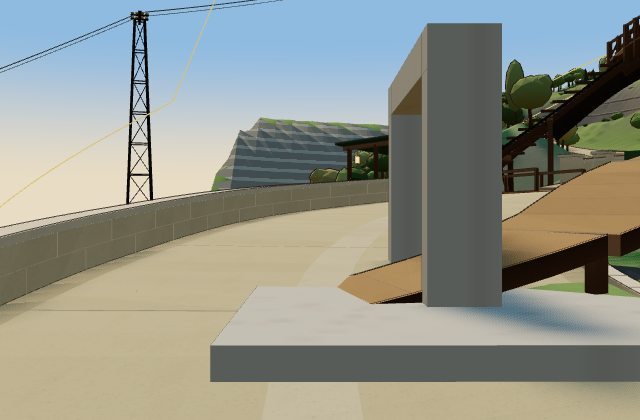

# Mountain Road before — what the pictures and probes show

30 September 2026 · unchanged world at `324cd5f246ab295af5cf64d553ebf78fad57f7b5`

There are **32 saved static images**, including one occluded Undercroft context shot. These are headless Chrome/SwiftShader renders of the review harness, **not physical Mac/iPhone evidence**. They help locate overlaps and judge the setting; they do not show an actual controlled ride or accept a join.

## How to read them

All images use Classic Hearth and full detail on 21 June 2026. The URL requested 13:00. The first nine images' inspector clocks are `17:00Z` (13:00 Toronto); the remaining 23 report `19:30Z` (15:30 Toronto). The raw `sun: 13:00` field records the request, not verified clock state. Use the inspector's clock when comparing lighting. There is no night, lite, Taylor, Newfoundland or Journey image in this set.

The first nine images are 1100 × 720; the resumed 21 and final two are 640 × 420 with reduced motion enabled. At ordinary joins/curves the camera is set 1.9 m above a source anchor and six metres back along its plan tangent. Its height is **not re-seated to the surface at that backed-up point**. The `rider-height` label in raw records therefore means nominal static context, not an accepted rider-height witness. The camera has no moving rider, body-collision or camera-controller validation. Native bridge anchors use nearby exported samples, not exact abutments. Most poses face uphill; no pair of approach directions is implied.

The manifest records all poses, successful files, world SHA, inspector snapshots, pending chunks and errors: [captures.json](captures/captures.json). Pending queues were empty at successful snapshots; that alone does not prove runtime streaming behavior. Inspector SHA is null in the review harness; the outer manifest records the checkout SHA. Frame draw/triangle totals and software-rendering times are not incremental per-district budget evidence.

An initial load exceeded the first 60-second harness wait and saved no image. The next run saved nine before it was deliberately closed for a smaller viewport/reduced-motion continuation; 21 `Target page, context or browser has been closed` failures remain in the manifest, followed by successful captures for those names. The final run added Scholars and Undercroft context. Three HTTP 404 console errors are retained; their resource URLs were not logged, so their cause is unresolved. The images do not certify an error-free page.

## Places that look rough

**Foot and town lane:** [road-foot](captures/road-foot.jpg), [V03-lane](captures/V03-lane.jpg) and [blocker-foot](captures/blocker-foot.jpg) show several different surfaces close together. A raised crossing/edge is visible near the climb. The cruiser stalls around chain 352.5 m at `[1281.47,54.87,717.04]`, and the baked graph names `yearWalk.shoulders.lakeside` at the Foot. At that probe point the explicit surface query returns no deck while terrain height is 54.820. This supports investigating source ownership; it does not alone establish the exact wheel/ground failure. The reverse keep-right lane return also stalls near chain 333 m, `[1279.56,55.28,736.54]`.

**Ore Line South Portal:** the [portal witness](captures/blocker-ore-portal.jpg) shows a large grey slab/frame in the lower-road setting. At the recorded rider centre `[1350.46,66.9,681.95]`, the centre ceiling query is unbounded, but the left footprint sample `[1350,681.95]` has ceiling **67.15**: only **.25 m above the rider base**, versus the cruiser's 1.55 m height. That spatially agrees with the low-headroom audit near chain 512.5 m. A single centreline query would have missed it. Preserve the portal/cart function while measuring the full overlap before repair.

**Library and dam branches:** [H3](captures/H3.jpg) shows a brown access ramp entering the pale road. [b3-foot](captures/b3-foot.jpg) and [blocker-dam](captures/blocker-dam.jpg) show another branch/deck at the carriageway. Layered queries at the [library witness](captures/blocker-library.jpg) choose native road **85.960** from a lower input height, or library balcony **87.640** from the recorded rider height. At the dam they choose road **123.159** or promenade **123.853**. The audit records .44-second airborne transitions with drops **1.23 m at 7.7 m/s** near the library and **1.21 m at 16 m/s** near the dam. The still images corroborate intersecting surfaces; they cannot show the launch itself. Whether a Horizon adapter can safely repair native-owned branch floors remains a decision with measurements, not permission to edit native source.

**Hairpins:** H1–H7 all have saved views. H1/H6 show stone edge pieces against the slopes; H2/H3/H5 show how close rails, stairs and access ramps are to the road; H4/H7 have more open outlooks. These poses do not establish that every exposed edge has a collidable visible guard. No downhill rider or stopping test is pictured. The radius/speed table uses source curvature and scripted descent, with centreline-demand limits stated in the book.

**Tunnel:** [east portal](captures/tunnel-east.jpg) has a continuous-looking pale carriageway and repeated warm wall pools even in daylight. This says nothing about night adaptation, outside-to-inside camera exposure, exact portal lips or the adjacent January footway's full walking continuity.

**Whole mountain:** the [aerial](captures/chain-aerial.jpg) makes the loops, woodland, bridges and plateau readable. Large terraced/coarse outer faces are conspicuous. It is useful context, not proof that the distant district surfaces, authored views or all transport clearances are finished.

## Neighbour gaps

[Stillwater](captures/stillwater-gap.jpg) shows the low shore and nearby lane; its short connector is plausible from the separate endpoint/terrain measurement. It does not show a completed route down to Green Road. [Hollow](captures/hollow-gap.jpg) is partly hidden by orchard trees; [Scholars](captures/scholars-gap.jpg) shows the steep intervening slope. Neither is a measured road alignment. [North/Throat](captures/north-throat-gap.jpg) looks out over a broad pale face and recessed opening; the full flight mouth and all gates are not visible in that view. [Shoulder](captures/shoulder-gap.jpg) is context for an overlook, not proof of route clearance. [Undercroft](captures/undercroft-context.jpg) is **occluded by rock** and is retained as an unsuccessful sightline, not useful portal evidence. The Prow and Crown are covered by existing-route/summit poses; no new interior road is proposed.

The book's eight plan/profile diagrams are computed feasibility drawings, not game captures. They provide the endpoint measurements that these views cannot establish. None of the new links is construction-ready.

## Saved-image index

| Image | Purpose |
|---|---|
| [Prow-mouth](captures/Prow-mouth.jpg) | nominal static join/curve context |
| [V03-lane](captures/V03-lane.jpg) | nominal static join/curve context |
| [road-foot](captures/road-foot.jpg) | nominal static join/curve context |
| [summit](captures/summit.jpg) | nominal static join/curve context |
| [structure.mountainRoadCanalBridge-east](captures/structure-mountainRoadCanalBridge-east.jpg) | nominal static join/curve context |
| [structure.mountainRoadCanalBridge-west](captures/structure-mountainRoadCanalBridge-west.jpg) | nominal static join/curve context |
| [b-foot-foot](captures/b-foot-foot.jpg) | nominal static join/curve context |
| [b-foot-summit](captures/b-foot-summit.jpg) | nominal static join/curve context |
| [b2-foot](captures/b2-foot.jpg) | nominal static join/curve context |
| [b2-summit](captures/b2-summit.jpg) | nominal static join/curve context |
| [b3-foot](captures/b3-foot.jpg) | nominal static join/curve context |
| [b3-summit](captures/b3-summit.jpg) | nominal static join/curve context |
| [H1](captures/H1.jpg) | nominal static join/curve context |
| [H2](captures/H2.jpg) | nominal static join/curve context |
| [H3](captures/H3.jpg) | nominal static join/curve context |
| [H4](captures/H4.jpg) | nominal static join/curve context |
| [H5](captures/H5.jpg) | nominal static join/curve context |
| [H6](captures/H6.jpg) | nominal static join/curve context |
| [H7](captures/H7.jpg) | nominal static join/curve context |
| [tunnel-east](captures/tunnel-east.jpg) | nominal static join/curve context |
| [tunnel-west](captures/tunnel-west.jpg) | nominal static join/curve context |
| [blocker-foot](captures/blocker-foot.jpg) | nominal static join/curve context |
| [blocker-ore-portal](captures/blocker-ore-portal.jpg) | nominal static join/curve context |
| [blocker-library](captures/blocker-library.jpg) | nominal static join/curve context |
| [blocker-dam](captures/blocker-dam.jpg) | nominal static join/curve context |
| [stillwater-gap](captures/stillwater-gap.jpg) | neighbour/aerial context |
| [hollow-gap](captures/hollow-gap.jpg) | neighbour/aerial context |
| [north-throat-gap](captures/north-throat-gap.jpg) | neighbour/aerial context |
| [shoulder-gap](captures/shoulder-gap.jpg) | neighbour/aerial context |
| [chain-aerial](captures/chain-aerial.jpg) | neighbour/aerial context |
| [scholars-gap](captures/scholars-gap.jpg) | neighbour/aerial context |
| [undercroft-context](captures/undercroft-context.jpg) | occluded; unsuccessful sightline retained |

## What is owed

The acceptance set still needs exact abutments and both portal/bridge approaches at an actual seated rider height, natural downhill and full footway coverage, all three themes by day/night and full/lite from rider/air/Journey, real controller and camera motion, measured visible guard/headroom/step scans, the transport/flight/view suites and district-attributed rendered budgets. Physical phone/Mac feel is separate. No picture or timeout is treated as a pass.

Read [the book](../../../MOUNTAIN_ROAD.md), [chain audit](chain/AUDIT.md), [inventory and footprint queries](inventory.json), [all-mode summary](modes/SUMMARY.md) and [neighbour samples](neighbour-scans.json). Next owner: Jonathan for the Phase 1 choices, Codex for further evidence and the bounded work he authorizes.
