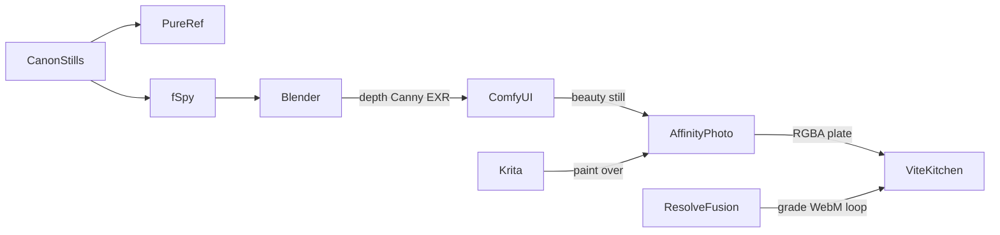

# Computer Home studio pipeline

Jonathan’s machine now has **Blender, fSpy, Krita, Affinity Photo, DaVinci Resolve, ComfyUI**. That is a real lookdev bench. This page maps **who owns which job**, what is **still missing to be a full UI studio**, and the crazy list (plugins, automations, skills, extra apps).

Canon stills: `hearth-canon-*.jpg`. Confirm still posts. Phone stays mostly untouched. Empty-room pixels in the kitchen wait until this pipeline can export one locked camera.

Marks: **MUST** (do this week) · **STRONG** (full studio, do before fire/wallet-open) · **LATER** (go-crazy, unlock per slice)

---

## Who owns what today



| App you have | It handles | It does not handle |
|---|---|---|
| **fSpy** | Solve camera from a still (vanishing lines → focal length, pose). Save `.fspy` | Putting that camera in Blender (needs the **importer add-on**). Painting. The kitchen |
| **Blender** | Locked camera bible, desk plane, hit-box JSON, depth/Canny/normal/mist, clay layout, Cycles shadow-catcher, GLB export, later Hercules overlay renders | Photoreal paint (Comfy/Cursor). Final masks (Affinity). Color grade of JPEGs (Resolve). Shipping 7MB fur on Add |
| **ComfyUI** | Generate/inpaint stills **in that camera** (Flux + ControlNet from Blender maps). Isolate objects. Upscale | Layout. Color pipeline. The PWA. Video packs you skipped on purpose |
| **Affinity Photo** | Hero plate ops: roto, alpha, contact shadow, **money hole** in parchment, export PNG/WebP with ICC | Vector logos (Designer). Fire loops (Resolve). Camera solve (fSpy) |
| **Krita** | Paintovers, grain, wraparound textures, frame-by-frame fire/snow doodles | Precision masking as good as Affinity. Type for live CAD (that is Fraunces in the app) |
| **DaVinci Resolve + Fusion** | Match grade across stills, 4s seamless fire/snow WebM, planar track a sticker onto the desk, grain | Modeling. Flux. The React compositor |
| **Cursor + this repo** | GenerateImage fallback, plate compositor, HTML hits, Fraunces cents, Playwright proof | Being a DCC |
| **Chrome 1280/1440** | Pass/fail: “do I sit here?” | Authoring |

**Gap in what you named:** PureRef (art bible), the **fSpy Blender importer zip**, **ffmpeg**, **ComfyUI Manager**, Blender’s bundled **Node Wrangler**. Those five are the “absolutely need” layer. Not more DCCs.

---

## MUST this week (full studio, still no extra DCC)

### 1. fSpy → Blender importer

The app you installed is not enough. Download `fSpy-Blender-*.zip` from [stuffmatic/fSpy-Blender releases](https://github.com/stuffmatic/fSpy-Blender/releases/latest). Do not unzip. Blender **Edit → Preferences → Add-ons → Install from Disk** → enable **Import-Export: fSpy importer**. Check: **File → Import → fSpy**.

### 2. Blender bundled add-ons (free, already on disk)

Enable: **Node Wrangler**, **LoopTools**, **Add Mesh: Extra Objects**, **Import Images as Planes**, **Bool Tool**, **Copy Global Transform**, **Rigify** (Hercules later). Node Wrangler is non-optional for shading.

Also once: Color management stays **AgX** for 3D beauty; when matching a canon JPEG 1:1, set View Transform **Standard** on that scene so the backplate does not get a second grade.

### 3. ComfyUI Manager + image graph (not video)

Install [ComfyUI-Manager](https://github.com/Comfy-Org/ComfyUI-Manager). Then custom nodes:

- `comfyui_controlnet_aux` (Canny, Depth Anything)
- `ComfyUI_essentials` or KJNodes
- `rgthree-comfy`
- `ComfyUI-Custom-Scripts` (pysssss)
- `ComfyUI-Inpaint-CropAndStitch`
- BiRefNet or RMBG (cut wallet/calc off a still)
- LayerDiffuse or equivalent transparent-object path

Models (Image, not the 53 GB MiniMax pack): **Flux** (dev or schnell/GGUF if VRAM is tight) + a **Flux ControlNet depth/canny**. That is the camera lock.

### 4. ffmpeg

[ffmpeg](https://ffmpeg.org/) CLI. Resolve exports the loop; ffmpeg makes a looping **WebM/VP9** the kitchen can play, plus `fps`/`loop` checks. Resolve does not replace this.

### 5. PureRef

[pureref.com](https://www.pureref.com/download.php). Drop all six `hearth-canon-*.jpg` on one board. Every slice is judged against that board, not memory.

### 6. One folder bible (on your machine, not git)

```text
hearth-office/
  00-canon/          copies of hearth-canon-*.jpg
  01-fspy/           .fspy projects
  02-blender/        camera-bible.blend + camera.json
  03-passes/         depth, canny, mist, cryptomatte EXR
  04-comfy/          workflows + outputs
  05-plates/         empty-room, per-object PNG
  06-masks/          Affinity/Krita
  07-grade/          Resolve stills + WebM
  08-web/            AVIF/WebP 1280/1440/1920
```

Never put household books in here. Fictional CAD only.

---

## STRONG — what a full UI studio adds next

These turn “we can make a still” into “we can make a product.”

### Blender

| Add-on | Handles |
|---|---|
| **Photographer** (Chafouin, paid) | Real camera: exposure, EXIF, matching a backplate |
| **Gaffer** (free) | Light linking / studio lamps on the desk |
| **Poly Haven add-on** | HDRIs and wood scans without leaving Blender |
| **BlenderKit** | Proxy furniture while we wait for hero plates |
| **MACHIN3tools** + **Hard Ops / Boxcutter** | Boolean CAD-pad, wooden Sill Four, clocks |
| **TexTools** + **UVPackmaster** | UVs on hero props |
| **SimpleBake** | Lightmaps if a GLB ever overlays |
| **Auto-Rig Pro** or Rigify | Hercules later, never Mixamo |
| **Physical Starlight and Atmosphere** | Night sky if we rebuild the window in 3D |
| **Botaniq / Geo-Scatter** | Pines outside the glass |
| **BlenDir** | Enforces the folder bible |

Built-in you should actually use: **Cryptomatte**, **light linking**, **shadow catcher**, **glTF exporter**, **OpenEXR multilayer**, **Geometry Nodes** (shelf packing), **Mantaflow** only as a placeholder until EmberGen/WebM.

### ComfyUI (full stills desk)

| Node / model | Handles |
|---|---|
| IP-Adapter / Flux Redux | “Stay looking like *this* still” |
| IC-Light | Relight a cut-out wallet onto fire-lit wood |
| Segment Anything 2 + Grounding DINO | “the leather wallet” without hand roto |
| SUPIR or Ultimate SD Upscale | 4K without mush |
| Impact Pack | Face/detailing; use lightly (no cat uncanny) |
| GGUF Flux | 8–12 GB VRAM machines |
| AnimateDiff / Wan **later** | Fire loop *from* the still; you skipped this on purpose at install |

### Affinity Photo

Macros: **Punch money hole** (fixed rect, export alpha), **Desk contact shadow**, **sRGB WebP**. Import LUTs from Resolve so Photo and Fusion agree. Live filters for frequency separation on parchment.

### Krita

G’MIC plugin. Animation workspace only for hand-painted fire flicker if Comfy/Resolve loops look cheap.

### Resolve / Fusion

| Add | Handles |
|---|---|
| **Fusion Reactor** | Package manager for Fusion tools |
| **Neat Video** | Denoise without killing wood grain |
| **Dehancer** or **FilmConvert** | Match AI stills to one filmic night |
| **Magic Mask** (Studio) | Isolate fire, snow, cat without rotoscoping |
| **Mocha** (inside Studio) | Planar track Mail onto the desk if the plate warps |

Free Resolve is enough for the first WebM. Studio is the upgrade if Magic Mask / extra codecs matter.

### Delivery already in Hearth

Vite compositor, Playwright, `three@0.185` (overlay only), wrangler, R2, Fraunces. **gltf-transform** when any mesh ships.

---

## LATER — go crazy (unlock per slice)

Do not install all of this. Pick when a slice names the hole.

**Make it move:** EmberGen (Windows/Linux fire), Marvelous Designer (sofa throw), Cascadeur + AccuRIG (Hercules pose), Meshy/Tripo (wallet-open GLB), Spline **bake to frames** (calc tilt), Theatre.js / GSAP in the kitchen, R3F overlay, Runway/Kling for snow.

**Make it tactile 3D:** Substance Painter or ArmorPaint + Material Maker, Marmoset Toolbag, Nomad, ZBrush, RizomUV, Instant Meshes, MeshLab, Quixel/Fab + Mixer, KeyShot skip (Cycles is free).

**Make it a captured room:** Unreal 5 Movie Render Queue (authoring), Houdini Indie (snow, packing), Postshot + SuperSplat (only after multi-view), RealityScan / Apple Object Capture, World Labs (unlikely to hit *exact* stills).

**Make it facility-grade comp:** Nuke Indie, Mocha Pro, Silhouette, OpenRV/DJV for EXR, ACES OCIO config shared Blender↔Resolve, DisplayCAL if the night looks different on two monitors.

**Make it sharp:** Topaz Photo / Video AI, Magnific, ImageMagick, `cwebp` / `avifenc`, Sharp in the Vite build (this one we should add in-repo).

**UX without redrawing the cabin:** Superdesign hit boxes on a still, Protopie for tap feel, Figma **only** as a hotspot overlay, VoiceOver/NVDA, Stark.

**Skip forever as the kitchen:** Spline-as-room, Unreal pixel stream, Figma-as-room, Mixamo, Babylon, PlayCanvas, Lottie/Rive as the cabin.

---

## Automations (this is how it becomes a studio, not six apps)

| Automation | What it does |
|---|---|
| **Blender camera JSON** | `blender --background camera-bible.blend --python export_camera.py` → `camera.json` (fov, matrix, desk UV). The Vite compositor reads this. Repo script when Section 2 starts |
| **Depth → Comfy** | Drop EXR in `03-passes/` → Comfy API runs the locked Flux+depth workflow → `04-comfy/` |
| **Plate → web** | Sharp/ffmpeg: 4K PNG → AVIF/WebP at 1280/1440/1920@1x/2x → `08-web/` → R2 |
| **ffmpeg loop** | `ffmpeg -stream_loop -1` fire WebM, even duration, no audio, `faststart` |
| **Playwright vs canon** | Screenshot computer Home at 1280 vs `hearth-canon-*.jpg` (SSIM / pixelmatch). Fail the slice if the empty room drifts |
| **Hazel / Keyboard Maestro / folder action** | New file in `05-plates/` kicks convert. Optional; the repo script is enough |
| **ComfyUI workflow JSON in git** | The cabin inpaint graph is a file, not a screenshot of a node graph |
| **Never** auto-post money, never send journal stills to Comfy |

---

## Skills (Cursor / repo)

**Already here, use them:** `hearth-design-review`, `hearth-visual-verify`, `hearth-implement`, `hearth-worksession`. Visual verify stays 320/390/720/~1100 for phone; computer proof is **1280 and ~1440**.

**Add when Section 2 starts (repo skills, not more software):**

| Skill | Handles |
|---|---|
| `hearth-office-plates` | One object, one plate, camera JSON, mask hole, hit box, Dual Course kill (milk) |
| `hearth-office-camera` | fSpy → Blender → `camera.json` checklist |
| Comfy workflow as a skill file | “Inpaint wallet only, ControlNet strength X, no new fireplace” |

Cursor **GenerateImage** stays the fallback if Comfy is down. Superdesign annotates hotspots; it does not draw the room.

---

## What each new addition handles (short)

| Addition | Job stolen from no one — it fills a hole |
|---|---|
| fSpy **importer** | Turns the app you installed into a Blender camera |
| Node Wrangler | Makes Blender shading usable |
| ComfyUI Manager + Flux ControlNet | Makes Comfy the locked-camera painter |
| ffmpeg | Makes Resolve loops kitchen-ready |
| PureRef | Stops us matching memory instead of the still |
| Photographer / Gaffer | Makes 3D lamps sit in the still’s light |
| BiRefNet / SAM | Cuts objects without a day of roto |
| IC-Light | Relights cutouts onto firewood |
| Fusion Reactor + Neat Video | Makes six stills look like one night |
| Sharp + R2 | Makes 4K plates a PWA |
| EmberGen / Meshy / three overlay | Motion after the empty room is true |
| Playwright vs canon | Stops “kind of” shipping |

---

## Privacy

No household journal, credentials, or Production snapshots in Comfy, Meshy, or any image host. Fictional `$412.00` / milk `$12.50` only.
