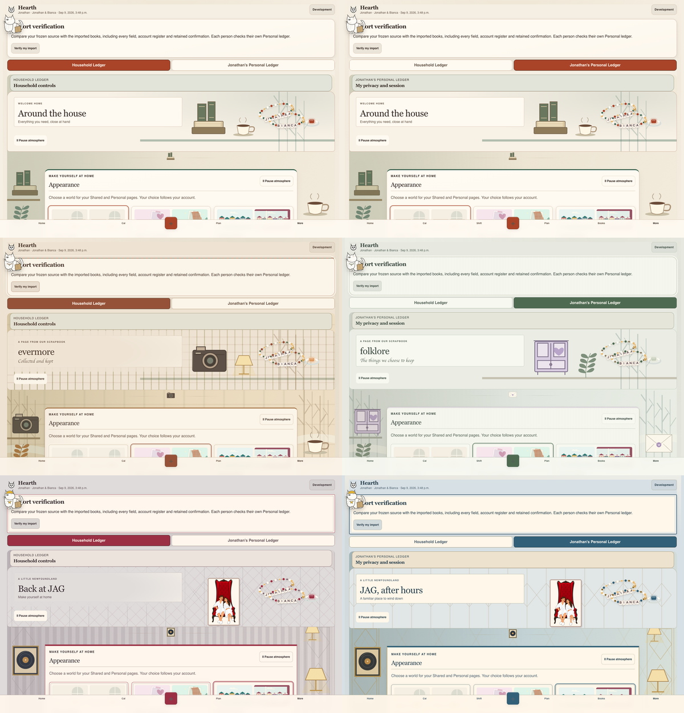

# More actual-page evidence

Installed Chrome, local Vite App, synthetic completed-books fixtures. Hosted requests blocked. Desktop full-scroll images are resized from 1440 to 1000px for repository size; phone images remain 390px. Original PNGs and all viewport/nested captures remain local under `.artifacts/more-*`.

| Scene | Phone full scroll | Desktop full scroll |
|---|---|---|
| Classic Shared | [Phone](classic-household-mobile.webp) | [Desktop](classic-household-desktop.webp) |
| Classic Personal | [Phone](classic-personal-mobile.webp) | [Desktop](classic-personal-desktop.webp) |
| evermore | [Phone](taylor-household-mobile.webp) | [Desktop](taylor-household-desktop.webp) |
| folklore | [Phone](taylor-personal-mobile.webp) | [Desktop](taylor-personal-desktop.webp) |
| JAG lobby | [Phone](newfoundland-household-mobile.webp) | [Desktop](newfoundland-household-desktop.webp) |
| JAG music | [Phone](newfoundland-personal-mobile.webp) | [Desktop](newfoundland-personal-desktop.webp) |

Nested examples: [charter](charter.webp), [destructive guard, cancelled](guard.webp), [category validation](category-error.webp), [deferred Pairing loading](loading.webp), [failed Pairing import recovery](load-error.webp).

Machine-readable evidence: [normal](normal-report.json), [sparse](sparse-report.json), [long](long-report.json), [nested](nested-report.json), [loading/error](loading-error-report.json).

Normal, sparse and long runs covered all six combinations at 320,390,719,720,1100,1440,1920px (126 viewport cases). Final title fix recaptured normal and long. Sparse content had already passed before the title-only fix. Nested states were reviewed at 320,390,720,1100,1440px; loading/import-error at390/1440 in all six scenes. Zero reported axe violations or overflow in successful runs. Long fixture includes extended identity/account/recent-change/restore labels. Equal-tip restore stays disabled and was not forced to become actionable.

All guards were cancelled, not accepted. Real OAuth, network pairing, permission writes, enabled historical Restore, destructive completion, physical device, VoiceOver/Safari and two-device acceptance are not claimed. App regression tests independently cover existing startup, refusal and Confirm boundaries. Appearance pending/error/offline behavior is covered by existing focused lifecycle tests; hosted account saving is not browser-accepted here.
